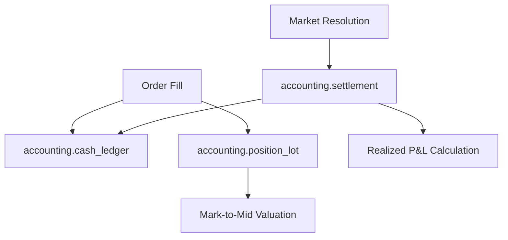

# Double-Entry Accounting, Settlement & Reconciliation

## 1. Multi-Lot Accounting Model

Positions are tracked across both **YES** and **NO** outcome tokens using weighted-average cost basis:

$$\text{Avg Entry Price} = \frac{\sum (\text{Lot Size} \times \text{Lot Price})}{\sum \text{Lot Size}}$$

---

## 2. Multi-Outcome Settlement Formula

For a resolved market with outcome price $P_{\text{win}} \in \{0.0, 1.0\}$:
* **YES Payout**: $\text{Shares}_{\text{YES}} \times 1.0$ (if YES wins) else $0.0$.
* **NO Payout**: $\text{Shares}_{\text{NO}} \times 1.0$ (if NO wins) else $0.0$.
* **Realized P&L**: $\text{Total Payout} - \text{Total Invested}$.

---

## 3. Reconciliation Pass

Reconciliation runs periodically comparing:
1. Internal cash ledger vs broker/exchange balance.
2. Local open orders vs active exchange orderbook quotes.
3. Position lots vs exchange contract balances.
Discrepancies trigger immediate `DISCREPANCY_DETECTED` state and observation-only mode.
