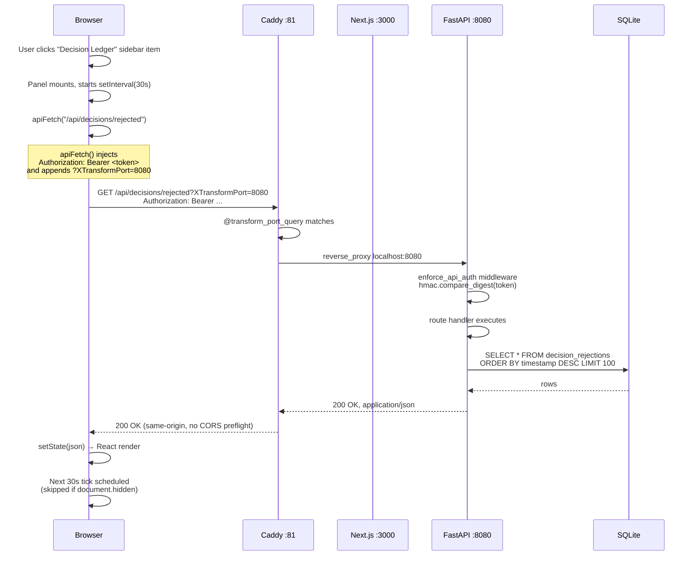
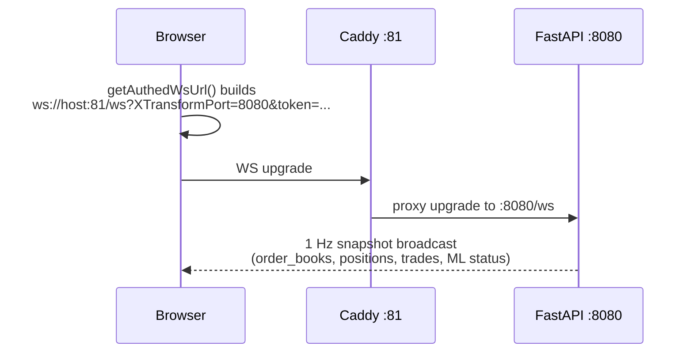
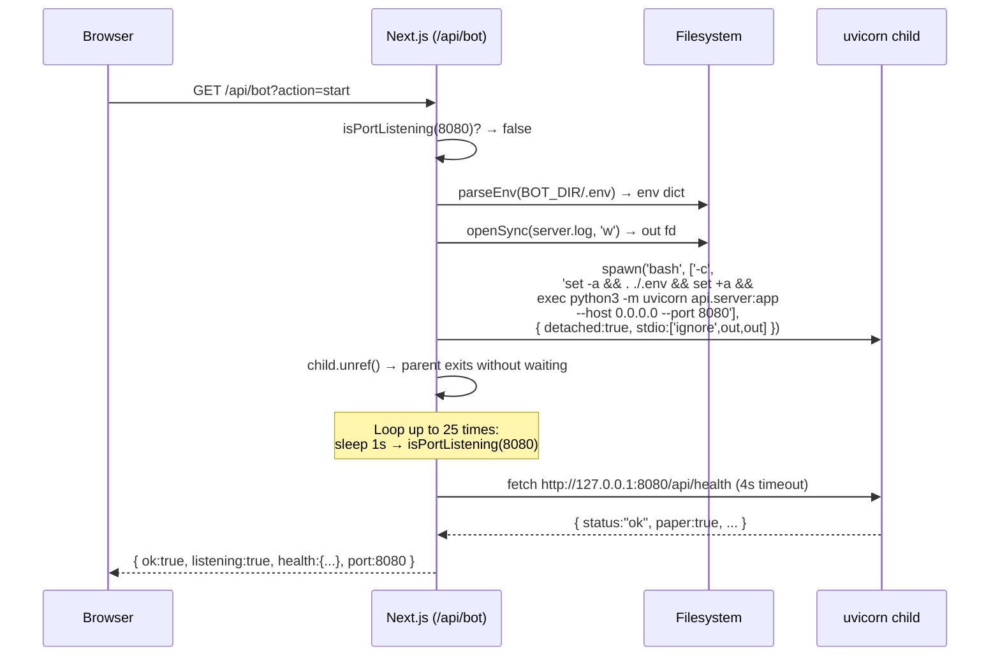
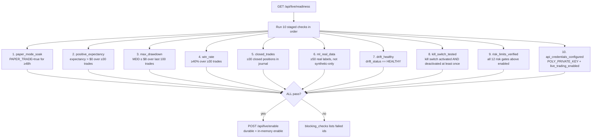
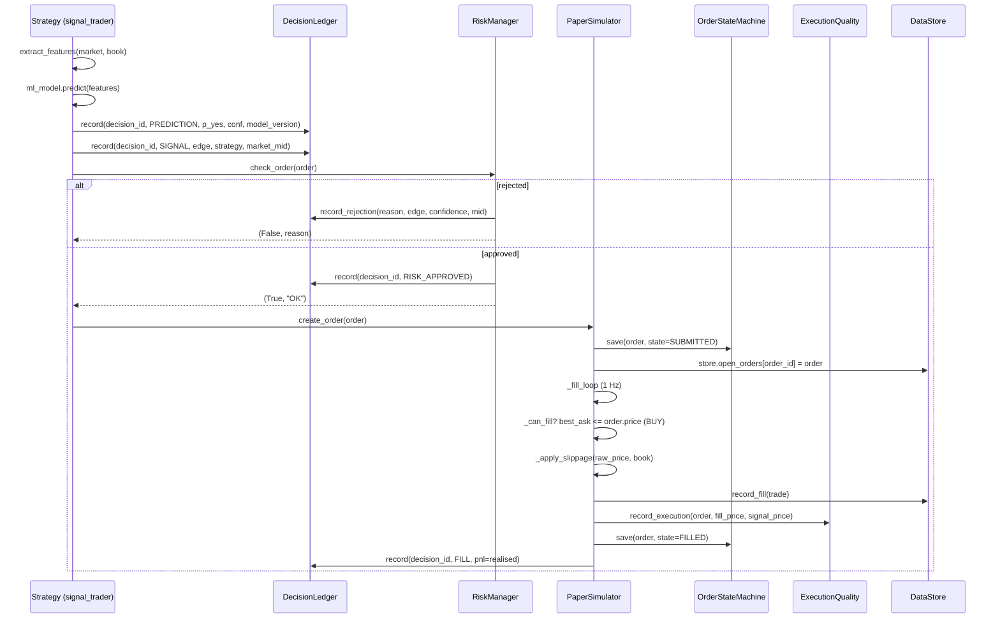
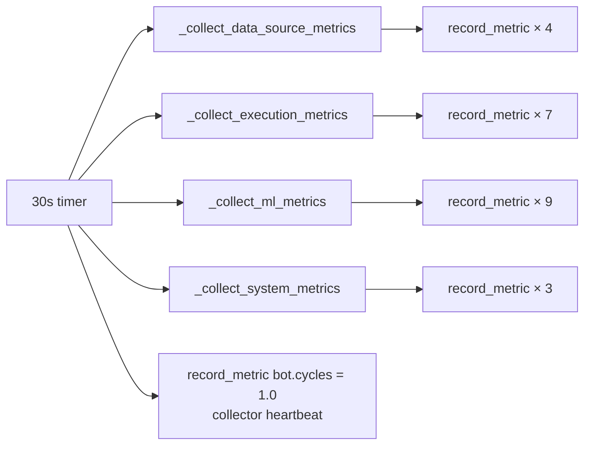

# Architecture

This document describes the system design of the Polymarket trading bot
platform — a 3-tier workstation that pairs a Next.js 16 trading dashboard
with a Python FastAPI quant backend, fronted by a Caddy gateway that
multiplexes a single public port across both processes.

The platform runs in **paper-trading mode by default** (real funds
disabled). Every architectural choice below is biased toward safe,
observable, paper-mode operation; live trading is gated behind a
10-check readiness exam that is documented in §7 and §11.

---

## 1. Overview

The system is a three-tier monolith-with-sidecar: a browser hits a
single Caddy gateway on port **81**, which reverse-proxies either to the
Next.js frontend (port 3000) or to the FastAPI backend (port 8080)
depending on whether the request URL carries the `?XTransformPort=`
query parameter. The backend is spawned as a **detached child process
of the Next.js server**, so the whole stack deploys as one unit and the
backend survives Next.js tool-call cleanup.

```
                            ┌─────────────────────────────────────┐
                            │            Browser (SPA)           │
                            │  37 panels · ws + polling clients   │
                            └─────────────────┬───────────────────┘
                                              │  HTTP :81  /  ws :81
                                              ▼
                  ┌───────────────────────────────────────────────────┐
                  │            Caddy Gateway  (port 81)              │
                  │                                                   │
                  │   ?XTransformPort=N → reverse_proxy :N           │
                  │   (no param)          → reverse_proxy :3000      │
                  └────────────┬──────────────────────┬───────────────┘
                               │                      │
                               │                      │  ?XTransformPort=8080
                               ▼                      ▼
            ┌────────────────────────────┐  ┌────────────────────────────────┐
            │  Next.js 16  (port 3000)   │  │  FastAPI / uvicorn  (port 8080)│
            │  ────────────────────────  │  │  ──────────────────────────── │
            │  App Router · RSC + 'use  │  │  ~77 routes across 13 modules  │
            │  client' panels           │  │  Lifespan-managed background   │
            │  /api/bot?action=start     │  │  loops (poller, settlement,   │
            │  spawns uvicorn child proc │  │  ML orchestrator, label        │
            │  apiFetch() wrapper        │  │  backfill, broadcast, …)      │
            │  auto-injects Bearer token │  │                                │
            └────────────┬───────────────┘  └────────────┬───────────────────┘
                         │                                │
                         │  in-process                    │  sqlite3.connect()
                         │  (no DB)                       ▼
                         │                  ┌────────────────────────────────┐
                         │                  │   SQLite Databases (WAL)       │
                         │                  │   ────────────────────────────  │
                         │                  │   audit_trail.db               │
                         │                  │   decision_ledger.db           │
                         │                  │   execution_quality.db         │
                         │                  │   observability.db              │
                         │                  │   closed_positions.db           │
                         │                  │   order_state_machine.db        │
                         │                  │   shadow_trades.db               │
                         │                  │   market_intelligence.db       │
                         │                  │   (PostgreSQL/TimescaleDB       │
                         │                  │    on standby — see §12)         │
                         │                  └────────────────────────────────┘
                         │
                         ▼
            External Polymarket services
            ───────────────────────────
            Gamma API      → market catalog, resolved labels
            CLOB REST API  → order books, depth, fills
            Polygon / RSS  → fundamental news sentiment
```

The flow is unidirectional and synchronous for the request path:
browser → Caddy → Next.js or FastAPI → SQLite. Real-time pushes
(order-book snapshots, fills) go back over a WebSocket upgraded
through the same Caddy gateway.

---

## 2. System Components

### 2.1 Next.js Frontend

| Aspect | Detail |
| --- | --- |
| Framework | Next.js 16 (App Router, Turbopack) on `bun` |
| Port | `3000` |
| Panels | **37** total — direct imports for the original 27; `next/dynamic` + `ssr:false` for the 10 Wave-8 client-only panels |
| Navigation | `Sidebar.tsx` `NAV_GROUPS` — 8 groups (Main / Markets / Portfolio / Capital / Strategies / Intelligence / Analytics / System) → 24 `NavSection` IDs |
| State | `useBot()` hook drives `snapshot`/`status` polling + WebSocket; per-panel `setInterval` polling (10–60 s) auto-pauses on `document.hidden` |
| Auth | `apiFetch()` wrapper auto-injects `Authorization: Bearer <token>` from `localStorage['polymarket_api_token']` (or `NEXT_PUBLIC_API_TOKEN` fallback) |
| Gateway routing | `apiFetch()` and the `window.fetch` monkey-patch in `src/lib/api.ts` transparently append `?XTransformPort=8080` to every `/api/...` call |

**Panel taxonomy** (per Sidebar group):

```
Main         → command (Command Center)
Markets      → markets-books, markets-screener
Portfolio    → portfolio-positions, portfolio-orders, portfolio-trades
Capital      → capital-allocator
Strategies   → strategies-registry, strategies-arbitrage
Intelligence → intelligence-analysis, intelligence-aiml,
               intelligence-copilot, intelligence-shadow,
               intelligence-validation
Analytics    → analytics-performance, analytics-backtest,
               analytics-attribution, analytics-execution,
               analytics-closed
System       → system-health, system-database, system-observability,
               system-retention, system-decisions, system-safety
```

The 10 Wave-8 panels (Shadow Inference, ML Validation, Attribution,
Execution Quality, Closed Positions, Capital Allocator, Observability,
Retention, Decision Ledger, Safety Gate) are loaded with
`dynamic(() => import(...), { ssr:false })` because they touch
`window`, `localStorage`, or `matchMedia` at module scope.

### 2.2 FastAPI Backend

| Aspect | Detail |
| --- | --- |
| Framework | FastAPI 0.128 on `uvicorn` (`python3 -m uvicorn api.server:app --host 0.0.0.0 --port 8080`) |
| Port | `8080` (only exposed via Caddy `?XTransformPort=8080`) |
| Routes | **~77 HTTP routes** + 1 WebSocket (`/ws`). 54 routes declared directly in `api/server.py`; ~23 registered via 13 `register_routes(app)` feature modules |
| Process | Spawned as a **detached child of `next-server`** (`spawn(..., { detached: true })` + `child.unref()`) so it survives Next.js hot-reload and tool-call cleanup |
| Auth | Fail-closed bearer-token middleware: every route except `/api/health`, `/docs`, `/redoc`, `/openapi.json` requires `Authorization: Bearer <API_TOKEN>` (503 if unset, 401 on mismatch — `hmac.compare_digest` to prevent timing attacks) |
| CORS | Locked to `CORS_ORIGINS` explicit list (no wildcard) |
| Lifespan | Async `lifespan(app)` context manager starts/stops 9 background loops: watchdog, paper_sim, book_poller, settlement_engine, fundamental_engine, position_manager, training_orchestrator, label_backfill, broadcast/reconciliation/persistence |

**Background loops started in `lifespan()`**:

1. `watchdog` — liveness supervisor for every registered subsystem
2. `paper_sim` — paper-trading fill simulator (only when `PAPER_TRADE=true`)
3. `book_poller` — tiered REST CLOB poller (WS feed retired per KD-08/D5)
4. `market_discovery` — 500+ market catalog ingestion
5. `settlement_engine` — mark-to-market + resolved-market settlement
6. `fundamental_engine` — news/RSS sentiment ingest
7. `position_manager` — TP/SL trailing-stop supervisor
8. `training_orchestrator` — ML retrain scheduler (6 h or drift-triggered)
9. `label_backfill` — resolved-market ground-truth label harvest
10. `_broadcast_loop` — 1 Hz WebSocket snapshot broadcast
11. `_reseed_loop` — 10 min Gamma market re-seed
12. `_token_sync_loop` — 20 s token-list sync
13. `_state_persistence_loop` — 30 s store state save
14. `_reconciliation_loop` — daily storage-vs-engine reconciliation

**13 feature modules with `register_routes(app)`** (wired at module import):

| Module | Routes added |
| --- | --- |
| `core.decision_ledger` | `GET /api/decision/{token_id}`, `GET /api/decisions/rejected` |
| `core.execution_quality` | `GET /api/execution-quality` |
| `core.observability` | `GET /api/observability`, `GET /api/observability/history/{name}` |
| `core.closed_positions` | `GET /api/positions/closed`, `GET /api/positions/closed/stats` |
| `core.attribution` | `GET /api/attribution` |
| `core.capital_allocator` | `GET /api/capital/allocation` |
| `core.shadow_trading` | `GET /api/shadow/trades`, `GET /api/shadow/comparison` |
| `core.live_safety_gate` | `GET /api/live/readiness`, `POST /api/live/enable` |
| `core.retention` | `POST /api/system/prune` |
| `ml.routes` | `GET /api/ml/versions`, `POST /api/ml/rollback` |
| `risk.routes` | `GET /api/risk/strategies/paused` |
| `ml.validation` | `POST /api/ml/validate` |
| `core.observability_collector` | (no HTTP routes — wraps lifespan to start the 30 s auto-collector) |

### 2.3 Caddy Gateway

| Aspect | Detail |
| --- | --- |
| Port | `81` (single exposed port) |
| Config | `/Caddyfile` (10 lines) — see below |
| Routing rule | `?XTransformPort=N` → `reverse_proxy localhost:N`; otherwise → `localhost:3000` |

```caddy
:81 {
    @transform_port_query {
        query XTransformPort=*
    }
    handle @transform_port_query {
        reverse_proxy localhost:{query.XTransformPort} { ... }
    }
    handle {
        reverse_proxy localhost:3000 { ... }
    }
}
```

The gateway pattern yields two operational wins:

1. **Single exposed port** — only `:81` is open; the browser never
   learns about `:3000` or `:8080`. Simplifies firewall rules and
   TLS termination.
2. **CORS-free** — the browser sees every request as same-origin
   (`http://host:81`), so the FastAPI CORS policy is the second line
   of defense rather than the primary one. CORS preflights are
   avoided entirely for `/api/*` calls.

### 2.4 SQLite Databases

The platform deliberately uses **one SQLite file per concern** so that
pruning, vacuuming, or migrating one store never perturbs another's
schema or immutability contract. All stores default to
`/app/data/<store>.db` but are env-var-overridable; the production
deployment overrides them to
`mini-services/polymarket-bot/data/<store>.db`.

| DB file | Env var | Tables | Purpose |
| --- | --- | --- | --- |
| `audit_trail.db` | `AUDIT_DB_PATH` | `audit_events` | Immutable forensic trail of every signal, order, fill, risk event, model prediction, fundamental ingestion (90 d retention) |
| `decision_ledger.db` | `DECISION_LEDGER_DB_PATH` | `decision_events`, `decision_rejections` | Correlation-ID chain linking `PREDICTION → SIGNAL → RISK → ORDER → FILL` (30 d) |
| `execution_quality.db` | `EXECUTION_QUALITY_DB_PATH` | `execution_quality` | Per-fill slippage, latency, realized edge (signal/decision/submitted/best_bid/ask/actual) (30 d) |
| `observability.db` | `OBSERVABILITY_DB_PATH` | `metrics` | 31-metric health snapshot store across 6 categories (7 d) |
| `closed_positions.db` | `CLOSED_POSITIONS_DB_PATH` | `closed_positions` | Closed-position journal with 7 attribution dimensions (strategy/confidence/edge/prob/liquidity/direction/holding period) |
| `order_state_machine.db` | `ORDER_STATE_MACHINE_DB_PATH` | `order_transitions` | Append-only OSM lifecycle history (CREATED → VALIDATED → SUBMITTED → ACKNOWLEDGED → OPEN → FILLED) |
| `shadow_trades.db` | (derived from `DECISION_LEDGER_DB_PATH.parent`) | `shadow_trades` | Counterfactual trades recorded on every risk rejection (challenger journal) |
| `market_intelligence.db` | `MARKET_DB_PATH` | `market_snapshots`, `orderbook_ticks`, `fundamental_news`, `ml_feature_store` | Time-series + ML feature store (32-dim normalized vectors with ground-truth outcomes) |
| `model_registry.json` | `MODEL_REGISTRY_PATH` | (JSON, not SQLite) | ML model version lineage with promotion gate (Brier ≤ 0.22 AND AUC ≥ 0.70) |

All SQLite stores are opened with `PRAGMA journal_mode=WAL` for
read-concurrency (dashboards polling while writes stream in).

---

## 3. Request Flow

### 3.1 Panel click → render



### 3.2 The `apiFetch` wrapper

`src/lib/api.ts` does three things transparently for every `/api/*`
call:

```ts
export async function apiFetch(input: string, init?: RequestInit) {
  const headers = new Headers(init?.headers)
  const t = getApiToken()
  if (t && !headers.has('Authorization'))
    headers.set('Authorization', `Bearer ${t}`)
  return fetch(withGatewayPort(input), { ...init, headers })
}

function withGatewayPort(input: string): string {
  // .../api/foo  →  .../api/foo?XTransformPort=8080
  // (skipped for /api/bot — that's a Next.js route, not FastAPI)
  if (input.startsWith('/api/bot')) return input
  if (input.includes('XTransformPort=')) return input
  const sep = input.includes('?') ? '&' : '?'
  return `${input}${sep}XTransformPort=${API_PORT}`
}
```

A `window.fetch` monkey-patch (`installFetchWrapper`) applies the same
`withGatewayPort` transform to bare `fetch()` calls so third-party
hooks (e.g. `useBot`) don't need to be rewritten. `/api/bot` is
explicitly excluded — that route is served by Next.js itself, not
FastAPI.

### 3.3 WebSocket flow



The `_broadcast_loop` in `api/server.py` wakes every 1 s, builds a
fresh `_build_snapshot()` dict from the in-memory store + ML model
state, and broadcasts it to all connected WebSocket clients.

---

## 4. Backend Bootstrap

The FastAPI backend is **spawned by Next.js** on demand via the
`/api/bot?action=start` route. The lifecycle is implemented in
`src/app/api/bot/route.ts`:



Key properties of the bootstrap:

| Property | Mechanism |
| --- | --- |
| **Detached** | `spawn(..., { detached: true })` + `child.unref()` — the uvicorn process becomes its own session leader and is not killed when Next.js exits |
| **Single deploy unit** | Next.js + FastAPI ship together; no separate systemd unit needed for the backend |
| **Survives tool-call cleanup** | Because the backend is detached (not a `child_process` that the parent waits on), Next.js hot-reloads and `kill -TERM next-server` do not propagate to uvicorn |
| **Health check loop** | Up to 25 iterations of `sleep(1s) → isPortListening(8080)` via TCP `net.createConnection` (1.5 s timeout). On success, an HTTP probe to `/api/health` confirms FastAPI is actually serving, not just bound |
| **Env loading** | The `.env` file is sourced into the bash subshell (`set -a && . ./.env && set +a`) so all `API_TOKEN`, `DECISION_LEDGER_DB_PATH`, etc. are visible to uvicorn |
| **Logs** | stdout + stderr are redirected to `mini-services/polymarket-bot/server.log` (overwrite mode) |

The bootstrap is **idempotent**: `isPortListening(8080)` is the first
check, so calling `?action=start` repeatedly is a no-op once the
backend is running. `?action=status` (the default) only probes, never
spawns.

---

## 5. Decision Ledger Architecture

The decision ledger is a correlation-ID system that links every stage
of a trade's lifecycle via a single `decision_id` (a `dec-<uuid4>`
string). It is the audit-trail backbone of the platform — any trade,
whether it reached the fill stage or was rejected along the way, can
be reconstructed end-to-end.

### 5.1 Stage chain

```
   PREDICTION ──► SIGNAL ──► RISK_APPROVED ──► ORDER ──► FILL
                     │
                     └──► RISK_REJECTED  (early-exit branch)
```

| Stage | Emitter | What's recorded |
| --- | --- | --- |
| `PREDICTION` | `strategies/signal_trader.py::_ml_signal` | ML `p_yes`, `confidence`, `model_version` (auto-stamped by `decision_ledger.record` on PREDICTION stage) |
| `SIGNAL` | `strategies/signal_trader.py::_ml_signal` | Strategy, predicted_edge, market_mid |
| `RISK_APPROVED` | `strategies/base.py::submit_order` | Risk gate cleared, order ready to submit |
| `RISK_REJECTED` | `strategies/signal_trader.py` (via `record_rejection()`) | Reason code (`low_confidence`, `wide_spread`, `neutral_zone`, `insufficient_kelly_edge`), predicted_edge, confidence, market_mid |
| `ORDER` | `paper/simulator.py::create_order` | order_id, side, price, size, strategy |
| `FILL` | `paper/simulator.py::_execute_fill` | fill_price, pnl (realised P&L) |

### 5.2 SQLite schema

Two tables in `decision_ledger.db`:

```sql
-- Ordered stage chain (append-only)
CREATE TABLE decision_events (
    id          INTEGER PRIMARY KEY AUTOINCREMENT,
    timestamp   REAL    NOT NULL,
    decision_id TEXT    NOT NULL,
    stage       TEXT    NOT NULL,        -- PREDICTION/SIGNAL/RISK_*/ORDER/FILL
    token_id    TEXT,
    strategy    TEXT,
    pnl         REAL    DEFAULT 0.0,
    data_json   TEXT                     -- per-stage payload (model_version, prices, etc.)
);
CREATE INDEX idx_dec_id    ON decision_events(decision_id, timestamp ASC);
CREATE INDEX idx_dec_token ON decision_events(token_id, timestamp DESC);
CREATE INDEX idx_dec_stage ON decision_events(stage);

-- Fast filtered rejection listing
CREATE TABLE decision_rejections (
    id              INTEGER PRIMARY KEY AUTOINCREMENT,
    timestamp       REAL    NOT NULL,
    decision_id     TEXT,
    token_id        TEXT,
    strategy        TEXT,
    predicted_edge  REAL,
    confidence      REAL,
    reason          TEXT,                 -- low_confidence/wide_spread/...
    market_mid      REAL
);
CREATE INDEX idx_rej_token   ON decision_rejections(token_id, timestamp DESC);
CREATE INDEX idx_rej_decision ON decision_rejections(decision_id);
```

### 5.3 Chain reconstruction

A `decision_id` is minted once per signal via
`DecisionLedger.new_decision_id()` (`dec-<uuid4>`). Every subsequent
stage call (`record(decision_id=..., stage=..., **data)`) appends a
row to `decision_events`. The chain is reconstructed by:

```sql
SELECT stage, timestamp, data_json, pnl
FROM   decision_events
WHERE  decision_id = ?
ORDER  BY timestamp ASC;
```

Rejections are dual-written: a `RISK_REJECTED` row goes into
`decision_events` (so the main chain is complete) AND a row goes into
`decision_rejections` (so the dashboard can filter rejected decisions
without scanning the chain).

The `record()` contract is **fire-and-forget**: every persistence
error is logged at `error` level and swallowed, so a ledger hiccup
never blocks the trading pipeline. Writes happen on `asyncio.to_thread`
so the event loop is never blocked on SQLite I/O.

### 5.4 HTTP surface

| Endpoint | Returns |
| --- | --- |
| `GET /api/decision/{token_id}` | Recent decision events for a token, newest first |
| `GET /api/decisions/rejected` | Recent rejected decisions (filterable by strategy/reason) |

---

## 6. ML Pipeline Architecture

The ML engine is a 4-member ensemble with a Level-2 stacking
meta-learner. It is trained on a blend of synthetic market dynamics
(3 000 samples) and real DB samples harvested by the resolved-market
label backfill service. Drift is monitored continuously via PSI / KS /
rolling-Brier; retrain triggers fire when drift is detected or on a
6 h schedule.

### 6.1 Feature extraction

`ml/features.py::extract_features(market, book) -> np.ndarray` produces a
**fixed 38-dimensional `float32` vector** per token from the live order
book + market metadata:

| Group | Indices | Examples |
| --- | --- | --- |
| Microstructure | 0-17 | mid_price, spread_norm, OFI, micro_price_drift, depth ratios, urgency, price extremity, binary variance |
| Cyclical time | 18-21 | hour_sin, hour_cos, day_sin, day_cos (UTC) |
| Market structure / fundamentals | 22-31 | competitiveness, spread_compression, fundamental_sentiment, whale_flow_index, hurst_exponent (R/S), price_acceleration, slippage_estimate, depth_slope, decay_acceleration, cluster_correlation |
| Regime one-hot | 32-35 | trending, mean_reverting, volatile, resolution_convergence |
| Price dynamics | 36-37 | rolling_volatility (std of last 10 log-returns), price_momentum_5bar |

The module maintains a per-token 60-bar rolling price history
(`_price_history: dict[str, Deque[float]]`) for the Hurst exponent
and momentum features.

### 6.2 Base models

`ml/model.py::MarketMLModel` trains four base learners on the
38-feature matrix:

| # | Model | Library | Calibration | Role |
| --- | --- | --- | --- | --- |
| 1 | `RandomForestClassifier` (150 trees, max_depth=10) | sklearn | `CalibratedClassifierCV(method="isotonic", cv=5)` | Robust bagging base |
| 2 | `GradientBoostingClassifier` (100 trees, lr=0.06, depth=4) | sklearn | isotonic (5-fold) | Boosted signal |
| 3 | `SGDClassifier(loss="log_loss", warm_start=True, max_iter=1)` | sklearn | none | Online incremental learner (`partial_fit` per resolved market) |
| 4 | `LGBMClassifier` (120 trees, lr=0.05, num_leaves=31) | lightgbm | none | Optional 4th member (graceful fallback to 3-member ensemble if `lightgbm` import or libgomp fails) |

### 6.3 Level-2 meta-learner

`ml/ensemble_meta_learner.py::EnsembleMetaLearner` stacks a
`LogisticRegression` over the 4 base predictions, with two extra
 engineered features (disagreement std, mean confidence) for a 6-dim
 input:

```
meta_features = [p_rf, p_gb, p_sgd, p_lgbm, disagreement_std, conf_mean]
```

| Property | Value |
| --- | --- |
| Activation threshold | ≥30 resolved outcomes in the buffer |
| Refit cadence | Every 50 new outcomes |
| Buffer size | 1 000 (deque, FIFO) |
| Fallback | When not warm, `predict()` returns `None` and `MarketMLModel.predict` falls back to **adaptive Brier-inverse weighting** (per-model weight ∝ `1/rolling_brier`, window=200, deque O(1)) |

### 6.4 Time-ordered train/test split

```python
# 80/20 split — TIME-ORDERED, no shuffling
n_total = len(X)
n_train = int(n_total * 0.80)
X_tr, y_tr = X[:n_train], y[:n_train]    # oldest 80%
X_cal, y_cal = X[n_train:], y[n_train:]  # newest 20% for calibration + validation
```

A random permutation would mix later (synthetic, most recent) samples
into the training fold and inflate calibration metrics. The
chronological split prevents lookahead bias — critical because the
dataset is a blend of real DB samples (oldest, from resolved markets)
and synthetic samples (newest).

### 6.5 Drift detection

`ml/drift_detector.py::ModelDriftDetector` monitors three independent
signals:

| Signal | Threshold | Status escalated to |
| --- | --- | --- |
| **PSI** (Population Stability Index, 10 bins) | `<0.10` healthy / `<0.25` moderate / `≥0.25` significant | `MODERATE_SHIFT` / `SIGNIFICANT_DRIFT` |
| **KS** (two-sample Kolmogorov-Smirnov) | `<0.15` healthy / `<0.25` moderate / `≥0.25` significant | `MODERATE_SHIFT` / `SIGNIFICANT_DRIFT` |
| **Rolling Brier** (last 500 outcomes) | `>0.22` with ≥20 samples | `SIGNIFICANT_DRIFT` (preserved — won't downgrade while still elevated) |
| **EWMA Brier** (α=0.05, ≈38-sample half-life) | `>0.22` from `HEALTHY` | `MODERATE_SHIFT` (early-warning, fires before 20-sample floor) |

The PSI baseline is **the model's own prediction distribution** captured
on the first `compute_psi()` call (after ≥30 samples) — not the
U-shaped market baseline (which structurally disagreed with
~0.5-centered predictions and produced perpetual false positives).

`compute_psi()` runs every 50 new predictions after the 50-sample
warm-up floor. Status transitions are logged. `reset()` clears the
windows after a successful retrain (so the detector returns to
`HEALTHY`).

### 6.6 Label backfill (Gamma API)

`core/label_backfill.py::LabelBackfillEngine` harvests ground-truth
labels from resolved markets:

```mermaid
flowchart LR
  A[45s startup grace] --> B[Page Gamma /markets?closed=true]
  B --> C[For each resolved market]
  C --> D[Build synthetic 5-level OrderBook<br/>from outcomePrices/volume/liquidity]
  D --> E[extract_features market, book]
  E --> F{timescale_db.has_labeled_sample?<br/>Idempotency check}
  F -- no --> G[INSERT into ml_feature_store<br/>(features_json, p_pred, confidence, outcome_resolved)]
  F -- yes --> H[Skip — already labeled]
  G --> I{≥50 real labels accumulated?}
  I -- yes --> J[Trigger ml_model.fit_initial retrain]
  I -- no --> K[Wait 24h]
  J --> K
  H --> K
  K --> B
```

- **Pagination**: `PAGE_SIZE=100`, `MAX_PAGES=25` (≤2 500 markets/cycle)
- **Idempotency**: `timescale_db.has_labeled_sample(token_id)` prevents
  re-backfilling the same token across cycles
- **Retrain trigger**: `MIN_LABELS_FOR_RETRAIN=50` real labels
  accumulated → `ml_model.fit_initial()` re-runs

### 6.7 Retrain triggers

`ml/training_orchestrator.py::ContinuousTrainingOrchestrator` is a
background loop that fires a champion/challenger retrain on any of
three independent triggers:

| Trigger | Condition |
| --- | --- |
| Drift | `psi >= 0.10` OR `rolling_brier > 0.22 with n_outcomes ≥ 20` |
| Schedule | `time_since_retrain >= 21600s` (6 h) |
| Label threshold | (indirectly via `label_backfill_engine` ≥50 labels) |

**Champion/challenger gating**:

1. Sample diverse hyperparameters for the challenger
   (`rf_max_depth`, `gb_learning_rate`, `n_estimators_*`).
2. Train challenger in `asyncio.to_thread` (off the event loop).
3. Compare Brier scores: promote only if
   `challenger_brier < champion_brier × MIN_IMPROVEMENT_RATIO`.
4. On promotion: **transplant SGD online state + rolling Brier
   windows** from champion to challenger so accumulated real-market
   learning is preserved.
5. Register the new version in `model_registry.json` with
   promotion gate `Brier ≤ 0.22 AND AUC ≥ 0.70`.

### 6.8 Shadow inference (challenger models)

`ml/shadow_inference.py::ShadowInferenceEngine` runs challenger models
in parallel with the production `predict()` call:

```python
# Inside MarketMLModel.predict():
p_yes, confidence = ...  # production prediction (unchanged)
try:
    shadow_inference.run_shadow(features, token_id, p_yes)
except Exception:
    pass  # never degrade predict() latency
```

- The challenger output **never affects** `p_yes` / `confidence`.
- Each challenger keeps a `deque(maxlen=500)` ring buffer of
  (features, prod_p, challenger_p, token_id, ts) for offline
  disagreement analysis.
- Registered at startup: `logistic_baseline` challenger (simple
  `0.5 + pe × 0.3` formula).

The HTTP surface is `GET /api/shadow/trades` (recent counterfactual
trades) and `GET /api/shadow/comparison` (shadow-vs-live side-by-side).

---

## 7. Risk Management Architecture

The risk engine (`risk/manager.py::InstitutionalRiskEngine`) implements
**defense-in-depth**: a stack of independent gates, each capable of
halting the trade. The first gate to trip short-circuits the rest.

### 7.1 Capital model

```
recognized_operating_capital = min(verified_equity, $100)
Hard bankroll ceiling (never auto-increased): $200
Min cash reserve: $40    →  Max deployable: $60
Per-trade experimental: $1   Normal: $1–$2   Per-market: $3   Absolute max: $5
```

### 7.2 Gate stack (in evaluation order)

| # | Gate | Threshold | Action on trip |
| --- | --- | --- | --- |
| 0 | Shadow mode | `trading_mode == "shadow"` | Reject (evaluation only) |
| 0 | Kill switch | `store.kill_switch_active OR kill_switch_file_exists()` | Reject (durable file-backed halt) |
| 0 | Observation-only | `self.observation_only AND not order.paper` | Reject (live orders disabled until reconciled) |
| 0b | Reconciliation gate | `total_exposure > $60` (live orders only) | Reject (exposure not reconciled) |
| 0c | Live-trading disabled | `not order.paper AND not settings.live_trading_enabled` | Reject (paper-only by default) |
| 0d | Per-trade cooldown | `is_strategy_paused(strategy)` (loss ≥ $0.50 → 300 s cooldown) | Reject with seconds-remaining |
| 1 | Kill switch (redundant) | `store.kill_switch_active` | Reject |
| 2 | Daily loss stop | `daily_pnl ≤ -$2.00` | **Trigger kill switch** + cancel all orders |
| 2b | Weekly loss stop | `weekly_pnl ≤ -$5.00` | **Trigger kill switch** |
| 3 | Max drawdown | `(peak_equity - current_equity) ≥ $8.00` (baseline = $100 operating) | **Trigger kill switch** |
| 4 | Cash reserve | `total_exp + order_cost > $60` | Reject |
| 5 | Total open risk | `total_exp + order_cost > $25` | Reject |
| 6 | Per-market cap | `market_exp + order_cost > $3 × ml_risk_mult` | Reject (dynamic ML-health scaling) |
| 6b | Normal position | `market_exp ≤ 0 AND order_cost > $2 × ml_risk_mult` | Reject (new-position sizing) |
| 6c | Per-strategy cap | `strat_exp + order_cost > $15` | Reject |
| 6d | Correlated group | `group_exp + order_cost > $8` (per slug) | Reject |
| 6e | **MTM exposure** | `mtm_total + order_cost > $25` (mark-to-market, not cost basis) | Reject (prevents unrealized gains outflanking the cap) |
| 7 | Max open positions | `active_positions >= 8` (new markets only) | Reject |
| 8 | Pending capital | `pending_capital + order_cost > $10` | Reject |
| 9 | Max open orders | `len(open_orders) >= settings.max_open_orders` | Reject |
| 10 | Price sanity | `0.01 <= price <= 0.99` | Reject |
| 11 | Min order size | `size >= $0.50` | Reject |
| 12 | Bankroll ceiling | `total_exp + order_cost > $160` (max loss vs reserve) | Reject |

`ml_risk_mult` (gate 6 / 6b) is a dynamic multiplier in `[0.30, 1.00]`
derived from live ML calibration and concept-drift status — when the
model is poorly calibrated or drifting, per-market caps shrink
automatically.

### 7.3 Circuit breakers (kill-switch triggers)

Only gates **2 / 2b / 3** trigger the kill switch (hard halt). The
others are per-order rejections. The kill switch is **dual-write**:

- `store.kill_switch_active = True` (in-memory)
- `write_kill_switch(reason)` writes a file to `KILL_SWITCH_PATH` so
  the halt survives process restarts
- All open orders are cancelled via `store.cancel_all_orders()`
- Audit event logged: `category="risk", event_type="kill_switch_activated"`

### 7.4 Per-trade circuit breaker

A single closed trade losing ≥ `$0.50` pauses the responsible strategy
for `300 s`:

```python
# In report_trade_pnl(strategy, pnl):
if pnl_dec <= -PER_TRADE_MAX_LOSS:
    self._strategy_cooldowns[strategy] = time.monotonic() + STRATEGY_COOLDOWN
```

Subsequent BUY orders for that strategy are rejected by gate 0d.
Expired cooldowns are lazily cleared on read.

### 7.5 MTM (mark-to-market) risk gate

Gate 6e is the **MTM gate**: the section-5 cap is on cost-basis
exposure, which does not move when an open position's market value
rises. A profitable position can therefore silently widen true risk
past the $25 ceiling simply because its mark has appreciated. The MTM
gate re-checks the same $25 cap on a mark-to-market basis
(`core.portfolio.compute_mark_to_market_exposure()`) so unrealized
gains cannot outflank the cap. Best-effort: if the MTM helper is
unavailable, the gate is skipped (fail-open) — section 5 still
enforces the cost-basis $25 cap.

### 7.6 Position sizing via capital allocator

`core/capital_allocator.py` exposes two complementary sizing
entrypoints:

| Entrypoint | Used by | Formula |
| --- | --- | --- |
| `allocate_size(...)` (T9) | Hot scan loop (strategies) | `raw = SIZE_SCALE × edge^0.4 × confidence`; 5 safety gates; clip to `[$0.50, $3.00]` |
| `allocate_capital(...)` (T5) | Attribution-friendly API | `raw = saturating_edge(edge) × smoothstep(confidence) × calibration_mult × drawdown_mult × correlation_mult × performance_mult × liquidity_mult`; clip to `[0, $3.00]` |

**Saturating edge curve** (Michaelis–Menten): `raw_size = V_MAX × edge / (K_M + edge)`.

The T9 curve uses `exponent = 0.4` (strictly sublinear, `< 0.5`). This
guarantees the institutional "4× edge gives < 2× size" saturation
contract: scaling edge by 4 multiplies the raw size by
`4^0.4 ≈ 1.74`, comfortably under 2×. A linear curve (1.0) would
multiply size by 4×; a square-root curve (0.5) by exactly 2×.

The 5 safety gates (any trip → return `0.0` "do not trade"):

1. `edge <= 0` — no positive edge
2. `confidence < MIN_CONFIDENCE` — model not confident enough
3. `drawdown > MAX_DRAWDOWN_USD` — MDD breached
4. `existing_exposure > MAX_EXISTING_EXPOSURE_USD` — per-group ceiling
5. `liquidity <= 0` — no book liquidity

### 7.7 10-check live safety gate

`core/live_safety_gate.py::check_live_readiness()` runs 10 staged
checks before live trading can be enabled. All 10 must pass; the gate
is the single payload the Safety Gate panel polls.



Each check returns `{id, name, passed, severity="BLOCKING", threshold, value, detail}`.
A check that throws records itself as failed (with the exception text
in `detail`) — the gate must always answer, even when a dependency is
broken. This is the live-trading safety contract.

---

## 8. Execution Architecture

### 8.1 Order lifecycle



### 8.2 OSM (Order State Machine)

`core/order_state_machine.py` is the canonical lifecycle state
machine, persisted append-only to `order_state_machine.db`. Illegal
transitions raise `InvalidTransition` (fail-closed — a FILLED order
cannot move back to OPEN, a CANCELLED cannot move to FILLED).

```
CREATED → VALIDATED → SUBMITTED → ACKNOWLEDGED → OPEN ─┬→ PARTIALLY_FILLED → FILLED
                                                        ├→ FILLED
                                                        ├→ CANCELLED
                                                        ├→ REJECTED
                                                        └→ EXPIRED

VALIDATED   → CANCELLED / REJECTED
SUBMITTED   → REJECTED / EXPIRED
ACKNOWLEDGED → CANCELLED / EXPIRED
PARTIALLY_FILLED → PARTIALLY_FILLED / FILLED / CANCELLED / REJECTED / EXPIRED
```

`generate_idempotency_key(strategy, token_id, side, price, size)` is a
deterministic SHA-256 of the 5-tuple, so duplicate strategy decisions
are detected before they hit the exchange. Terminal states:
`FILLED`, `CANCELLED`, `REJECTED`, `EXPIRED`.

### 8.3 Marketable SL/TP exits

`core/position_manager.py::evaluate_positions()` runs on every loop
tick. TP/SL exit orders are **marketable** — they sell into the
current `best_bid` (not `round(mid, 3)` which would never cross):

```python
# TP triggered (mid >= take_profit_price)
exit_order = Order(
    token_id=pos.token_id,
    side=Side.SELL,
    price=book.best_bid,        # ← marketable: fills immediately
    size=pos.yes_shares,
    strategy="position_manager_tp",
)
# Risk gate (V3): exits must clear the same institutional gates as entries
allowed, reason = await risk_manager.check_order(exit_order)
if allowed:
    await paper_sim.create_order(exit_order, strategy=strat, decision_id=...)
```

Stale prior exit orders are cancelled before submitting a new one
(`managed.active_exit_order_id` tracks the prior ID).

### 8.4 Inventory flush

When a position is closed (via TP/SL or manual close), the settlement
engine (`core/settlement.py`) flushes the inventory:

1. Cancel any open orders for the token (avoid double-counting).
2. Record the closed position in `closed_positions.db` with the
   7 attribution dimensions (strategy, direction, confidence,
   predicted_edge, p_yes, market_mid, liquidity).
3. Update `store.daily_pnl`, `store.peak_equity`, `store.equity_history`.
4. Call `risk_manager.report_trade_pnl(strategy, pnl)` (fires per-trade
   circuit breaker if loss ≥ $0.50).

### 8.5 Paper trading slippage model

`paper/simulator.py::_apply_slippage(order, raw_price, book)` models
realistic execution slippage as three additive tick components:

| Component | Formula | Rationale |
| --- | --- | --- |
| **Crossing penalty** | Flat `1 tick` | Taker fee / adverse selection paid when crossing the spread |
| **Size impact** | `0.5 × (overflow / SLIPPAGE_DEPTH_BUCKET)` ticks, where `overflow = max(0, size - top_depth)` | Linear market-impact curve: orders small enough to be absorbed by top level pay no size impact; deeper sweeps walk the book |
| **Queue position** | `SHA-256(order_id)[0] & 0x01` (0 or 1 tick) | Deterministic per-order-id so a given order always sees the same queue penalty across runs (reproducible P&L) |

```
total_slippage = (crossing + size_impact + queue) × TICK_SIZE
BUY  → slipped = raw_price + total_slippage   (worse entry)
SELL → slipped = raw_price - total_slippage   (worse exit)
slipped = clamp(slipped, 0.01, 0.99)
```

Fill eligibility (no slippage applied yet):

| Side | Fill condition | Raw fill price |
| --- | --- | --- |
| BUY | `best_ask <= order.price` | `best_ask` |
| SELL | `best_bid >= order.price` | `best_bid` |

### 8.6 Execution quality recording

Every fill is recorded by `core/execution_quality.record_execution()`:

```sql
INSERT INTO execution_quality (
    timestamp, order_id, decision_id, token_id, strategy, side,
    signal_price,      -- ML predicted price at signal time
    decision_price,    -- price at RISK_APPROVED stage
    submitted_price,   -- order.price
    best_bid, best_ask,
    expected_fill,     -- best_ask (BUY) or best_bid (SELL)
    actual_fill,       -- post-slippage price
    spread,
    slippage,          -- actual_fill - expected_fill
    slippage_bps,      -- |slippage / expected_fill| × 10 000
    latency_ms,        -- decision_id creation → fill timestamp
    realized_edge,     -- (exit_price - entry_price) for SELL
    paper
)
```

The HTTP surface is `GET /api/execution-quality` for the per-fill
metrics table.

---

## 9. Observability Architecture

The observability stack has two layers: a **generic metric store**
(`core/observability.py`) and a **background auto-collector**
(`core/observability_collector.py`) that periodically pulls stats from
every subsystem and persists them so `GET /api/observability` always
has fresh data without each subsystem instrumenting itself.

### 9.1 Generic metric store

Schema (`observability.db`):

```sql
CREATE TABLE metrics (
    id            INTEGER PRIMARY KEY AUTOINCREMENT,
    timestamp     REAL    NOT NULL,
    category      TEXT    NOT NULL,    -- data_source/bot/strategy/execution/ml/system
    name          TEXT    NOT NULL,
    value         REAL    NOT NULL,
    metadata_json TEXT                  -- per-metric context (source, window, weights, ...)
);
CREATE INDEX idx_metrics_cat_name_time ON metrics(category, name, timestamp DESC);
CREATE INDEX idx_metrics_name_time     ON metrics(name, timestamp DESC);
CREATE INDEX idx_metrics_cat           ON metrics(category);
```

Six canonical categories:

| Category | Recommended metric names |
| --- | --- |
| `data_source` | `updates`, `latency`, `staleness` |
| `bot` | `cycles`, `errors` |
| `strategy` | `evaluations`, `signals`, `rejects` |
| `execution` | `submissions`, `fills`, `rejections`, `slippage` |
| `ml` | `inference_latency`, `prediction_distribution`, `drift` |
| `system` | `cpu_percent`, `memory_percent`, `memory_used_mb` |

The recorder accepts ANY `(category, name)` pair so ad-hoc metrics
land in the "other" bucket; only the canonical names above are
surfaced in the health report.

### 9.2 Auto-collector

`core/observability_collector.py` wraps the FastAPI app's lifespan
context manager (NOT an HTTP route registration — `register_routes`
is a misleading name here). On startup it schedules a single
asyncio task `observability-collector` that wakes every 30 s and
runs `_collect_cycle()`:



| Cycle step | Source | Metrics emitted |
| --- | --- | --- |
| `_collect_data_source_metrics` | `book_poller.stats` | `updates`, `errors`, `tracked_tokens`, `staleness` |
| `_collect_execution_metrics` | `data_store` (under lock) | `submissions`, `fills`, `rejections`, `positions`, `paper_balance`, `daily_pnl`, `slippage` (mean per-trade PnL proxy) |
| `_collect_ml_metrics` | `ml_model` + `drift_detector` | `inference_latency`, `prediction_distribution`, `drift`, `brier_score`, `ece`, `roc_auc`, `is_fitted`, `n_updates`, `seconds_since_last_trained` |
| `_collect_system_metrics` | `psutil` | `cpu_percent`, `memory_percent`, `memory_used_mb` |
| `bot.cycles` heartbeat | collector itself | `1.0` per cycle (liveness signal) |

Total: **~31 metrics per cycle across 6 categories** (canonical names +
extension metrics in the same buckets).

Each `_collect_*` is independently fault-tolerant (catches its own
exceptions and logs at `debug`), so a failure in one subsystem never
prevents the others from being recorded. The `bot.cycles` heartbeat
is the collector's liveness signal — if the dashboard sees
`bot/cycles` age growing, the collector itself is stuck, not just one
subsystem.

### 9.3 HTTP surface

| Endpoint | Returns |
| --- | --- |
| `GET /api/observability` | Structured health report — latest value per `(category, name)` bucketed by canonical category; unknown categories go to "other" |
| `GET /api/observability/history/{name}` | Most-recent-N samples for a single metric (sparkline / trend data) |

---

## 10. Data Retention

`core/retention.py` enforces bounded storage across the four SQLite
ledgers. Retention windows are centralized so a future operator can
tune the policy in one place.

| Store | Retention | Env var | Rationale |
| --- | --- | --- | --- |
| `observability.db` (metrics) | **7 days** | `OBSERVABILITY_DB_PATH` | High-frequency snapshots (30 s cadence → ~2 880 rows/metric/day); rolls fastest |
| `decision_ledger.db` (events + rejections) | **30 days** | `DECISION_LEDGER_DB_PATH` | Long enough to reconstruct a trade's full lifecycle; short enough to keep SQLite compact |
| `execution_quality.db` (per-fill stats) | **30 days** | `EXECUTION_QUALITY_DB_PATH` | Per-fill slippage stats — same window as decision ledger |
| `audit_trail.db` (audit_events) | **90 days** | `AUDIT_DB_PATH` | Forensic / compliance window — rolls slowest |

### 10.1 Pruning mechanism

```python
def prune_old_data(table: str, max_age_hours: float, db_path: Path) -> int:
    # Strict identifier regex: ^[A-Za-z_][A-Za-z0-9_]*$  (no SQL injection)
    cutoff = time.time() - (max_age_hours * 3600)
    with sqlite3.connect(db_path) as conn:
        cur = conn.cursor()
        cur.execute(f"DELETE FROM {table} WHERE timestamp < ?", (cutoff,))
        conn.commit()
        return cur.rowcount
```

- **Sync I/O** (SQLite `DELETE` is fast on bounded rowcounts); HTTP
  endpoint wraps in `asyncio.to_thread` so the event loop is never
  blocked.
- **Defensive**: every public function swallows its own persistence
  errors (logged at `error`, returns 0) — a retention hiccup never
  breaks the pipeline.
- **Idempotent / safe on every boot**: `DELETE` against a missing
  table or DB file is caught + logged + returns 0.
- **SQL-injection safe**: table names can't be parameterised in
  SQLite, so the strict regex check is the only safe pattern.

### 10.2 HTTP surface

| Endpoint | Body | Action |
| --- | --- | --- |
| `POST /api/system/prune` | `{"target": "observability"|"decision_ledger"|"execution_quality"|"audit_events"|"all"}` | Invoke a single store prune or `run_all_pruning()` |

Returns `{pruned: {<store>: <rowcount>}, ...}`.

---

## 11. Security Architecture

### 11.1 Bearer token auth (fail-closed)

Every FastAPI route except `/api/health`, `/docs`, `/redoc`,
`/openapi.json` requires `Authorization: Bearer <API_TOKEN>`:

```python
@app.middleware("http")
async def enforce_api_auth(request: Request, call_next):
    if request.method == "OPTIONS":       # CORS preflight
        return await call_next(request)
    path = request.url.path
    if path in PUBLIC_PATHS or path.startswith("/api/health"):
        return await call_next(request)
    if not settings.api_token:
        return JSONResponse(503, {"detail": "AUTH_NOT_CONFIGURED"})
    if not _valid_token(request.headers.get("authorization")):
        return JSONResponse(401, {"detail": "Unauthorized"})
    return await call_next(request)
```

Token comparison uses `hmac.compare_digest` to prevent timing
attacks. The token is loaded from `mini-services/polymarket-bot/.env`
(`API_TOKEN=...`); the browser stores it in
`localStorage['polymarket_api_token']` and `apiFetch()` injects the
header.

In **live** mode, `/docs`, `/redoc`, `/openapi.json` are also removed
from `PUBLIC_PATHS` so the OpenAPI schema is not exposed.

### 11.2 Paper trading default

The platform boots in **paper mode** by default:

```ini
TRADING_MODE=paper
PAPER_TRADE=true
LIVE_TRADING_ENABLED=false
```

Three modes are supported:

| Mode | Behavior |
| --- | --- |
| `paper` | Paper simulator fills all orders against a synthetic book; no real funds |
| `shadow` | Evaluation only — `check_order` rejects every order ("shadow trading mode active") |
| `live` | Real funds — requires `LIVE_TRADING_ENABLED=true` AND `POLY_PRIVATE_KEY` configured; lifespan aborts startup otherwise |

The lifespan startup guard for live mode is fail-closed:

```python
if settings.trading_mode == "live":
    if not settings.live_trading_enabled:
        raise RuntimeError("trading_mode=live but LIVE_TRADING_ENABLED is false")
    if not settings.has_credentials:
        raise RuntimeError("trading_mode=live but POLY_PRIVATE_KEY is not configured")
```

### 11.3 10-check live safety gate

Before live trading can be enabled, all 10 staged checks in
`core/live_safety_gate.py` must pass (see §7.7). The
`POST /api/live/enable` endpoint is the only path to set
`LIVE_TRADING_ENABLED=true`, and it requires `confirm=true` in the
body. The enable is **dual-write**:

- In-memory: `settings.live_trading_enabled = True`
- Durable: env var / config file update (so the flag survives restart)
- Audit log: `audit_logger.log_event(category="system", event_type="live_trading_enabled", ...)`
- Kill-switch interlock: if the kill switch is active, the enable
  call is rejected.

### 11.4 CORS

CORS is locked to the explicit `CORS_ORIGINS` list (no wildcard
fallback since the S12 security hardening). The Caddy gateway makes
CORS a second line of defense — every browser request is same-origin
from Caddy's perspective, so CORS preflights are avoided for `/api/*`
calls.

---

## 12. Scaling Considerations

### 12.1 Current SQLite limitations

SQLite is the only persistent store today. It works well for
paper-trading volume (tens of trades/day, 30 s observability cadence,
~7 d retention) but has known limits:

| Limit | Impact | Current mitigation |
| --- | --- | --- |
| Single-writer concurrency | High-frequency writes (e.g. observability collector at 30 s cadence × 31 metrics) can serialize | WAL mode + per-store DB isolation so writes don't block each other |
| No native time-series compression | `market_snapshots` and `orderbook_ticks` grow linearly | Retention pruning (7 d observability) + daily reconciliation artifact rotation |
| No HA / replication | Single-node only — no read replicas | Acceptable for paper trading; live deployment would need a single primary |
| No native partitioning | Large tables slow to scan | Indexes on `(category, name, timestamp DESC)` etc. keep point queries fast |

### 12.2 Migration path: PostgreSQL / TimescaleDB

`core/timescale_db.py` is a **standby PostgreSQL/TimescaleDB adapter**
already wired into the lifespan startup:

```python
# api/server.py lifespan:
from core.timescale_db import timescale_db
await timescale_db.init_postgres_pool()
```

| Property | Current (SQLite) | Target (TimescaleDB) |
| --- | --- | --- |
| Connection | `sqlite3.connect(path)` per call | `asyncpg.Pool` (configured via `DATABASE_URL`) |
| Migration runner | None (CREATE TABLE IF NOT EXISTS) | `core/db/migration_runner.py` with versioned SQL files |
| Time-series tables | `market_snapshots`, `orderbook_ticks`, `ml_feature_store` (SQLite) | Hypertable partitions on `timestamp` |
| Feature store | `ml_feature_store` (SQLite, 32-dim JSON blob) | Native columnar or `TIMESCALEDB` hypertable |
| Fallback | If PostgreSQL connection fails, runs on SQLite standby | — |

The `init_postgres_pool()` call is wrapped in `try/except` — if the
TimescaleDB host (`timescaledb:5432`) is unreachable, the platform
falls back to SQLite with a `WARNING` log. The standby is always
present in the code; promoting it is a deployment-time decision
(set `DATABASE_URL`, run migrations, restart).

### 12.3 Horizontal scaling

The current architecture is **single-node by design**:

- In-memory `data_store.store` (order books, positions, trades) is
  not replicated; the WebSocket broadcast loop assumes a single
  process.
- Background loops (book poller, settlement, ML orchestrator) are
  singletons — running two instances would double-submit orders.

A horizontal-scale path would require:

1. Externalize `data_store` to Redis (order books, positions) — keeps
   the broadcast loop stateless.
2. Move background loops to a dedicated worker process (Celery / RQ)
  with a single-leader election (etcd / Redis lock).
3. Migrate SQLite stores to PostgreSQL / TimescaleDB (§12.2).
4. Add a sticky-session load balancer for WebSocket connections
   (or move to a pub/sub model where any backend can broadcast).

None of this is implemented today; the platform is sized for a single
operator running paper trades. The code structure (singletons behind
module-level imports) makes the migration path mechanical rather
than architectural.

---

## 13. Design Decisions

### 13.1 Why SQLite?

| Reason | Detail |
| --- | --- |
| **Zero-config** | No DBA, no connection pool, no auth setup — `sqlite3.connect(path)` is the entire bootstrap |
| **Sufficient for paper volume** | Paper trading generates ~tens of trades/day, 30 s observability snapshots, 7-30 d retention — well within SQLite's write throughput (WAL mode) |
| **Per-concern isolation** | One DB file per concern (audit, decisions, execution, observability, etc.) so pruning / vacuuming one store never perturbs another's schema |
| **Backup = file copy** | `cp audit_trail.db audit_trail.db.bak` is a complete backup; no `pg_dump` choreography |
| **Migration path exists** | `core/timescale_db.py` standby adapter (§12.2) — promoting to PostgreSQL is a deployment decision, not a rewrite |

Trade-off accepted: single-writer concurrency. Mitigated by WAL mode
+ per-store DB isolation + `asyncio.to_thread` so the event loop is
never blocked on SQLite I/O.

### 13.2 Why child-process backend?

| Reason | Detail |
| --- | --- |
| **Survives tool-call cleanup** | `spawn(..., { detached: true })` + `child.unref()` detaches uvicorn from the parent's process group; Next.js hot-reloads and `kill -TERM next-server` do not propagate |
| **Single deploy unit** | Next.js + FastAPI ship together; no separate systemd unit / Docker container for the backend |
| **Idempotent bootstrap** | `isPortListening(8080)` is the first check in `/api/bot?action=start`; calling repeatedly is a no-op once running |
| **Health-checked** | Up to 25 × 1 s TCP port probes + an HTTP `/api/health` fetch confirm the backend is actually serving, not just bound |
| **Logs to file** | stdout + stderr → `server.log` (overwrite mode) so the backend's logs survive even if Next.js restarts |

Trade-off accepted: the backend's lifecycle is now coupled to Next.js
for startup but not shutdown. Manual `pkill -f uvicorn` is the
fallback if Next.js is unavailable.

### 13.3 Why gateway routing?

| Reason | Detail |
| --- | --- |
| **Single exposed port** | Only `:81` is open; firewall rules and TLS termination are trivial |
| **CORS-free** | The browser sees every request as same-origin (`http://host:81`); no CORS preflights for `/api/*` calls; the FastAPI CORS policy is the second line of defense, not the primary |
| **Routing rule is one line** | `?XTransformPort=N → reverse_proxy localhost:N` — entire config is 23 lines of Caddyfile |
| **Transparent to client code** | `apiFetch()` and the `window.fetch` monkey-patch auto-append `?XTransformPort=8080`; existing `fetch('/api/...')` calls work unchanged |

Trade-off accepted: the gateway is a single point of failure. Caddy
is operationally simple (one binary, one config file) so the
operational cost is low.

### 13.4 Why time-ordered ML split?

| Reason | Detail |
| --- | --- |
| **Avoids lookahead bias** | A random permutation would mix later (synthetic, most recent) samples into the training fold and inflate calibration metrics; the chronological split ensures the calibration fold is strictly newer than the training fold |
| **Matches deployment reality** | The model is trained on past data and deployed to future data — the time-ordered split mirrors this asymmetry |
| **Critical for blended datasets** | The training set is a chronological blend of real DB samples (oldest, from resolved markets) and synthetic samples (newest). Random permutation would destroy this ordering |

Trade-off accepted: the calibration fold is the last 20% of the
chronological blend, which may have different distributional
properties than the training fold. The isotonic calibrator
(`CalibratedClassifierCV(cv=5)`) smooths this.

### 13.5 Why saturating edge curve?

| Reason | Detail |
| --- | --- |
| **Diminishing returns at high edge** | A 100% edge with 100% confidence should not produce a 100× size; the institutional "size cap" contract mandates a hard ceiling |
| **Sublinear exponent** | `exponent = 0.4` (strictly `< 0.5`) guarantees the "4× edge gives < 2× size" saturation contract: `4^0.4 ≈ 1.74`, comfortably under 2× |
| **Compared to alternatives** | Linear (`1.0`) multiplies size by 4×; square-root (`0.5`) by exactly 2× — only an exponent strictly below 0.5 satisfies the `< 2×` contract for every edge value |
| **Bounded by $3 cap** | Even at saturation, the size is clipped to `[$0.50, $3.00]` so tail risk is bounded regardless of edge |

The Michaelis–Menten form (`V_MAX × edge / (K_M + edge)`) is used in
the T5 `allocate_capital` path; the power-law form
(`SIZE_SCALE × edge^0.4 × confidence`) is used in the T9
`allocate_size` hot-loop path. Both share the same $3 cap and
saturation contract.

---

## 14. Wave 13–14 architectural additions

Wave 13 and Wave 14 layered an enterprise operational surface onto the
1.0 platform: a metrics pipeline, an external-API circuit breaker, an
A/B testing framework, a feature-flags system, an i18n layer, and a
frontend error-reporting pipeline. Each is documented below — none
changes the core PREDICTION → SIGNAL → RISK → ORDER → FILL chain; they
all wrap or observe it.

### 14.1 WebSocket broadcast layer (`core/ws_broadcast.py`)

```text
                  ┌─────────────────────────────┐
                  │  WebSocketBroadcastManager   │
                  │  (module-level singleton)    │
                  └──────────────┬──────────────┘
                                 │  broadcast(channel, payload)
       ┌─────────────────────────┼───────────────────────────┐
       ▼                         ▼                           ▼
  channel="book"        channel="orders"           channel="trades"
  (book snapshots)      (order state changes)      (fill events)
       │                         │                           │
       └─────────────┬───────────┴────────────┬──────────────┘
                     ▼                        ▼
              channel="events"        channel="alerts"
              (audit log entries)     (severity-tagged alerts)
                     │
                     ▼
        ┌─────────────────────────────┐
        │  Connected WS clients      │
        │  (frontend useWebSocket()) │
        └─────────────────────────────┘
```text

- **5 channels multiplexed** on a single `WS /ws` connection. Each
  client subscribes to the union; the server broadcasts per-channel so
  a single subscriber receives every channel without N round-trips.
- **`broadcast(channel, payload)`** is the only public surface; any
  subsystem (paper simulator, audit logger, alerting, decision ledger)
  can push to all clients without holding a reference to the manager.
- **Back-pressure**: if a client's send queue exceeds the soft cap, the
  server drops the oldest queued messages for that client (rather than
  blocking the broadcast call) and emits a `dropped_messages` gauge.
- **Stats surface**: `GET /api/ws/stats` returns connected-client count,
  per-channel message counts, and drop counts — surfaced on the
  Observability panel.
- **Frontend**: `useWebSocket` hook auto-reconnects with exponential
  backoff; `useRealtimeData` is a REST-polling fallback that fires
  when the WS connection is down.

### 14.2 Circuit breaker pattern (`core/circuit_breaker.py`)

A standalone circuit breaker wraps every outbound Polymarket / Gamma /
CLOB call. Distinct from the per-trade strategy breaker in §11.3 —
that one protects against a single bad trade; this one protects
against a degraded upstream.

```text
                ┌───────────────┐
                │  CLOSED       │  ← normal operation; requests pass through
                └───────┬───────┘
                        │  N consecutive failures
                        ▼
                ┌───────────────┐
                │  OPEN          │  ← fast-fail; requests short-circuit with
                │                │     a synthetic 503 (no upstream call made)
                └───────┬───────┘
                        │  cooldown_seconds elapsed
                        ▼
                ┌───────────────┐
                │  HALF_OPEN     │  ← a single probe request is allowed through;
                │                │     if it succeeds → CLOSED; if it fails → OPEN
                └───────────────┘
```text

- **Three states** (CLOSED / OPEN / HALF_OPEN) with a configurable
  failure threshold, cooldown, and probe window.
- **State is shared** across all callers within the process via a
  module-level singleton — a failing Polymarket CLOB call opens the
  breaker for the next Gamma call too, because they share the upstream
  network path.
- **Surface**: `GET /api/circuit-breakers` returns the per-breaker
  state (the breaker is keyed by upstream service name) — surfaced on
  the System Health view.
- **Tested**: `tests/test_circuit_breaker.py` (46 tests) covers every
  state transition, concurrent access from multiple threads, and the
  probe half-open contract.

### 14.3 A/B testing framework (`ml/ab_testing.py`)

```text
        ┌─────────────────────────────┐
        │  ExperimentManager (singleton) │
        └──────────────┬──────────────┘
                       │
            ┌──────────┴───────────┐
            ▼                      ▼
   start_experiment()        evaluate_experiment()
   (variant assignment)       (significance test)
            │                      │
            ▼                      ▼
   ┌─────────────────┐   ┌──────────────────────┐
   │  Variants        │   │  Metrics              │
   │  • control        │   │  • Brier score delta  │
   │  • challenger A   │   │  • ROC-AUC delta       │
   │  • challenger B   │   │  • Sharpe delta        │
   └─────────────────┘   └──────────────────────┘
```text

- **Multi-variant experiments** compare model variants, strategy
  parameters, or capital-allocation curves against a control.
- **Assignment** is deterministic per (experiment_id, subject_id) so
  the same market always sees the same variant within an experiment.
- **Significance tracking** uses Brier-score deltas + ROC-AUC deltas;
  a variant is promoted when N consecutive evaluation windows show a
  statistically significant improvement.
- **Surface**: `GET /api/ab-test`, `POST /api/ab-test/start`,
  `POST /api/ab-test/stop`, `GET /api/ab-test/evaluate`.
- **Tested**: `tests/test_ab_testing.py` (30 tests) covers variant
  assignment, evaluation, stop conditions, and concurrent access.

### 14.4 Feature flags system (`core/feature_flags.py`)

A runtime-toggleable flag system gates new functionality (advanced
backtest, A/B testing, circuit breaker, etc.) so we can ship code paths
dark and enable them per-deployment.

- **13 default flags** declared in code: `circuit_breaker`,
  `advanced_backtest`, `ab_testing`, `walk_forward_cv`,
  `monte_carlo_backtest`, `prometheus_metrics`, `audit_log_viewer`,
  `rate_limit_dashboard`, `frontend_error_reporting`, `user_preferences`,
  `api_versioning`, `db_migrations`, `theme_switcher`.
- **Runtime toggle** via `GET /api/flags`, `POST /api/flags/{key}`,
  `POST /api/flags/{key}/reset` — flips the in-memory flag without a
  restart.
- **Frontend hook** `useFeatureFlags()` polls every 30s with visibility-
  aware pause so a flag flip in production is reflected in the UI
  within a minute.
- **Default-deny**: unknown keys return `false`; a flag must be
  explicitly declared to be `true`.
- **Tested**: `tests/test_feature_flags.py` (21 tests).

### 14.5 Prometheus metrics pipeline (`core/prometheus_metrics.py`)

A `prometheus_client`-backed metrics surface exposes request counters,
latency histograms, rate-limit-hit counters, and active WebSocket
gauges in the Prometheus exposition format at `GET /metrics`.

```text
            ┌─────────────────────────────────────────┐
            │  prometheus_client Registry (singleton)  │
            └─────────────────────┬───────────────────┘
                                  │
       ┌──────────────────────────┼──────────────────────────┐
       ▼                          ▼                          ▼
  Counter                  Histogram                    Gauge
  • requests_total         • request_duration_seconds  • active_ws_clients
  • rate_limit_hits_total  • upstream_call_seconds     • open_orders
  • client_errors_total    • db_query_seconds           • active_positions
       │                          │                          │
       └──────────┬───────────────┴──────────────────────────┘
                  ▼
       ┌────────────────────────────┐
       │  GET /metrics               │  ← Prometheus exposition format
       │  (no auth; /metrics is      │     (text/plain; version=0.0.4)
       │   added to PUBLIC_PATHS)     │
       └────────────────────────────┘
                  │
                  ▼
       ┌────────────────────────────┐
       │  Grafana dashboard         │  ← grafana/dashboard.json +
       │  (provisioned datasource)  │    grafana/provisioning/{datasources,
       │                            │    dashboards}/*.yml
       └────────────────────────────┘
```text

- **3 metric types**: Counter (monotonic), Histogram (bucketed),
  Gauge (live value).
- **Cardinality discipline**: per-IP is intentionally NOT a label (would
  blow up cardinality); the rate-limit tracker (§14.6 below) handles
  the per-IP view in-memory.
- **Middleware integration**: `request_logging_middleware` records
  every request into the counter + histogram; the rate-limit handler
  records hits into the rate-limit counter; the WS broadcast manager
  updates the active-clients gauge on connect/disconnect.
- **Grafana**: a single `docker-compose up` ships Grafana with the
  datasource auto-provisioned (Prometheus at `http://prometheus:9090`)
  and the dashboard auto-imported (p50/p95/p99 latency, error rate,
  rate-limit hits per minute, active WS clients).
- **Tested**: `tests/test_prometheus.py` (covers counter / histogram /
  gauge emission + the `/metrics` endpoint shape).

### 14.6 i18n layer (`src/i18n/` + `src/hooks/useTranslation.ts`)

A bilingual (English + French) i18n surface powered by `next-intl`.

```text
       src/messages/
       ├── en.json    ← 108 keys (nav, groups, common, status, positions, analytics)
       └── fr.json    ← 108 keys (parity-tested via useTranslation.test.ts)
              │
              ▼
       src/i18n/config.ts  ←  Locale type, getLocale(), setLocale() (SSR-safe)
              │
              ▼
       src/i18n/request.ts ←  next-intl server config (pins to defaultLocale
       │                       so SSR payload matches first client render)
       ▼
       src/hooks/useTranslation.ts  ←  useState + useEffect mount reconcile,
                                       useCallback-memoised t(key),
                                       changeLocale(locale) persists + flips
       │
       ▼
       src/components/Sidebar.tsx       ←  t(group.labelKey) + t(item.labelKey)
       src/components/TopStatusBar.tsx  ←  <LocaleSwitcher /> (EN / FR select)
```text

- **Catalog parity test**: `useTranslation.test.ts` asserts `en.json`
  and `fr.json` expose IDENTICAL key sets so a half-finished
  translation never leaks a raw key into the UI.
- **SSR-safe**: `getLocale()` returns `defaultLocale` when `window` is
  undefined; `setLocale()` is a no-op on the server. Stale persisted
  values (e.g. a removed locale) fall back to `defaultLocale`.
- **Referential stability**: the `t()` function is `useCallback`-memoised
  per-locale so memoised consumers don't re-render on parent re-renders.
- **Sidebar integration**: every NavItem and NavGroup carries a
  `labelKey` resolved through `t()`; both the visible label AND the
  collapsed-mode tooltip use the translated string. Kbd shortcuts,
  icons, the collapse toggle, the mobile drawer, `aria-current` logic,
  and sr-only hints are untouched.

### 14.7 Frontend error-reporting pipeline (`src/lib/errorReporter.ts`)

A Sentry-like client-side crash reporter that posts batches to the
backend so a renderer crash in a user's browser is visible in the
backend log within seconds.

```text
       Browser                                    Backend
       ┌──────────────────────────────┐           ┌─────────────────────────────┐
       │  installErrorHandlers()      │           │  POST /api/client-errors    │
       │  • window 'error'            │           │  (PUBLIC_PATHS — auth-free   │
       │  • window 'unhandledrejection'│  batch   │   so a crashed client can   │
       │  • window 'beforeunload' →  │  POST     │   still report)              │
       │    flush()                   │ ────────► │                              │
       │                              │           │  ClientErrorBatch model      │
       │  captureError(err, ctx)      │           │  + dedicated client_errors   │
       │  captureMessage(msg, level)  │           │    logger                    │
       │  flush()  (5s coalescing)    │           │                              │
       │  getErrorStats()  (sessionId,│          │  → structured JSON log       │
       │   queueLength, etc.)         │           │  → (future) Sentry export    │
       └──────────────────────────────┘           └─────────────────────────────┘
```text

- **5 exports**: `captureError`, `captureMessage`, `flush`,
  `installErrorHandlers`, `getErrorStats` (+ `_resetForTests`).
- **ErrorBoundary integration**: `ErrorBoundary.componentDidCatch`
  forwards the error + componentStack context to `captureError` so
  every panel-level boundary reports its crashes.
- **Batching**: errors are queued and flushed in a 5s coalescing window
  (or immediately on `beforeunload`) so a crash storm doesn't DDoS the
  backend.
- **Deduplication**: identical errors (same message + same stack hash)
  within a flush window are coalesced into a single batch entry with a
  `count` field.
- **Auth-free endpoint**: `/api/client-errors` is in `PUBLIC_PATHS` so
  a client whose auth token expired can still report its crash.
- **Tested**: `src/lib/errorReporter.test.ts` (24 tests) covers every
  export + the install + end-to-end round-trip.

---

*End of ARCHITECTURE.md.*
