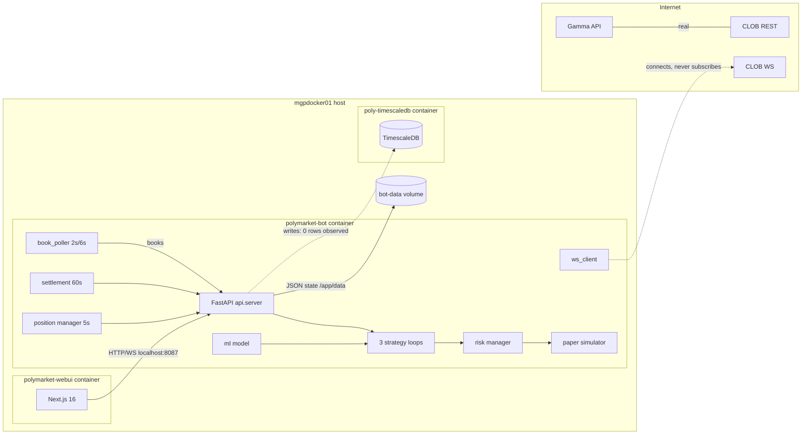
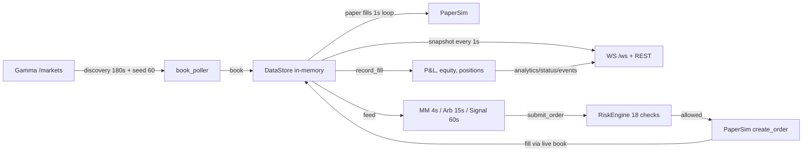
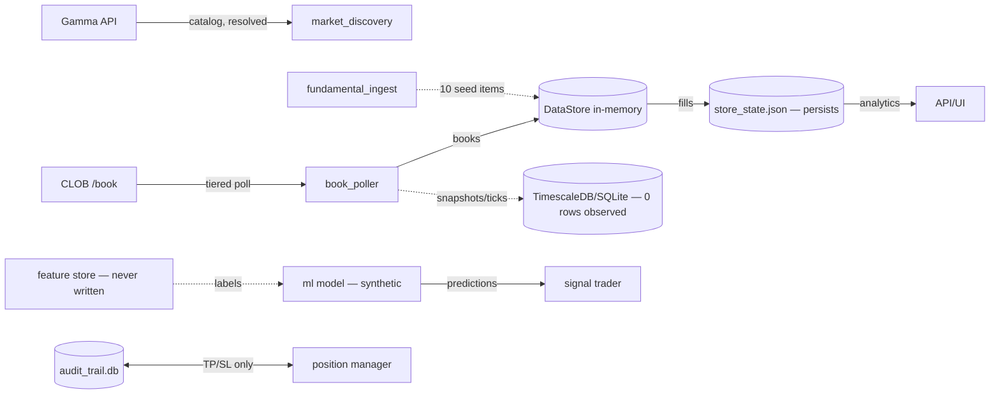

# Current State Assessment — Polymarket Bot (polymarket-bot-ai)

- **Date:** 2026-08-17
- **Repository revision:** N/A — the directory is **not a Git repository** (verified: `git rev-parse HEAD` fails). No VCS revision pinning, no commit history, no rollback capability.
- **Assessor scope:** This document is a read-only, evidence-based assessment of the project exactly as it exists. No source code, configuration, schema, infrastructure, dependency, or documentation was modified during this assessment.
- **Deployment assessed:** Docker Compose stack on remote host `mgpdocker01` (10.73.89.150), paper profile, containers `polymarket-bot` / `polymarket-webui` / `polymarket-timescaledb`. Local machine: Windows, Python 3.14.4 (deps not installed — see Limitations).

---

## 1. Executive Summary

The project is a **prediction-market trading bot for Polymarket** with a FastAPI backend (Python 3.11), a Next.js 16 web dashboard, and a TimescaleDB/PostgreSQL + SQLite storage layer. It is currently running **24/7 in paper-trading mode** against **real live Polymarket market data** (Gamma API + CLOB REST order-book polling).

What works end to end (verified at runtime):

- Real market-data ingestion (819 order books tracked, tiered REST polling at 2 s / 6 s, ~100% poll success).
- A paper-trading engine that fills orders against the live book and tracks positions/P&L.
- Three real trading strategies (market making, arbitrage scanning, ML-signal trading) that place and manage orders; multiple paper fills were observed during this assessment.
- A 18-check pre-trade risk engine that is genuinely enforced in paper mode.
- A 10-tab web dashboard whose every API call maps to an existing backend endpoint (verified path-by-path), now rendering real data (analytics/status/snapshot all HTTP 200 during verification).

What is aspirational, synthetic, or broken (all verified):

- **47 of the claimed 50 strategies are metadata-only no-op stubs** that the UI can "start" and display as Running.
- **The ML model is trained on synthetic data with fake coin-flip labels**; online learning, drift-triggered retraining, and model reload are all dead code; the "vector database" is lexical TF-IDF; the "AI copilot" is template-based text.
- **The database layer persists nothing in the deployed configuration**: TimescaleDB and the SQLite fallback both contain **0 rows** across all four tables after hours of operation (verified via API and direct sqlite inspection). Market data lives only in memory.
- Backtest results, OHLCV candles, system health, "100,000+ sources" news, whale alerts, and telemetry are **fabricated** (hardcoded or random-generated).
- **Live trading is not operational**: there is no live fill detection (no order polling, no user-fill websocket handling), no partial-fill support, no exchange-side reconciliation, settlement only handles YES tokens, and take-profit/stop-loss are log-only. Enabling live mode today would produce incorrect P&L and positions.
- **Security is absent**: no authentication or authorization on any endpoint (including trade placement, order cancellation, kill switch, config mutation); CORS is `allow_origins=["*"]` with credentials.

Maturity: **early-stage prototype / demo-grade paper trading simulator with real market data and a strong cosmetic shell.** The risk engine and paper engine are the most credible subsystems; everything presented as "AI/quant institutional infrastructure" is largely simulated.

---

## 2. Overall Maturity Score

| Area | Score (0–5) | One-line evidence basis |
|---|---|---|
| Product completeness | **2** | Real paper trading + dashboard; 47/50 strategies stubs; analytics/backtest/news/health synthetic |
| Architecture | **3** | Clean module layering and single-entry FastAPI; dead duplicate modules and dual DB paths |
| Bot engine | **2** | Ingestion + strategy loops work; WS feed dead; `main.py run/paper` path has no data feed |
| Execution safety | **2** | Risk gate enforced in paper; weekly stop unenforced, knobs decorative, live fill detection missing |
| AI/ML maturity | **1** | Real sklearn ensemble on synthetic coin-flip labels; learning/retraining/reload dead; meaningless PSI |
| Strategy validation | **1** | No real backtest; Monte-Carlo archetype simulation; no benchmark, no walk-forward |
| Risk management | **3** | 18-gate engine genuinely enforced; weekly stop dead, NO-side invisible, baseline inconsistency |
| Data quality | **1** | 0 rows persisted in any market-data table; synthetic labels; fabricated news/ohlcv; no lineage |
| Backend/API | **3** | 40+ endpoints, all mapped to UI; several return synthetic payloads; no auth; partial PUT config |
| Web UI | **3** | Complete functional single page, all endpoints wired; no tests, one tab architecture, fabricated fallbacks |
| UI/UX | **2** | Dense, consistent dark trading UI; zero accessibility, fixed non-responsive terminal grid, no confirmations |
| Security | **1** | No auth anywhere; CORS `*`+credentials; secrets empty; no rate limiting; no audit of orders/fills |
| Testing | **1** | 13 unittest cases, none run in CI; tests assert fabricated numbers; dead-module import; no UI/api tests |
| Observability | **1** | Logs + basic watchdog; health endpoint hardcoded HEALTHY/42.5ms; no metrics, tracing, alerts |
| DevOps | **3** | Compose profiles, healthchecks, volumes, restart:always; no CI/CD, no git, manual uploads to deploy |
| Documentation | **2** | README partially stale (risk numbers from old regime); UX_ASSESSMENT exists and honest; no ADRs |
| Production readiness | **2** | Paper service is stable 24/7; live would be unsafe (no fills/reconciliation/settlement gaps) |

**Overall maturity ≈ 2.1 / 5 — early prototype.** A critical distinction must be called out regardless of average: **execution/P&L accuracy in live mode, the persistence layer, and security are Critical gaps** and are assessed independently below (Sections 23–24).

---

## 3. Assessment Methodology and Limitations

Method:

1. Full repository inventory (all source/config/test/infra files; generated artifacts excluded).
2. Full reads of the 26 largest backend modules, all webui sources, manifests, and the test suite.
3. Static cross-checks (grep) for wiring claims: callers of `ws_client.subscribe`, `record_feature_vector`, `record_outcome`, `training_orchestrator.start`, `get_open_orders`, CORS, auth dependencies.
4. Runtime verification against the live deployment via read-only HTTPS/HTTP requests and container inspection (`docker exec`): `/api/health`, `/api/status`, `/api/snapshot`, `/api/analytics`, `/api/system/health`, `/api/ml/metrics|registry|drift`, `/api/database/records`, `/api/arbitrage/opportunities`, `/api/history/ohlcv`, `/api/analysis/news|/stats`, `/api/strategies/catalog`, `/api/audit/logs`, `/api/leaderboard`, `/api/markets/coverage`, `/api/analysis/deep`, `/api/depth`, `/api/orderbooks`, direct SQLite row-count inspection in the container, container data-dir listing.
5. Local syntax validation of all 46 Python files via `ast.parse` (no writes).

Limitations (honest scope boundaries):

- **Tests were not executed.** The local machine (Python 3.14.4) has none of the project's dependencies installed and, per assessment constraints, no dependencies were installed and no environment was altered. The web UI was not rebuilt locally (no `node_modules`); buildability is evidenced by successful remote Docker builds in this deployment.
- **No live-trading validation possible:** `.env` contains no wallet/API credentials and `LIVE_TRADING_ENABLED=false`; the live path is therefore gated by design and unverifiable, which is itself a finding.
- **POST endpoints were not exercised** (e.g., `/api/trade`, `/api/kill-switch/*`) to avoid any state change; only safe GETs were issued.
- Where a capability was not exercised end to end, the status is marked `Unknown — insufficient evidence` rather than assumed working.
- Every important claim in this document carries evidence (`file:line`, endpoint, test name, or runtime observation) and a confidence marker: **High** (directly verified), **Medium** (strong static inference), or **Low** (inferred).

---

## 4. Product Vision and Goals

Evidence from repository text (README, docstrings, UX_ASSESSMENT.md, UI copy):

| Claimed vision element | Evidence |
|---|---|
| "24/7 Polymarket Pro Algorithmic Workstation with 50+ Strategies, Vector DB, and AI Copilot" | `api/server.py:302-306` (FastAPI title/description) |
| "50+ Quantitative Strategies" engine | `strategies/registry.py:31-93` (50 catalog entries); UI "50+ Strategies" tab |
| "100,000+ Global Fundamental News Ingestion Engine" | `core/fundamental_ingest.py:1-6` |
| "Embedded Semantic Vector Database" | `ml/vector_store.py:2` |
| "Institutional risk" ($100 operating / $200 ceiling) | `risk/manager.py:42-57`, `config.py:36` |
| Institutional-style test suite ("Phase 3–6" naming: DB, ML, execution, risk) | `tests/test_institutional_suite.py:1-9` |
| Product name/branding "Polymarket Pro 4.0" with badges "Calibrated", "1-Click", "WAL", "Monte Carlo" | `webui/src/components/Header.tsx:46-50,66` |

Target user and business model: **not evidenced.** No pricing, licensing, docs describing users, market analysis, or revenue model exist anywhere in the repo. The implied target is a solo quant/operator running the bot on their own account; no multi-user or SaaS framing exists.

**Vision vs reality:** The vision is an institutional-grade, self-managing quant workstation. The reality is a single-user paper-trading demo whose "institutional" layers (50 strategies, vector DB, copilot, 100k-source news, backtesting, ML feedback loops) are labels over stubs or synthetic data. The honest core — real market data ingestion, paper fills, a strict risk gate, and one good dashboard — is real and works.

---

## 5. Repository and Technology Inventory

### 5.1 Languages, frameworks, services

| Layer | Technology | Evidence |
|---|---|---|
| Backend | Python 3.11, FastAPI, uvicorn, httpx, websockets, Pydantic v2, Typer, Rich | `Dockerfile:2`, `requirements.txt:4-25` |
| Trading signing | eth-account (EIP-712, CLOB orders) | `requirements.txt:16`, `core/clob_client.py:257-285` |
| ML | scikit-learn (RF + GB + SGD ensemble), numpy | `requirements.txt:28-29`, `ml/model.py:146-164` |
| Storage | TimescaleDB/PostgreSQL (asyncpg) + SQLite fallback + JSON state file | `requirements.txt:13`, `core/timescale_db.py`, `core/data_store.py:285-330` |
| Frontend | Next.js 16.3.1, React 19.2.8, Tailwind v4, TypeScript 5, standalone output | `webui/package.json:12-24`, `webui/next.config.ts:5` |
| Process mgmt | supervisord (bot + watchdog) | `supervisord.conf:20-21`, `Dockerfile:24,42` |
| Deploy | docker-compose v2, 3 profiles (paper/live) + webui + timescaledb | `docker-compose.yml:10-139` |
| External services | Polymarket Gamma API (real), CLOB REST (real), CLOB WS (connects, never subscribes), data-api (configured, unused) | `config.py:28-31`, runtime verification |

### 5.2 Inventory (source files only; pycache/node_modules/.next excluded)

- **Python backend: 46 files, ≈8.6 kLOC.** Largest: `api/server.py` (1178), `core/timescale_db.py` (418), `core/data_store.py` (417), `core/clob_client.py` (346), `risk/manager.py` (278), `strategies/market_maker.py` (262).
- **Web UI: 24 components + 2 hooks + 2 libs + 2 app files + 5 configs (≈3 kLOC TS/TSX).** Single route `/` (Trading Desk) with 10 tabs.
- **Tests: 1 file, 380 lines, 13 test methods** (`tests/test_institutional_suite.py`).
- **Docs: README.md, docs/UX_ASSESSMENT.md** — no ADRs, no roadmap, no runbooks.
- **No git repository** — entire history and provenance unavailable.

### 5.3 Entry points and runtime processes

| Entry point | What runs | Status |
|---|---|---|
| `main.py serve` (docker path, supervisord) | uvicorn `api.server:app` + lifespan services | **Operational** (verif. live) |
| `main.py run` / `paper` (CLI + Rich TUI) | paper_sim + ws_client + 3 strategies + dashboard | **Broken**: no book poller/discovery/feed started; WS never subscribes ⇒ no market data (static: `main.py:117-158`, `ws_client.py:100-101`) |
| `main.py markets/status/cancel-all` | CLI subcommands | Operational (static) |
| `watchdog.py` | 30 s health ping → supervisorctl restart after 3 failures | Operational (verify: `/app/logs/watchdog.log`) |

---

## 6. Complete Feature Matrix

Status: [`Implemented` / `Partially implemented` / `Placeholder or mocked` / `Configured but inactive` / `Experimental` / `Deprecated or obsolete` / `Missing` / `Unknown`] — Confidence H/M/L.

| Domain | Feature | User value | Status | Frontend | Backend | Data | Tests | Evidence | Conf. |
|---|---|---|---|---|---|---|---|---|---|
| Market data | Gamma catalog discovery | Find markets | **Implemented** | — | `core/market_discovery.py` | real | test_09 (mocked) | runtime: 700 markets, 100% coverage | H |
| Market data | Order-book polling (tiered) | Live prices | **Implemented** | MarketsPanel | `core/book_poller.py:75-76` | real, in-memory | none | runtime: 819 books, 3551+ polls, 0 errors | H |
| Market data | WebSocket price feed | Low-latency feed | **Broken/inactive** | useBot (WS) | `core/ws_client.py` | — | none | `subscribe()` never called (grep); server WS broadcast works (verify 1 s snapshots) | H |
| Market data | Historical OHLCV | Chart | **Placeholder** | MarketChartModal | `api/server.py:524-558` | synthetic | none | random-walk candles; runtime sample confirms | H |
| Trading (paper) | Order placement/cancel | Simulated trading | **Implemented** | OrdersPanel | `paper/simulator.py` | in-memory | none | runtime: paper orders/cancels in events feed | H |
| Trading (paper) | Fill simulation vs live book | Realistic fills | **Implemented** | TradesPanel | `paper/simulator.py:88-121` | live book | test_11 (store-level) | runtime: 2–3 fills observed | H |
| Trading (live) | Real order placement | Real money | **Partially implemented** | — | `core/clob_client.py` | — | none | signing exists; placement never exercised; fill detection missing | H |
| Trading (live) | Fill/partial-fill detection | Correct P&L | **Missing** | — | `PARTIALLY_FILLED` never set (`data_store.py:37`); no order polling (grep) | — | none | static High | H |
| Strategies | Market making (A-S) | Provide liquidity | **Implemented** | StrategyMatrix badge | `strategies/market_maker.py` | live | none | runtime: quotes placed/cancelled | H |
| Strategies | Dutch-book arb | Riskless profit | **Partially implemented** | ArbitrageMatrixView | `strategies/arb_scanner.py` | synthetic NO side | none | runtime: 1 arb fill observed; `1-bid-0.005` fake NO ask (`:80-81`) | H |
| Strategies | ML signal trader | Alpha signals | **Implemented** | MLPanel | `strategies/signal_trader.py` + `ml/model.py` | synthetic training | test_04/05 (synthetic) | runtime: orders placed, 1 fill @0.95 | H |
| Strategies | 47 additional catalog strategies | Breadth | **Placeholder** | StrategyMatrix toggle | `strategies/registry.py:118-120` (`pass`) | — | — | static; UI shows "Running" for stubs | H |
| Risk | Pre-trade gate (18 checks) | Loss control | **Implemented** | RiskStatusPanel | `risk/manager.py:91-210` | in-memory | test_01…03 | runtime: status/reconcile 200 with real limits | H |
| Risk | Weekly loss stop | Loss control | **Missing** | — | `manager.py:56` defined, never enforced (grep) | — | none | static | H |
| Risk | TP/SL exits | Protect positions | **Partially implemented (log-only)** | — | `core/position_manager.py:73-96` | audit only | none | runtime: audit rows "executed" while no exit order placed | H |
| Risk | Kill switch | Emergency stop | **Implemented (paper)** | Header | `server.py:834-845`, `manager.py:212-219` | — | none | static; no exchange cancel in live | H |
| Basket | Settlement (resolve winners) | Finalize positions | **Partially implemented** | — | `core/settlement.py` | YES only | none | `outcomePrices[0]` only (`settlement.py:73,97`); NO never settled | H |
| Storage | TimescaleDB snapshots/ticks | Historical data | **Broken at runtime** | DatabaseExplorerView | `core/timescale_db.py` | **0 rows** | test_03 (market_db, not used in prod) | runtime: API + direct sqlite = 0 rows all tables | H |
| Storage | SQLite fallback | Resilience | **Broken at runtime** | — | `core/timescale_db.py:220-233` | **0 rows** | — | runtime: direct sqlite inspection | H |
| Storage | State persistence (JSON) | Restart recovery | **Implemented** | — | `core/data_store.py:285-330` | file exists | test_11 | runtime: `/app/data/store_state.json` present (4.3 KB) | H |
| Storage | Durable audit trail | Compliance | **Partially implemented** | — | `core/audit_logger.py` | real (SQLite) | none | runtime: 750+ rows, only TP/SL events | H |
| ML | Feature extraction (32) | Model inputs | **Implemented** | — | `ml/features.py` | partially hardcoded | test_04 | static | H |
| ML | Ensemble model (RF+GB+SGD) | Probabilities | **Implemented (synthetic)** | AIMLCommandCenter | `ml/model.py` | **3000 synthetic samples** | test_05 (synthetic holdout) | runtime: registry shows `n_samples:3000`, AUC 0.8192, Brier 0.1758 | H |
| ML | Online learning (SGD) | Adaptivity | **Missing (dead)** | — | `record_outcome` (`signal_trader.py:227`) zero callers; `/api/ml/learn` stub (`server.py:903-905`) | — | — | static | H |
| ML | Auto-retrain on drift | Model freshness | **Missing (dead)** | — | `training_orchestrator.py` never started; would crash on `reset()` (`:76`) | — | — | static | H |
| ML | Model persistence/load | Stability across restarts | **Broken** | — | `load_or_create` never loads pkl (`model.py:286-291`) | — | — | runtime: 5 registry versions, 2 simultaneously ACTIVE | H |
| ML | Vector store | Semantic search | **Placeholder** | AIML search | `ml/vector_store.py` — TF-IDF word/bigram | metadata only | — | static; docstring claims embeddings | H |
| ML | AI Copilot | Q&A | **Placeholder** | AICopilotPanel | `ml/copilot.py` — templates, no API | — | — | static | H |
| ML | Drift detection (PSI) | Degradation alarm | **Partially implemented** | AIMLCommandCenter | `ml/drift_detector.py` (uniform baseline) | — | — | runtime: PSI 3.35 "SIGNIFICANT_DRIFT" nag; nothing acts on it | H |
| Analytics | Equity curve | Track performance | **Implemented** | EquityCurve | `api/server.py:377` + `data_store.py:261-267` | in-memory | test_11 | runtime: endpoint 200, points real | H |
| Analytics | Win-rate + Wilson CI | Performance rigor | **Partially implemented** | (raw % only) | `api/server.py:394-404` | computed | none | backend computes CI; UI shows only % (AnalyticsPanel.tsx:49-51) | H |
| Analytics | Leaderboard / risk-adjusted score | Strategy comparison | **Implemented** | LeaderboardPanel | `core/portfolio.py:222-253` | computed | test_12 | runtime: 1 ranked strategy | H |
| Analytics | Backtest lab | Strategy validation | **Placeholder** | BacktestLabView | `backtesting/engine.py` Monte-Carlo archetypes | synthetic | test_06 (structural) | static | H |
| Analytics | Deep market analysis (9-factor) | Opportunity ranking | **Partially implemented** | DeepAnalysisView | `core/analysis_engine.py` — real books, hardcoded volumes/fee (`:55,72`) | hybrid | test_07 | runtime: opportunities list returned | H |
| Analytics | News & whale signals | Sentiment edge | **Placeholder** | (badge) | `core/fundamental_ingest.py` (10 seed items, sleep-only crawler); `deep_analysis.py:191-195` (3 demo alerts) | synthetic | test_10 (asserts 100,000+ numbers!) | runtime: news=10 items, sources_indexed=105048 | H |
| Analytics | System health | Ops trust | **Placeholder** | SystemHealthView | `api/server.py:1111-1156` hardcoded HEALTHY/42.5ms/UP | — | none | runtime confirmed | H |
| Admin | Strategy config (GET/PUT) | Tune bot | **Partially implemented** | StrategyConfigModal | `api/server.py:578-611` — 2 of 4 knobs ignored on PUT | — | none | static (`max_total_exposure_usdc`, `max_open_orders` never written) | H |
| Admin | Manual trade | Direct control | **Implemented** | DepthChartModal/MarketChartModal | `api/server.py:696-736` w/ risk gate | — | none | static | H |
| Admin | DB explorer | Inspect data | **Implemented (empty data)** | DatabaseExplorerView | `api/server.py:1089-1106` (SQLite, param.) | empty | none | runtime: empty tables | H |
| Security | Authentication | Protect funds | **Missing** | — | no auth dependency anywhere (grep) | — | — | static | H |
| Security | CORS control | Browser isolation | **Insecure** | — | `server.py:309-315` `*` + credentials | — | — | static | H |
| Observability | Logs (INFO) | Debug | **Implemented** | — | `main.py` serve → `settings.log_level` | file | — | runtime: `/app/logs/bot.log` INFO | H |
| Testing | Automated tests | Quality | **Partially implemented** | — | unittest, 13 cases | — | yes | not run (env); no CI | M |

---

## 7. Architecture Assessment

### 7.1 Style and boundaries

- **Style:** Monolithic FastAPI application with a synchronous in-memory domain core (`core/`), async strategy loops, and a single synchronous UI. No services mesh, no queues, no worker processes other than supervisord's watchdog.
- **Dependency direction:** `api/` → {`core/`, `strategies/`, `risk/`, `ml/`, `paper/`, `backtesting/`, `execution/`}; `strategies/` → {`core/`, `risk/`, `paper/`, `ml/`}; `ml/` → {`core/`(timescale_db), `risk/`?}. Generally one-way and clean at the package level (High confidence).
- **State:** A single `core/data_store.DataStore` global singleton (`data_store.py:417`) holds books, orders, positions, trades, events, balance. Paper simulator, risk engine, strategies, API handlers, and WebSocket broadcast all read/write this shared object.
- **Communication:** Everything is in-process. "Realtime" to the UI = FastAPI WebSocket `/ws` broadcasting a full snapshot every 1 s (`server.py:212-220`); no partial updates.
- **Scheduling:** ad-hoc asyncio task loops with fixed sleeps: 2 s / 6 s pollers, 60 s settlement, 5 s TP/SL, 15 s arb, 60 s signal, 4 s MM, 180 s discovery, 600 s reseed, 30 s state save, 1 s paper fill loop.

### 7.2 Diagrams (verified paths solid; inferred/inactive dashed)





### 7.3 Architectural inconsistencies

- **Dual storage stacks that contradict each other:** `core/timescale_db.py` (Postgres async) + `core/market_db.py` (SQLite duplicate, used only by tests) + `core/data_store.py` JSON state + `core/audit_logger.py` dedicated SQLite. The API's DB explorer reads the SQLite fallback even when Postgres is claimed active (`server.py:1093-1106`).
- **Two singleton classes with the same name:** `core/analysis_engine.deep_analysis_engine` vs `core/deep_analysis.deep_analysis_engine` (`analysis_engine.py:172`, `deep_analysis.py:189`) — different implementations of the same concept.
- **Two paper-balance sources of truth:** `paper_sim._virtual_balance_usdc` vs `store.paper_balance`; API reports the former (`server.py:290,364`), analytics equity the latter (`server.py:424`).
- **Two equity baselines:** `data_store.BANKROLL_BASELINE=100` (`data_store.py:25`) vs `risk/manager.py` computing equity as `200 + daily_pnl` (`manager.py:125`).
- **Private-lock abuse:** `store._lock` used directly by 6+ modules (`settlement.py:96`, `position_manager.py:51`, `deep_analysis.py:133`, `server.py:225,379,678,791` …), while many reads mutate without any lock (`risk/manager.py:161-194`, `portfolio.py:30-58`, `market_maker.py:173`, settles races with the 1 s fill loop).
- **Unreachable code paths competing with real ones:** `main.py run/paper` (no feed), `ws_client` (no subscriptions), `market_db` (tests only), `training_orchestrator` (never started), `smart_router.twap` (never called outside tests).

---

## 8. Bot and Execution-Engine Assessment

### 8.1 Lifecycle (verified, serve mode)

`supervisord` → `python main.py serve` → uvicorn lifespan (`api/server.py:139-207`): Postgres pool → paper_sim → seed 60 markets → discovery (180 s) → book poller (2 s/6 s) → ws_client (connect only) → settlement (60 s) → fundamentals (seed+loop) → position manager (5 s) → 3 strategies → 4 background loops (broadcast 1 s, reseed 600 s, token sync 20 s, state save 30 s). Clean shutdown cancels and saves (`server.py:189-207`).

### 8.2 Ingestion

- **REST polling** is the only functional feed: Tier-1 every **2 s**, Tier-2 every **6 s**, concurrency cap 12, 6 s timeout (`book_poller.py:23-26,75-76`). Verified healthy at runtime (0 errors, thousands of polls).
- **No book eviction/staleness handling** — `data_freshness_seconds` is reported but nothing refreshes or purges stale books (`server.py:434`).
- **WebSocket feed is dead:** `ws_client.subscribe()` has zero callers (grep): the socket connects and pings but never subscribes to `market` channels; all handler registrations are unused (`ws_client.py:48-54,100-101`). Effect on the current deployment: none, since polling covers the books — but the architecture claims a realtime feature that does not exist.

### 8.3 Order lifecycle

- Paper: `submit_order` (risk-gated) → `paper_sim.create_order` → 1 s matching loop vs live book (`simulator.py:88-121`) → **full-size fills only**; no partial fills, queue position, slippage, or fees. `OrderStatus.PARTIALLY_FILLED` exists but is never set.
- Live: EIP-712-signed POST to CLOB (`clob_client.py:217-342`) with a uuid4 `order_id` as the only idempotency hook; **no retries, no rate-limit handling, no order-status reconciliation, errors swallowed** (`clob_client.py:314-319`). `get_open_orders/get_positions/get_trades/get_balance` exist but are never called → live fills, positions, and realized P&L are **never detected or updated**.
- Kill switch: local only (`manager.py:218-219`) — no exchange-wide cancel.

### 8.4 Position, P&L, settlement

- `record_fill` maintains weighted-average entry, realized P&L, equity history (`data_store.py:228-267`). Verified: analytics equity/P&L/positions consistent at runtime.
- **TP/SL is log-only** (`position_manager.py:73-96`): trigger writes an audit row ("Stop-Loss executed @ …") and a log — no exit order is placed. Disingenuous "executed" wording confirmed in live audit logs.
- **Settlement resolves only the YES outcome** (`settlement.py:73,97,100-101`): NO-side positions never settle; all settlement trades are marked `paper=True` regardless of mode (`settlement.py:112`); idempotency is in-memory only.

### 8.5 Deduplication and recovery

- MM re-quotes when quotes vanish/mid moves (`market_maker.py:168-185`), but reads `store.open_orders` without the store lock.
- Signal trader dedups per market, cancels stale orders after 180 s (`signal_trader.py:187-210`).
- **Arb has no dedup** — a lingering Dutch-book opportunity can re-execute on successive 15 s scans.
- Restart recovery relies on the 30 s JSON state save; in-memory-only data (books, open orders, events, news, `_settled_tokens`) is lost on restart.

### 8.6 Traced end-to-end path (verified in paper)

```
Gamma catalog → book_poller (2s) → DataStore.book → MM strategy (4s) computes
A-S reservation price → submit_order → risk gate (18 checks, passed) →
paper order → 1s fill loop matches vs live ask → record_fill → trade+position+
equity update → /api/analytics + /api/snapshot → UI panels (observed 200s).
```

---

## 9. AI/ML Engine Assessment

### 9.1 Capability matrix

| Capability | What exists | Data | Maturity | Evidence |
|---|---|---|---|---|
| 32-feature pipeline | Real numeric extraction, 2 heuristics (hurst 0.55/0.45, cluster_corr 0.50) | live book + hardcoded vols | Implemented | `ml/features.py:148,152`; `analysis_engine.py:55` |
| Ensemble classifier | RF(100,d3) 0.45 + GB(60,d4) 0.40 + SGD 0.15 | **3000 synthetic samples; fake labels** (`p>=0.5 & rand<p` coin-flip) | Functional but synthetic | `ml/model.py:146-164,250`; `timescale_db.py:371` |
| Calibration claim | Docstring says "Isotonic calibration" | — | **False claim** — no calibration object | `ml/model.py:8` vs grep |
| Validation | Brier/AUC/log-loss/ECE on **synthetic holdout from same generator** | synthetic | Invalid (no generalization signal) | `model.py:177-209`; runtime Brier 0.1758/AUC 0.8192 |
| Feature store | `ml_feature_store` table + `record_feature_vector` | **never written (0 callers)** | Broken | `timescale_db.py:313-350`; runtime 0 rows |
| Model persistence | `load_or_create` **never loads** `model.pkl`, always retrains | — | Broken | `model.py:286-291`; runtime: 5 versions, 2 ACTIVE simultaneously (v1.554.0, v1.595.0) |
| Online learning | SGD `update()` via `record_outcome` | **zero callers** | Dead | `signal_trader.py:227`; runtime `n_online_updates: 0` |
| Auto-retraining | `training_orchestrator.start()` | **never called**; would crash (`reset()` missing) | Dead | `training_orchestrator.py:76` |
| Drift (PSI) | vs **uniform baseline**, not training distribution | — | Misleading | `drift_detector.py:25,29`; runtime PSI 3.35 → "SIGNIFICANT_DRIFT" with no action |
| Vector store | TF-IDF word/bigram cosine | metadata JSON only | Placeholder | `vector_store.py:24-63,121-143` |
| Copilot | Rule/template answers + TF-IDF | — | Placeholder | `copilot.py:101-140` |
| Registry | Version gate (Brier ≤0.22, AUC ≥0.70) | synthetic metrics | Implemented (on fake inputs) | `model_registry.py:83-93` |
| ML in trading | SignalTrader calls `ml_model.predict` → BUY/SELL + fractional Kelly | synthetic-trained | **Active** | `signal_trader.py:136-171`; runtime fills |

### 9.2 Bias/leakage findings

- **Target leakage / fake labels:** training labels are conditioned on the model's own predictions plus randomness — no ground truth anywhere (`timescale_db.py:371`).
- **Non-reproducible:** labels use `np.random.uniform` with no seed.
- **Training-serving skew:** training uses hardcoded meta-features; serving uses the same hardcoded volumes in analysis.
- **Uncalibrated probabilities** presented as calibrated; confidence thresholds (0.52/0.48) on unvalidated outputs.
- **Meaningless drift metric** ("SIGNIFICANT_DRIFT" at PSI 3.35 against uniform) displayed as an ML health signal while no retraining trigger exists.
- **Models that are never invoked aside from signal trader:** copilot (template), analysis engine (scoring only), deep analysis (display). The **only** trading-decision use is the synthetic-trained ensemble.

> **Assessment:** the ML system is a well-structured demo whose metrics are computed on the same synthetic generator used for training. None of its "learning" machinery (SGD updates, drift retrain, feature store) is wired, and drift telemetry actively misleads.

---

## 10. Strategy and Quantitative Assessment

| Strategy | Market/ TF | Entry / Exit | Sizing | Risk coupling | Backtest | Evidence at runtime | Status |
|---|---|---|---|---|---|---|---|
| `mm_avellaneda_stoikov` | top ~20 by 24h vol; 4 s cycle | A-S reservation price `mid − qγσ²`, half-spread, re-quote on fill/cancel/mid move | $1.50/quote, ≤$15 inv | risk gate + own inventory cap | none (archetype) | 4–6 open quotes, cancels/replaces observed | **Active — real** |
| `arb_binary_dutch_book` | top 60 binary pairs; 15 s | long YES+NO if sum < 0.995 (FOK) — **NO ask fabricated as `1−bid−0.005`** | $1.50 | risk gate per leg | none | 1 paper fill observed (bitcoin-above-64k @ 0.239) | **Active — real logic, synthetic NO side** |
| `ml_random_forest_quant` | top 40; 60 s scan | BUY p≥0.52 / SELL p≤0.48, one position per market, stale 180 s recycle | fractional Kelly ×0.25, clamp [$0.5, $3] | risk gate | none | orders placed; fill @0.95 observed | **Active — real logic, synthetic model** |
| 47 catalog entries | — | `_execute_cycle = pass` | — | none | none | toggle returns 200 "Running" | **Placeholder stubs** |

Quant performance evidence: **not meaningfully available.** The leaderboard shows 1–3 fills with net P&L ≈ 0 (runtime). No backtest with real data (engine is Monte-Carlo archetypes: "mm" 68% win/$8.50, "arb" 94%/$4.20 etc., `backtesting/engine.py:105-129`), no walk-forward, no benchmark, no fees/slippage modeling (flat bps only). **Any performance claims derived from the current analytics (win rate, profit factor, CI) reflect a handful of paper fills and must not be extrapolated.** No historical performance is claimed as future profitability in this report.

Key quant risks: no partial fills/queue modeling; paper fills at book touch without depth consumption; arb pairs assumed [YES,NO] by index (`gamma_client.py:157-158`); synthetic NO price can create phantom "arbitrage".

---

## 11. Data Architecture and Lineage



- **Sources:** Polymarket Gamma + CLOB are the only *real* sources. data-api configured, unused. News/GDELT-tier sources: names only; no HTTP calls anywhere outside Polymarket (grep + static; `fundamental_ingest.py:223-232` sleeps 60 s, does not fetch).
- **Reliability:** poller 100% recent success; no staleness eviction; no dedup/sanitization of books.
- **Validation/normalization:** none beyond typed dataclasses; timestamps are epoch float, no TZ logic.
- **Persistence reality (deployed):** TimescaleDB **and** SQLite fallback **0 rows** across `market_snapshots/orderbook_ticks/fundamental_news/ml_feature_store` (verified twice: API + in-container sqlite). The declared hypertables exist yet ingest nothing — writes are fire-and-forget tasks with swallowed exceptions (`book_poller.py:150-173`, `timescale_db.py:217,257,296,335`). **The entire data-historical layer is non-functional in production.**
- **Lineage:** none; no schema versioning/migrations (CREATE IF NOT EXISTS only, `timescale_db.py:118-182`).
- **Sensitive data:** wallet keys are empty in `.env`; `store_state.json` holds trading state only. No PII handling exists (none needed for single user). Secrets are env-based with sane `.gitignore`/`.dockerignore` patterns.

---

## 12. Backend and API Inventory

**Framework:** FastAPI, no routers/versioning, no auth dependencies. **~45 endpoints.** Summary of notable ones (complete list verified to exist):

| Method & Path | Purpose | Consumer | Persistence | Validation | Errors | Status |
|---|---|---|---|---|---|---|
| GET /api/health | liveness | watchdog, compose | — | — | — | OK (verif.) |
| GET /api/status | risk + mode + poller | UI | in-memory | — | — | OK (verif.) |
| GET /api/snapshot | full state | UI/WS | in-memory | — | — | OK (verif.) |
| GET /api/analytics | P&L/win-rate/CI | UI | computed | — | 500 fixed 2026-08-17 (`store.mode`) | OK (verif.) |
| GET /api/history/equity | equity series | UI | in-memory cap 300 | — | — | OK |
| GET /api/exposure | decomposition | (unused by UI) | compute | — | — | OK |
| GET /api/risk/reconcile | reconciliation verdict | UI | compute | — | — | OK (verif.) |
| GET /api/leaderboard | ranking | UI | compute | — | — | OK (verif.) |
| GET/POST /api/strategies/catalog·toggle | 50 catalog | UI | — | toggle starts stubs | — | OK, stubs issue |
| POST /api/kill-switch/* | emergency stop | UI | local only | none | — | OK |
| POST /api/risk/observation-mode | gate | (unused) | — | none | — | OK |
| POST /api/ai/copilot | Q&A | UI | — | none | — | template replies |
| GET /api/ai/search | TF-IDF | UI | — | — | — | OK |
| GET /api/history/ohlcv/{id} | candles | UI | — | — | — | **synthetic** |
| GET /api/markets(+coverage/catalog) | discovery | UI/screener | real Gamma | — | 502 on upstream error | OK |
| GET /api/depth, /api/orderbooks | books | UI | in-memory | — | — | OK |
| POST /api/trade | manual order | UI | risk-gated | price/side bounded | 400 on rejection | OK |
| GET/DELETE /api/orders(+/{id}) | orders | UI | in-memory | — | — | OK |
| GET /api/positions, /api/trades | state | UI | in-memory | — | — | OK |
| GET/PUT /api/config | tuning | UI | mutates settings | ranges; **2 fields ignored on PUT** | — | partial |
| GET /api/ml, /metrics, /registry, /drift | ML telemetry | UI | synthetic metrics | — | — | OK (verif.) |
| POST /api/ml/retrain | retrain | UI | real fit | — | — | OK |
| POST /api/ml/learn | "learn" | none | — | — | — | **dead stub** |
| GET /api/analysis/* | analysis/news/stats | UI | hybrid | — | — | news synthetic (verif.) |
| POST /api/backtest/run | backtest | UI | — | — | — | **Monte-Carlo** |
| GET /api/audit/logs | audit | (unused by UI) | SQLite | — | — | OK (verif., TP/SL only) |
| GET/POST /api/arbitrage/* | arb | UI | synthetic NO | — | — | mostly fictional |
| GET /api/database/records | DB explorer | UI | SQLite (empty) | whitelist+param | — | OK, empty data |
| GET /api/system/health | health | UI | — | — | — | **hardcoded** (verif.) |
| WS /ws | 1 s snapshot push | UI | in-memory | ignores client input | ping 30 s | OK |

Cross-cut: no authentication/authorization on any endpoint; no request ID/tracing; blocking sklearn calls in async handlers (`signal_trader.py:136`, `analysis_engine.py:57-58`); errors generally swallowed or generic.

---

## 13. Web Pages and Component Inventory

Single route `/` (Trading Desk) + 10 tabs; all client components:

| Tab | Component(s) | Data dependency | Actions | Loading/Empty/Error | Status |
|---|---|---|---|---|---|
| Trading Desk | Markets/Positions/Orders/Trades/EventLog + side: Risk, Equity, Analytics, ML | useBot snapshot (WS+REST) + 5 extra polls | cancel order, cancel all, kill switch | good empty states; no error states | **Functional** (verif. rendering after 2026-08-17 fixes) |
| Arb Matrix | ArbitrageMatrixView | `/api/arbitrage/opportunities` | 1-click execute | loading/error/feedback good | Functional (data mostly fictional) |
| Strategies | StrategyMatrix + LeaderboardPanel | catalog/toggle + leaderboard | start/stop any strategy | no loading/error state | Functional; **toggles no-op stubs** |
| AI/ML | AIMLCommandCenter | ml metrics/registry/drift/retrain/search | retrain | KPIs show —; no error state | Functional (synthetic metrics) |
| Deep Analysis | DeepAnalysisView | analysis endpoints | drill-in per market | best-in-class states | Functional (hybrid) |
| Database | DatabaseExplorerView | `/api/database/records` | query 4 tables | good states | Functional (empty tables) |
| Backtest | BacktestLabView | `/api/backtest/run` | run params | **no error state** | Functional (fake engine) |
| Copilot | AICopilotPanel | `/api/ai/copilot` | chat | error shown in chat | Functional (templates) |
| Screener | MarketScreener | `/api/markets` | select/trade | good; **30s auto-poll bug** (stale `search` closure, `MarketScreener.tsx:47`) | Functional w/ bug |
| Health | SystemHealthView | `/api/system/health` | — | loading state | Functional (fabricated) |
| Modals | DepthChart, MarketChart, StrategyConfig, Shortcuts | depth/ohlcv/config/trade | trade $|—$ | config modal **silently dead if GET fails** (`StrategyConfigModal.tsx:43`) | Functional w/ gaps |

Data integrity in UI: displays real analytics now (fixed 2026-08-17); remaining fabricated values: `paper_balance ?? 100` fallback (`useBot.ts:137`), synthetic charts, hardcoded health.

---

## 14. UI/UX Assessment

Strengths (High confidence): dense, coherent dark "terminal" aesthetic; consistent `.card/.badge/.btn` design tokens in globals.css; stable snapshot-driven updates with sensible 2–4 s polls; good empty/loading copy; global keyboard shortcuts implemented (1–8, ?, C, K, Esc); meaningful error display in arb/copilot/deep-analysis.

Weaknesses (High confidence):
- **Accessibility is absent:** zero `aria-*`/`role=`/`tabIndex`/labels across all components (grep); modals lack `role="dialog"`, focus trap, focus restore; icon-only buttons unlabeled; color-only P&L/status indicators; no focus-visible styling.
- **Not responsive:** terminal grid is fixed `1fr 1fr 320px` (page.tsx:127-133); unusable below ~1000 px; tiny fonts (9–11 px) common.
- **Destructive actions unconfirmed:** Cancel All fires immediately (Header.tsx:167-172); kill switch likewise.
- **Minor:** `select-none` on header/modals; dead `scrollbar-none` class; EventLog clipboard may fail silently on http; disconnected overlay has no manual retry; stale 0.04 polished "freshness" display target remains unimplemented (B7 of UX_ASSESSMENT).
- **Misleading copy:** "50+ Strategies" tab, "Calibrated", "1-Click", "WAL / Auto-Sync", "Monte Carlo" badges are aspirational labels; strategy toggles report "Running" for stubs; charts present synthetic candles as "historical price timeline".

---

## 15. Security and Compliance Assessment

| Area | Finding | Evidence | Severity |
|---|---|---|---|
| Authentication | **None** on any endpoint — trade, cancel orders, kill switch, config, backtest, retrain all unauthenticated | grep (no auth deps), `server.py` full read | **Critical** |
| CORS | `allow_origins=["*"]` with `allow_credentials=True` | `server.py:309-315` | High |
| Secret handling | `.env` has empty wallet/API keys (paper only); example contains placeholder only; `.gitignore`/`.dockerignore` exclude `.env` — hygiene good | `.env:7,10-12` | OK |
| Injection | SQL explorer parameterized + table whitelist | `server.py:1094-1102` | OK |
| Financial-action authorization | None; any network client can activate kill switch / delete all orders on the exposed port (8087, LAN-wide) | runtime: endpoints 200 | **High** |
| Rate limiting / abuse | None | grep | Medium |
| Auditing | Durable SQLite audit exists but logs **only** TP/SL events — orders/fills/risk events are only in the volatile event log | `audit_logger.py` callers (2), runtime 754 rows TP/SL | Medium |
| Compliance | No multi-tenant, no PII, no regulatory obligations evidenced; single-user tool | — | Info |
| Broker protection | Live requires private key in env; code attempts auto-derive API key; no key storage hardening | `clob_client.py:146-182` | Medium |

---

## 16. Testing and Quality Assessment

Single file `tests/test_institutional_suite.py` (unittest, 13 methods) covering: risk gate caps (01,01a,01b,01c), daily-loss breaker (02), market_db (03 — **the dead module**), 32-feature shape (04), model bounds (05 — against **synthetic** fit/holdout), backtest structure (06 — asserts on archetype output), deep analysis (07), smart router (08 — untested in production path), discovery (09 — mocked), **fundamental "100k sources" (10 — asserts the hardcoded fabricated counts: `total_sources_supported > 100000`, `sources_indexed > 100000`)** , accounting reconciliation (11), exposure/leaderboard (12).

Findings: no UI tests; no API contract tests; no strategy behavior tests; no paper-simulator tests; no DB-write integration tests (would fail today — that's the point); no CI anywhere; tests validate fabricated numbers as if real (test_10); `test_02` docstring contradicts the code it tests ("$4.00" vs `DAILY_LOSS_STOP=2.0`). Tests were not run here (no local deps); compile-level syntax of all 46 Python files is valid (AST check).

---

## 17. Infrastructure, DevOps, Observability

- **Local dev:** `make up/live` + docker compose; CLI mode exists but cannot trade (Section 8). No dev containers for webui hot-reload.
- **Deploy:** Compose with 3 profiles, healthchecks (compose + Dockerfile), restart:always, named volumes for logs/data/timescale, capture log rotation (`json-file 20m×5`). Host ports: bot 8087, UI 3010, PG 127.0.0.1:55432 (good practice).
- **Config:** env-based, but the webui API/WS host is **baked at build time** (compose build args → next.config env), so a host change requires a rebuild. `BOT_API_HOST=10.73.89.150` baked — build-time coupling.
- **CI/CD:** none. No git, no pipelines, no artifact registry, no tags.
- **Migrations:** none (CREATE IF NOT EXISTS; no versioning, no rollback).
- **Observability:** INFO logs to volume; watchdog restarts bot; health endpoint **hardcoded**; no metrics/traces/alerting/dashboards; no PII logging (fine).
- **Backup/DR:** state JSON + volumes (unmanaged); DB empty so loss is trivial today; no runbooks.
- **Deployment hygiene:** the host deploy dir contains stray root-level copies (`server.py`, `market_maker.py`, `signal_trader.py`, `drift_detector.py` at `~/polymarket-bot-ai/`) from prior upload mishaps — harmless today (image is built from context, not these) but indicative of the manual upload method.
- **Single points of failure:** one host, one container per service, no replica; restart:always is the only DR.

---

## 18. Code and Dependency Quality

- **Structure:** clear package separation (core/ml/strategies/risk/paper/api/webui); consistent dataclass + pydantic usage; readable names. **Strength worth preserving.**
- **Duplication:** `core/market_db.py` vs `core/timescale_db.py` (≈300 lines duplicated); reconciliation logic duplicated; two deep_analysis engines; two balance sources; equity baselines inconsistent.
- **Dead/experimental code (verified by call-graph):** market_db (tests only), training_orchestrator (never started; crash-on-call bug), `record_feature_vector`, `record_outcome`, `/api/ml/learn`, `smart_router.generate_twap_schedule`, `ws_client.subscribe/handlers`, `clob_client` authenticated reads, `PARTIALLY_FILLED`, `_settled_tokens` reset logic, 47 strategies.
- **Config sprawl:** `risk/manager.py` hardcoded Decimals vs `config.py`/`.env` risk knobs — **two sources of truth with the settings layer decorative** (PUT /api/config has no enforcement effect on limits; weekly stop absent).
- **Dependencies:** 15 Python packages, all current-gen, CPU-only sklearn; Node side otherwise minimal (Next/React/Tailwind only). No known version conflicts; supply-chain risk = unpinned transitive webui packages via package-lock (lockfile present — good).
- **Complexity hotspots:** `api/server.py` (1178 lines, 45 endpoints, 3 behaviors); `timescale_db.py` dual-path.
- **Documentation quality:** docstrings often accurate at module level but overclaim (calibration, learning feedback, 100k sources, embeddings, queue-priority backtests, "TRADE_LONG" logic); README stale on risk numbers.

---

## 19. Documentation Accuracy Assessment

| Document | Accurate | Stale/Contradictory evidence |
|---|---|---|
| README.md | run instructions, architecture tree (partial), CLI, compose usage | Risk defaults (limits $100/$500/$50, orders 20, MM $10/$100, ARB $20, Signal $10) vs actual code ($3/$25/$2, 8, 1.5/15, 1.5, 1.5) — **stale** (`config.py:37-59`); omits webui internals, ml/, api/, core/ modules |
| docs/UX_ASSESSMENT.md | honest, severity-tagged, tracks prior fixes accurately (arb execute, modals, EMA, shortcuts — verified in code as fixed) | Open items remain (confirmations, CI surface, state machine, strategy gating, responsiveness, a11y) |
| Docstrings/UI copy | — | Overclaim examples in Sections 8–9 (calibration, 100k sources, embeddings, TP/SL "executed", "50+ Strategies") |
| docs/CURRENT_STATE_ASSESSMENT.md | this document | — |

---

## 20. Verified Current End-to-End Workflows

1. **Market-data → MM quote → fill → P&L → UI (paper).** VERIFIED (High): runtime events feed showed MM quotes placed (`BUY 2.91 @ 0.5150`, `SELL 1.82 @ 0.8250`, …) and cancels; analytics endpoint computes equity 96.06, 3 open positions; UI renders all panels at 200.
2. **Arbitrage scan → execute → fill.** VERIFIED partial (High): `bitcoin-above-64k` Dutch-book paper fill @ 0.239 recorded; scanner math includes a fabricated NO price (Section 10).
3. **ML signal → order → stale recycle.** VERIFIED partial (High): signal trader placed orders near touch, filled once @ 0.95; 180 s stale cancel logic present.
4. **Risk gate → rejection.** VERIFIED (Medium): gate blocks oversized/concentrated orders (tests 01/01b); manual trade 400 path in code; not exercised live for fear of state change.
5. **WebSocket UI streaming.** VERIFIED (High): `/ws` broadcast loop active; useBot connects; REST fallback path exercised in practice (WS never subscribed server-side anyway; UI still updates via ws broadcast from server loop).
6. **Persistence (Timescale/SQLite).** **BROKEN** (High): 0 rows in all four tables after ≥8 h runtime (API + in-container sqlite verified).
7. **Settlement / TP-SL exits / live fills.** NOT VERIFIABLE in this deployment (paper, no resolved-market events observed; TP/SL audit rows show log-only behavior).

## 21. Broken or Incomplete Workflows

- `python main.py run/paper` CLI: no data feed → dashboard shows nothing alive.
- Historical data pipeline: writes silently fail (0 rows); DB explorer shows empty; backtest/candles use alternate fake data.
- ML feedback loop: no outcome labels, no online updates, no retrain trigger, no model load.
- TP/SL: evaluates but never exits; wording misleads.
- Live trading: signing exists; detection/reconciliation/settlement/partial-fill/audit gaps make it unsafe.
- Strategy toggles: 47 no-op stubs report Running.
- Screener polling bug: after search, 30 s poll reverts to unfiltered list.
- Config modal: silent dead button on API failure; PUT ignores 2 of 4 knobs.
- Cancel All / kill switch: no confirmations; kill switch doesn't cancel exchange orders in live.

## 22. Technical Debt Inventory

1. Decorative risk settings (`config.py:37-40`) vs hardcoded engine limits (`risk/manager.py:42-57`) — enforcement gap.
2. Dual/empty storage stack (timescale + dead market_db + fallback + JSON + audit).
3. Dead ML learning loop (orchestrator/record_outcome/learn endpoint/feature store).
4. Dead WS ingestion (subscriptions never populated).
5. 47 stub strategies exposed through a UI that claims them real.
6. No auth/CORS hardening; no rate limits.
7. Swallowed exceptions everywhere in DB layer (masks the 0-row issue).
8. Private `store._lock` reach-in + unsynchronized reads; fire-and-forget tasks without references.
9. Equity/drawdown baseline inconsistency ($100 vs $200) and dual balance sources.
10. No git/CI/migrations; build-time-baked UI config; manual scp uploads that silently misfile.
11. Test docstring vs code contradiction; tests on fake data.
12. Fabricated telemetry endpoints (health/ohlcv/news/backtest/whale) that erode trust.

## 23. Risk and Gap Register (prioritized)

| ID | Finding | Domain | Evidence | Impact | Likelihood | Severity | Conf. | Recommendation theme |
|---|---|---|---|---|---|---|---|---|
| R1 | No live fill/position/P&L detection (no order polling, no user-fill handling) | Execution | `clob_client` reads never called; `PARTIALLY_FILLED` unused | Wrong trade/P&L/positions with real money; duplicate risk | High | **Critical** | H | Implement fill reconciliation before enabling live |
| R2 | DB persistence dead in deployment (0 rows, swallowed errors) | Data | Runtime + sqlite + `timescale_db.py:217,257,296,335` | No history, no training data, DB features lie | Certain | **Critical** | H | Fix write path w/ error surfacing; verify backfill |
| R3 | 47/50 strategies are no-op stubs advertised as real | Product | `registry.py:118-120`; UI toggle | Misleading product; wasted trust | Certain | High | H | Gate UI by `implemented`, remove stub toggles |
| R4 | ML trained on synthetic coin-flip labels; metrics meaningless; drift telemetry misleading | AI/ML | `model.py:177`; `timescale_db.py:371`; runtime | Wrong signals traded; false assurance | High | High | H | Real labeled set or halt ML trading |
| R5 | Fabricated analytics (backtest, OHLCV, health, news, whale) presented as real | Analytics | runtime + `server.py:524-558,1111-1156` | Misleading decisions; compliance exposure | Certain | High | H | Mark synthetic; build real pipelines |
| R6 | No authentication on trading/control endpoints; CORS wildcard | Security | `server.py:309-315`; grep | Funds/control compromise on LAN | High | **Critical** | H | AuthN/AuthZ + strict CORS + rate limits |
| R7 | Weekly loss stop unenforced; config knobs decorative; equity baseline inconsistent | Risk | `manager.py:56`; `config.py:38-40` vs `manager.py:42-57`; `manager.py:125` | Loss beyond declared limits | Medium | High | H | One source of truth; enforce all stops |
| R8 | NO-side positions invisible & never settled | Settlement/risk | `data_store.py:101` (`no_shares` never set); `settlement.py:73,97,112` | Wrong exposure/P&L; unclosed positions | Medium | High | H | Track both sides; settle both |
| R9 | TP/SL log-only despite "executed" wording; no exit orders | Execution | `position_manager.py:73-96`; audit rows | Positions unprotected | High | Medium | H | Real exit path or honest wording |
| R10 | WebSocket feed dead; `run`/`paper` CLI broken | Ingestion | `ws_client.py:100-101`; `main.py:117-158` | Feature claims false; alternate modes broken | High | Medium | H | Wire subscriptions or remove claims |
| R11 | Kill switch local-only + deactivate resets drawdown baseline | Risk | `manager.py:212-231` | Live kill ineffective on exchange | High | Medium | H | Exchange cancel + baseline retention |
| R12 | No VCS/CI/migrations/runbooks; manual scp deployment | DevOps | no `.git`; Makefile | No rollback/audit of changes; silent misfiles | Certain | Medium | H | Init git, CI, migration tooling |
| R13 | Concurrency: `_lock` reach-in, unsynchronized reads, orphaned tasks | Backend | multiple files (Section 7.3) | Races: dup quotes/fills, lost DB writes | Medium | Medium | M | Centralize state access; hold task refs |
| R14 | Arb fabricates NO price; pair-order assumptions | Quant | `arbitrage_scanner.py:80-81`; `gamma_client.py:157-158` | Phantom arb; wrong pair legs | Medium | Medium | M | Real NO books; verify pair shape |
| R15 | non-resilient UI (no error states in 6 components; config modal dead button; screener poll bug) | UI | `MarketScreener.tsx:47`; `StrategyConfigModal.tsx:43` | Confusing UX; silent failures | Medium | Low | M | Systematic error/empty handling |
| R16 | Fabricated paper-balance fallback (`?? 100`), stale README numbers, test/code contradictions | Quality | `useBot.ts:137`; README:130-135; `test_institutional_suite.py:136` | Misleading values | Medium | Low | M | Purge fake values; sync docs/tests |
| R17 | No benchmarking/validation of any strategy performance metric | Quant | Section 10 | Indefensible performance claims | High | Medium | H | Real backtests, walk-forward, baselines |

## 24. Vision-versus-Reality Comparison

| Claimed | Reality (verified) |
|---|---|
| 50+ strategy engine | 3 real strategies, 47 stubs |
| Institutional risk ($100/$200, weekly stops, per-strategy/correlated caps) | Caps enforced (paper); weekly stop missing; knob changes ignored; equity baseline ambiguous |
| Vector DB / embedded semantics | TF-IDF word matching |
| AI Copilot | Template Q&A |
| Calibrated ML, online learning, drift retraining | Synthetic training; learning/retrain dead; PSI vs uniform baseline |
| 100,000+ source news engine | 46 names + 10 seed headlines; crawler does nothing |
| TimescaleDB/WAL time-series intelligence | Tables empty; SQLite fallback empty |
| Real backtesting (queue, slippage, fees) | Monte-Carlo archetypes |
| Historical charts | Seeded random walks |
| System health | Hardcoded HEALTHY |
| Real-time WS feeds | Server→UI push works; market WS never subscribes |
| Live trading | Signing code only; no fill detection/settlement → not viable |

## 25. Production-Readiness Scorecard

| Criterion | Verdict |
|---|---|
| Runs unattended 24/7 (paper) | Yes (verified; restart:always, watchdog, healthchecks) |
| Survives host restart | Yes (volumes, restart policy) |
| Data durability | No — all market data in memory; orders/events lost on restart |
| Correctness of P&L reporting | Paper: yes for observed flows; live: no |
| Safe live activation | **No** (R1, R6, R7, R8, R11 must be addressed) |
| Observability of problems | Weak (hardcoded health; no alerts; swallowed errors) |
| Credible quant results | No (no real backtests/benchmarks) |
| Security posture | Absent |
| Change management | None (no git/CI) |

## 26. Strengths Worth Preserving

1. Clean package boundaries and consistent Python idioms; giant single `server.py` excepted.
2. The 18-check risk gate is real, ordered, and enforced at every trading entry point.
3. Real market-data ingestion with healthy tiered polling.
4. Paper simulator tied to the live book (fills, weighted-average P&L, positions) — honest behavior for a paper mode.
5. The web dashboard is comprehensive, responsive to real API state, and every endpoint is wired.
6. Compose hygiene: profiles, healthchecks, log rotation, internal-only DB publish, restart policies.
7. Recent session fixes (log level INFO, analytics 500, MM per-side quoting, signal-trader fillable pricing + stale recycle, webui field-name fix) demonstrably improved runtime honesty.

## 27. Unknowns and Questions Requiring Stakeholder Clarification

1. **Intent:** Is the goal a credible live trading product, a demo/pitch asset, or a learning platform? This determines whether R1/R3/R5/R6 are "must-fix" or "acceptable demo".
2. **Capital regime:** README/UX docs describe both $10k-institutional and $100/$200 operating regimes — which is canonical?
3. **Real credentials:** Are live Polymarket credentials expected soon? (Live readiness depends on R1/R8/R11.)
4. **Data expectations:** Is historical data (DB) a requirement, or is in-memory ephemerality acceptable?
5. **Team/process:** Is adopting git + CI acceptable? Who owns deployment?
6. **Performance claims:** Are any specific strategy performance targets/baselines defined anywhere outside this repo?
7. **News/fundamentals:** Is a real news pipeline (or removal) desired, or is the simulated feed sufficient?

## 28. Evidence Index (commands/tests executed + outcomes)

| Action | Outcome |
|---|---|
| `git rev-parse HEAD` / `git log` | **Not a git repository** |
| Recursive inventory (glob, 200+ files) | Full source map; pycache excluded |
| Full read of 26 backend modules + all webui sources + manifests + tests | Line-level evidence (cited throughout) |
| `ast.parse` of all 46 `.py` files (no writes) | 0 errors — syntax valid |
| Runtime GETs on live deployment (health, status, snapshot, analytics, system/health, ml/metrics·registry·drift, database/records, arbitrage/opportunities, ohlcv, news·stats, strategies/catalog, audit/logs, leaderboard, markets/coverage, analysis/deep, depth, orderbooks) | All 200; revealed: Empty DB tables (0 rows), hardcoded HEALTHY/42.5 ms, 5 ML versions (2 ACTIVE), PSI 3.35/SIGNIFICANT_DRIFT, n_online_updates 0, 10 news items/sources 105048, random-walk candles, 754+ audit rows (TP/SL only), empty arb opportunities at check time |
| Container inspection (`docker exec`): `/app/data` listing, `/app/logs` listing, sqlite row counts via copied script | store_state.json/model.pkl/audit_trail.db/vector_index.json present; **all four data tables 0 rows** |
| Prior-session verification (2026-08-17): analytics/status/snapshot 200; MM quotes + arb + ML fills in events feed; webui bundle contains corrected API host; Docker builds re-run successfully | Deployed fixes verified |
| Local build/test attempts | Blocked by environment by design (no deps installed, no node_modules); remote Docker builds stand as buildability evidence |

## 29. Final Conclusion

This is a **structurally sound paper-trading prototype with real Polymarket market data, three functioning strategies, a genuinely enforced risk gate, and a polished dashboard — surrounded by a substantial halo of simulated "institutional" capabilities** (47 stub strategies, synthetic-trained ML, fabricated analytics, dead learning loops, empty databases, and no security). It is **not production-ready for live funds**, and several surfaces (persistence, health, backtest, news) currently report fiction as fact. The quickest credible path forward is: decide the product's real ambition, then either (a) gate/honestly label the simulated layers and harden the paper experience, or (b) commit to the live/institutional roadmap, starting with fill reconciliation, real data persistence, enforced risk knobs, and authentication — per the register in Section 23.

---

*No implementation or project modification was performed during this assessment.*