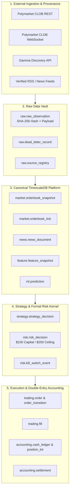

# Master Data, AI/ML, Risk & Execution Architecture

## 1. Executive Summary

The Polymarket Algorithmic Trading Workstation operates as an institutional-grade, point-in-time-correct, event-driven trading intelligence and execution operating system anchored in **PostgreSQL / TimescaleDB**.

Every observation, news event, feature vector, model prediction, strategy decision, risk check, order state transition, fill, position lot, settlement, and financial ledger transaction is durably persisted and mathematically auditable.

---

## 2. Core Architecture Tenets

1. **PostgreSQL / TimescaleDB as the System of Record**:
   - 15 logical schemas isolate data boundaries.
   - Hypertables partition high-velocity time series with zero insert degradation.
2. **Point-in-Time Truth & Anti-Lookahead Isolation**:
   - Features, predictions, and datasets strictly enforce `available_at <= decision_at`.
3. **Formal Risk Safety Kernel**:
   - Hardcoded capital limits: **$100 Operating Capital, $200 Absolute Ceiling, ~$3.00 Max Order Size, $2.00 Daily Loss Stop, $10.00 Weekly Loss Stop**.
   - Fail-closed invariant enforcement.
4. **Event-Sourced Order Execution & Double-Entry Accounting**:
   - Fully auditable state machine with idempotent fills and exact decimal balance conservation.
