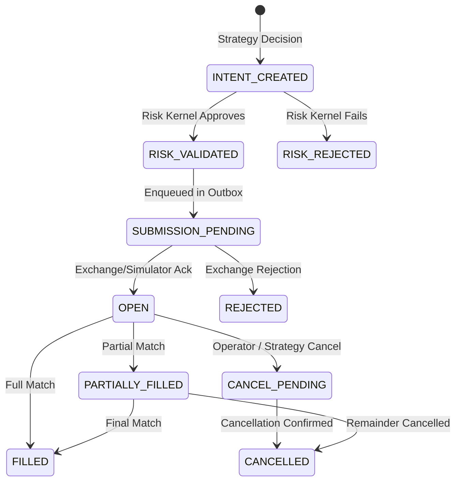

# Event-Sourced Order Execution State Machine

## 1. Order Lifecycle State Machine

Every order follows a deterministic, immutable state machine persisted in `trading.order` and `trading.order_transition`.

---

## 2. Transition Rules & Idempotency

* **Idempotency Keys**: Every order submission generates a deterministic UUID `client_order_id`. Retried submissions check for existing records to prevent double-execution.
* **Partial Fills**: Remaining size is updated dynamically upon fill execution.
* **Fill Ingestion**: Fills are recorded in `trading.fill` with unique fill IDs and attribution to strategy, model, and decision ID.
