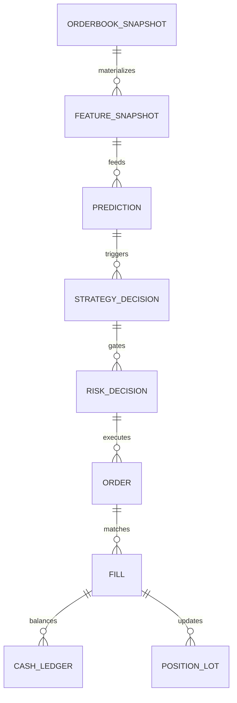

# PostgreSQL & TimescaleDB Enterprise Platform Design

## 1. Overview & Logical Schemas

The database architecture partitions all domain entities into 15 logical PostgreSQL schemas:

```
├── raw          (Immutable source observations, payload checksums, dead letters)
├── reference    (Polymarket events, condition IDs, token mapping, market tags)
├── market       (Hypertables: orderbook snapshots, L2 ticks, trades, continuous aggregates)
├── news         (Normalized news documents, source attribution, sentiment polarity)
├── intelligence (Entity nodes, claim extraction, event clusters, contradiction graphs)
├── feature      (Point-in-time feature definitions, values, snapshots)
├── ml           (Label definitions, dataset manifests, model registry, predictions, drift PSI)
├── strategy     (Strategy registry, candidate signals, structured decision ledger)
├── risk         (Risk parameters, 18-check pre-trade audit log, kill switch events)
├── trading      (Order intents, durable orders, state transitions, idempotent fills)
├── accounting   (Double-entry cash ledger, position lots, multi-outcome settlements, reconciliations)
├── audit        (High-priority financial and operational audit trails)
├── operations   (Structured system logs, service health, host metrics, migration tracking)
└── simulation   (Deterministic historical replay runs and backtest experiments)
```



---

## 2. TimescaleDB Hypertables & Continuous Aggregates

| Hypertable | Chunk Interval | Primary Dimension | Compression Policy |
| :--- | :--- | :--- | :--- |
| `market.orderbook_snapshot` | 1 day | `time` | Segment by `token_id`, Compress after 7 days |
| `market.orderbook_tick` | 1 day | `time` | Segment by `token_id`, Compress after 7 days |
| `market.market_trade` | 7 days | `time` | Segment by `token_id`, Compress after 14 days |
| `feature.feature_value` | 1 day | `time` | Segment by `token_id, feature_id`, Compress after 7 days |
| `ml.prediction` | 7 days | `time` | Segment by `model_id, token_id`, Compress after 30 days |
| `operations.structured_log` | 1 day | `time` | Segment by `service, level`, Compress after 3 days |
| `operations.system_metric` | 1 day | `time` | Segment by `service, metric_name`, Compress after 3 days |

### Continuous Aggregates (Real OHLCV Candles)

- `market.price_candle_1m`: 1-minute bucketed Open, High, Low, Close, VWAP, Tick Count.
- `market.price_candle_5m`: 5-minute continuous aggregate.
- `market.price_candle_1h`: 1-hour continuous aggregate.
