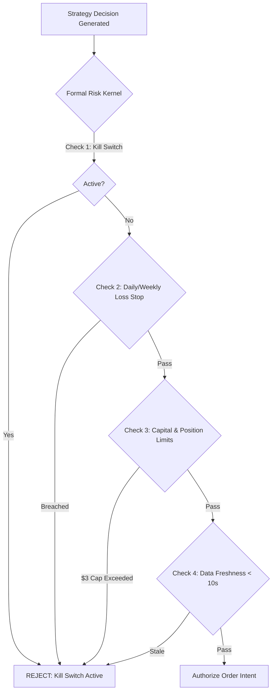

# Formal Risk Safety Kernel Specification

## 1. Safety Mandates & Capital Invariants

The platform enforces absolute financial safety through a unified pre-trade risk kernel. Every order path (algorithmic or manual) is evaluated by the same kernel before submission.

### Canonical Capital Limits ($100 / $200 Regime)

* **Operating Capital**: USD 100.00 (`min(verified_equity, 100.00)`)
* **Absolute Bankroll Ceiling**: USD 200.00
* **Minimum Cash Reserve**: USD 40.00 (Unencumbered cash reserve)
* **Maximum Deployable Capital**: USD 60.00
* **Maximum Single Order Size**: USD 3.00 (Hard limit per market)
* **Maximum Single Position**: USD 3.00 (Normal) / USD 5.00 (Exceptional)
* **Maximum Strategy Exposure**: USD 15.00
* **Maximum Correlated Exposure**: USD 8.00 (Grouped by underlying event)
* **Maximum Open Positions**: 8 simultaneous positions
* **Daily Loss Stop**: USD 2.00 (Triggers immediate circuit breaker)
* **Weekly Loss Stop**: USD 10.00 (7-day rolling window)
* **Maximum Drawdown**: 15% from high-water mark

---

## 2. Invariant Proof Rules

1. **Fail-Closed Default**: If market data is older than 10 seconds, risk data is missing, or the model health is degraded, order submission is blocked.
2. **Persistent Kill Switch**: Activation persists across application restarts and cancels all open working orders.
3. **No Bypass**: Manual trades and automated strategies pass through the identical 18-check validation suite.
