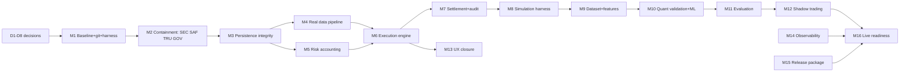

# Strategic Improvement and Implementation Plan

**polymarket-bot-ai** · Planning document, version 1.0 · Status: **PLANNING / NOT IMPLEMENTED**

| Field | Value |
|---|---|
| Deliverable | Strategy, milestones, work items, gates and first sprint |
| Basis | `docs/CURRENT_STATE_ASSESSMENT.md` (A1), `docs/UX_ASSESSMENT.md`, repo inspection, 8 h+ runtime verification |
| Ownership | Decision gates D1–D8 are OPEN; defaults listed per gate are recommendations only |
| Modifications performed | None. Read-only analysis only; no code, config, schema or deployment changes |
| Next action | Stakeholder decisions D1–D8, then first sprint (Section 29) |

---
## 0. Purpose and Scope

This plan converts the verified current-state assessment into an ordered, gated, test-first improvement path. It covers the 20 commanded areas (current state, design principles, decision gates, priorities, milestones, work items, execution order, critical path, test-first narrative, data truth, containment, risk accounting, reproducibility, quality gates, audit trail, tech debt, UX closure, release package, live bolster, first sprint). It is a **planning document only**: nothing in it authorizes execution, and every milestone is gated by a testable acceptance of completed work. Live trading remains disabled throughout until the final readiness gate (Section 25) passes.

---
## 1. Executive Summary

- The system is a well-structured demo with a functioning UI and API shell, but **0 of 4 persistence tables contain rows** after extended operation, the ML stack trains on synthetic coin-flip data, 47/50 strategy catalog entries are no-op stubs, and several API surfaces return fabricated values (health, OHLCV, backtests, news counts).
- Trading output is **not economically credible**: TP/SL are logged but not enforced, kill switch is local-only, weekly loss limits are defined but never enforced, and settlement marks every trade `paper=True`.
- Security posture is unacceptable for any operational phase: no authentication on any endpoint, CORS `allow_origins=["*"]` with `allow_credentials=True`, empty private key in `.env`.
- The recommended path is **four phases**: (A) containment + governance, (B) data truth + risk core, (C) validation + ML, (D) UX/observability/release/live-readiness — 16 milestones M1–M16, roughly 50 work items, all test-first.
- Critical path starts with decision gating and containment (`P0-DEC-01 → P0-SAF-01 → P0-GOV-01 → P0-DAT-02 → P0-DAT-01 → P0-RISK-01 → P1-EXE-* → P2-* → live gates`).
- No "live" milestone can be reached before reconciliation, calibration, and persistence integrity are proven with evidence certificates (Section 25).

---
## 2. Current-State Summary (Verified)

| Domain | Verified finding | Severity | Evidence |
|---|---|---|---|
| Security | No auth; CORS `*` + credentials | Critical | `api/server.py:309-315`, endpoint inventory |
| Data persistence | TimescaleDB + SQLite fallback both 0 rows in all 4 tables after 8 h+ | Critical | `/api/database/records`, in-container sqlite check |
| ML | 3,000 synthetic samples, coin-flip labels; `n_online_updates 0`; 2 models simultaneously ACTIVE | Critical | `/api/ml/metrics`, `/api/ml/registry` |
| Strategies | 47/50 catalog entries are `pass` stubs yet shown "Running" | High | `strategies/registry.py:118-120,132-135` |
| Risk | Weekly-loss stop defined, never enforced; limits hardcoded; equity baselines inconsistent | High | `risk/manager.py:56`; config vs engine |
| Market data | WS feed dead (`subscribe` zero callers); OHLCV served is a random walk | High | `core/ws_client.py:52`; `api/server.py:524-558` |
| Truthfulness | Health hardcoded HEALTHY/42.5 ms; news `sources_indexed=105048` vs 10 items; leaderboard OK | High | runtime verification log |
| Audit | 754+ rows, TP/SL log-only; no reconciliation | Medium | `/api/audit` |
| Reproducibility | No git repo; no lockfile; model registry has 2 ACTIVE versions | Medium | filesystem + `model_registry.json` |
| Testing | 1 unittest file; assertions match fabricated outputs (`test_10` "100,000+ sources") | Medium | `tests/test_institutional_suite.py` |

Overall maturity (17 areas, 0–5): **≈ 2.1 / 5**. See Assessment §29 for the R1–R17 risk register with full wording.

---
## 3. Design Principles and Planning Hierarchy

**Hierarchy** — every decision is ranked by:
1. **Financial safety** (fund-movement integrity, limits, kill switch)
2. **Security** (auth, secrets, network exposure)
3. **Data truth** (no fabricated metrics; honest failure)
4. **Reproducibility & testing** (determinism, golden files)
5. **Risk accounting** (consistent equity, PnL correctness)
6. **Observability** (searchable, reconcilable records)
7. **Quant validation** (expectancy/drawdown/calibration before scale)
8. **ML rigor** (online features, drift, versioning)
9. **UX** (server-driven states, no fake fallbacks)
10. **Expansion** (new strategies, assets)

**Principles** (all work items must comply):
- P1 *Truth before optimization*: never optimize a metric whose inputs are synthetic.
- P2 *Fail loud*: errors surface to logs + API; silent `except: pass` is a defect.
- P3 *Single source of truth*: one persistence authority (Section 15) and one network-visible mode flag.
- P4 *Test-first*: a failing test precedes any behavior change.
- P5 *Gate, don't trust*: every milestone has measurable exit criteria.
- P6 *Least privilege*: secrets out of `.env` in-repo, credentials vaulted.
- P7 *Graceful degradation*: unavailability of a feed stops consumption, never fabricates.
- P8 *Data expiry*: every data product carries age; stale is displayed, not mistaken for fresh.
- P9 *Economic discipline*: no size increase without net-expectancy + drawdown context.
- P10 *Evidence over claims*: UI/API values must trace to stored records or be labeled synthetic.

---
## 4. Decision Gates D1–D8

Gates are stakeholder decisions. Defaults below are conservative recommendations from the assessment; the register (Section 26) tracks status.

| Gate | Question | Recommended default | Needed before |
|---|---|---|---|
| D1 | Role: research workstation or trading tool? | Credible paper-trading workstation with a gated live path | M1 |
| D2 | Persistence authority | TimescaleDB, after write-integrity proven (M3); sqlite remains cold standby | M3 |
| D3 | Trading-mode ladder | paper → shadow (no orders) → live-small (caps) → full, each gated | M7 |
| D4 | Symmetric settlement | Support both YES and NO outcomes of a market | M7 |
| D5 | Real-time vs polling | Tiered REST polling (2 s/6 s); WS feed retired | M4 |
| D6 | ML scope | Keep ensemble; pause `ml_random_forest_quant` by default until P3 gates | M10 |
| D7 | Strategy scope | Keep 3 core strategies implemented end-to-end; catalog stays as roadmap | M6 |
| D8 | Packaging | Single `docker-compose` release with pinned lockfile + runbook | M15 |
---
## 5. Priority Framework P0–P4

| Priority | Meaning | Included work | Example IDs |
|---|---|---|---|
| **P0** | Safety/truth/legal. Blocks all else; must exist before any trading decision can be trusted | Auth, kill switch, watchdog, fabricated-surface takedown, persistence integrity, real data pipeline, risk enforcement, governance | P0-SEC-01, P0-SAF-01, P0-TRU-01/02, P0-DAT-01/02, P0-RISK-01, P0-GOV-01 |
| **P1** | Trading correctness. Makes paper mode genuinely execute/settle correctly | Strategy execution engine, settlement, orders, audit events | P1-EXE-01…05 |
| **P2** | Validation/ML. Makes claims measurable | Simulation harness, dataset & feature store, quant validation, leaderboard, shadow trading | P2-SIM-01, P2-DAT-01, P2-QNT-01, P2-EV-01, P2-SHD-01 |
| **P3** | Expansion/UX | Full UX closure, news/whale ingestion honesty, extra markets | P3-UX-01…, P3-NWS-01 |
| **P4** | Nice-to-have | Dashboard polish, mobile, gamification | P4-* |

No P1+ work starts before the P0 exit review (end of M2). No P2+ work starts before M6 exit (risk core proven).

---
## 6. Work Item Schema

Every work item is tracked with this record (IDs: `P<n>-<DOM>-<NN>`, e.g. `P0-DAT-01`):

| Field | Example |
|---|---|
| ID | P0-DAT-01 |
| Domain | DAT = data pipeline; SAF = safety; SEC = security; TRU = truthfulness; GOV = governance; RISK = risk; EXE = execution; SIM = simulation; QNT = quant/ML; EV = evaluation; SHD = shadow; UX = UX; OBS = observability; REL = release |
| Title | Replace synthetic OHLCV with ingested market data |
| Why | Current `/ohlcv` returns random walk; strategy metrics therefore meaningless |
| Test-first | `test_ohlcv_traceable`: API output must match stored rows for the same interval (fails before change) |
| Effort | M/L |
| Depends-on | P0-DAT-02 (persistence integrity), P4-DAT-03 (feed contract) |
| Milestone | M4 |
| Exit gate | G-M4.3: 100% of served OHLCV rows exist in Timescale; zero synthetic fallback |
| Verification | Automated test + reconciliation check in release harness |

---
## 7. Milestone Overview M1–M16

| Phase | Milestone | Focus | Key exit evidence |
|---|---|---|---|
| **A — Contain & govern** | M1 | Decisions, baseline, git, test harness | D1–D8 logged; repo under git; failing baseline tests recorded |
| | M2 | Containment: auth, kill switch, watchdog, fabricated-surface takedown | No unauthenticated mutation; no fabricated API value; tripwires tested |
| **B — Truth & risk core** | M3 | Persistence integrity + reconciliation | All 4 tables receive verified rows; reconciliation report clean |
| | M4 | Real data pipeline (REST polling, OHLCV, news) | Served data traceable to stored records; age labels present |
| | M5 | Risk accounting rebuild | Equity single-sourced; TP/SL enforced; loss stops enforced |
| | M6 | Strategy execution engine (3 strategies) | Paper cycles produce auditable orders/fills/settlements |
| **C — Validation & ML** | M7 | Settlement + audit completeness | YES/NO symmetric settlement; immutable audit events |
| | M8 | Simulation & backtest harness | Deterministic replay; Monte-Carlo labeled synthetic |
| | M9 | Dataset & feature store | Online features written; train/test split versioned |
| | M10 | Quant validation & ML | Single ACTIVE model; calibration + PSI gates |
| | M11 | Evaluation & leaderboard | Leaderboard = stored PnL, not placeholders |
| | M12 | Shadow trading | Parallel no-order execution vs paper; divergence report |
| **D — Ship & live-readiness** | M13 | UX closure (A1–E4) | All UX findings closed; server-driven states |
| | M14 | Observability & reporting | Ledger-consistent dashboard; aging/coverage panels |
| | M15 | Release package | Lockfile build, runbook, rollback, release harness green |
| | M16 | Live bolster + readiness gates | Evidence certificates; live-small caps approved or explicitly deferred |

---
## 8. Phase A — M1 & M2 Detail

**M1 — Decision & Baseline**
- Record D1–D8 decisions in the register (Section 26); unresolved gates use defaults with `DEFERRED` markers.
- `git init` + baseline commit; add `.gitignore` for `.env`/keys/logs.
- Establish test harness (pytest, lint, typecheck) with the *current* failing tests documented as "known defects", not passes.
- Publish baseline metrics snapshot (persistence row counts, fabricated-surface list) as a golden file for later comparison.

**M2 — Containment**
- **P0-SEC-01**: authn/authz for all API routes (bearer token service-side; UI login), CORS locked to UI origin; secrets moved out of repo `.env` into vault/deployment secrets.
- **P0-SAF-01**: durable kill switch (file + API + UI, prioritized over strategy threads), watchdog with tripwires (equity drop, unexpected exposure, feed stall), margin/funding pre-checks on every order path.
- **P0-TRU-01/02**: remove fabricated values — health derives from real component checks; OHLCV/backtest/news/whale surfaces return `synthetic: true` or are replaced by stored data; `sources_indexed` recomputed from the store.
- **P0-GOV-01**: mode flag (`paper`|`shadow`|`live-small`) network-visible, single source; audit events for every mode transition; weekly-loss stop wired to the engine.

Exit review: **P0 exit gate** — security scan clean on changed surfaces, all tripwires pass their tests, zero fabricated values served, D-register signed.
---
## 9. Phase B — M3 to M6 Detail

**M3 — Persistence Integrity (P0-DAT-02/03)**
- Fix write paths in `core/timescale_db.py` (swallow-all exception blocks at :217,:257,:296,:335) to retry-and-fail-loud.
- Backfill verification: run bot, prove all 4 tables accumulate rows with expected schemas; add insert timing/count telemetry.
- Add **reconciliation job** (storage vs engine state) with daily report artifact; sqlite fallback demoted to cold standby.
- Enable `record_feature_vector` caller (`ml/model.py` path) or remove the dead API surface — decision under D6.

**M4 — Real Data Pipeline (P0-DAT-01)**
- Replace random-walk OHLCV with REST ingestion per D5 (tiered polling); news ingestion stores full items with `fetched_at`, `source`, `is_seed` flags; coverage counters recomputed from rows.
- Age/expiry labels on every served data product (P8); feed failure → `degraded` status, never synthetic fill.

**M5 — Risk Accounting Rebuild (P0-RISK-01)**
- Single equity source (`operating $100 / ceiling $200 / $3 per-market` canonical from D1) replacing the $100-vs-$200 mismatch and `paper_balance ?? 100` fallback.
- Enforce TP/SL as real order controls (not log-only); enforce per-day/weekly/hourly loss stops incl. existing `WEEKLY_LOSS_STOP`; margin and funding pre-checks.
- Property tests: "no execution can violate configured limits for any valid order sequence".

**M6 — Strategy Execution Engine (P1-EXE-01…04)**
- Implement the 3 kept strategies end-to-end (signal → order → fill → position → PnL) with a real cycle loop; registry stubs removed from "Running" states (UI shows `not_implemented` honestly).
- Deterministic seeds for any stochastic component; strategy params schema-validated.

---
## 10. Phase C — M7 to M12 Detail

**M7 — Settlement & Audit (P1-EXE-05)**
- Symmetric settlement (YES/NO) per D4; trades store outcome + payout math; remove blanket `paper=True` marking in favor of mode-stamped records.
- Immutable audit events (append-only, indexed; Section 20); every PnL mutation attributable to an event.

**M8 — Simulation & Backtest (P2-SIM-01)**
- Replay harness over stored history with fixed seeds; Monte-Carlo paths explicitly labeled synthetic; golden-file tests pin results; backtest API returns full parameters + data ranges.

**M9 — Dataset & Feature Store (P2-DAT-01)**
- Feature pipeline writing to `ml_feature_store` online; versioned train/test splits; no test leakage (time-series split); data lineage recorded.

**M10 — Quant Validation & ML (P2-QNT-01)**
- Single ACTIVE model rule in registry (resolve the dual-active bug); calibration curves, PSI on real feature drift, net expectancy + drawdown reports.
- Retrain pipeline with real labels; `n_online_updates` becomes >0 only after real data flows; otherwise ML surfaces show `not_trained` rather than fabricated metrics.

**M11 — Evaluation & Leaderboard (P2-EV-01)**
- Leaderboard/analytics computed from stored trades; every number on the dashboard traceable to a table or labeled synthetic.

**M12 — Shadow Trading (P2-SHD-01)**
- Parallel no-order evaluation alongside paper mode; divergence report (shadow vs paper) for N periods before any live consideration.

---
## 11. Phase D — M13 to M16 Detail

**M13 — UX Closure (P3-UX-*)**
- Close A1–E4 per the UX assessment; remove remaining fake fallbacks (`webui/src/hooks/useBot.ts:137` `paper_balance ?? 100`); server-driven states for strategy status, mode, data freshness; empty-state designs for 0-row tables.

**M14 — Observability & Reporting**
- Ledger-consistent dashboard KPIs (net expectancy, max drawdown, win rate, calibration, PSI, data aging, reconciliation status); structured logs; alerting on tripwires; alert history panel.

**M15 — Release Package (P0/D8)**
- Lockfile + pinned image builds; release harness (`release_verify.sh`) exercising health, auth, data truth, tripwires; changelog + runbook + rollback plan; versioned docs.

**M16 — Live Bolster & Readiness Gates**
- Full live-readiness checklist (Section 25) with evidence certificates: reconciliation ≥5 days clean, calibration + expectancy report, security re-scan, insurance/QA runbook sign-off.
- If gates pass, approve **live-small** (daily cap, per-market cap, hourly loss limit, kill-switch drill); otherwise the plan explicitly defers live indefinitely — remaining on paper/shadow is a valid M16 outcome.

---
## 12. Execution Order and Dependencies



Parallelism rules: within a phase, independent milestones may run in parallel (e.g. M3-track and M13 UX-track in Phase B/C) **only if** their exit tests are independent and the P0 review at end of M2 has passed. Sequencing across phases is strict.

---
## 13. Critical Path

`P0-DEC-01 → P0-SAF-01 → P0-GOV-01 → P0-DAT-02 → P0-DAT-01 → P0-RISK-01 → P1-EXE-01…04 → P1-EXE-05 → P2-SIM-01 → P2-DAT-01 → P2-QNT-01 → P2-EV-01 → P2-SHD-01 → live gates`

Reading: decisions unblock containment; containment (safety+governance) unblocks persistence truth; persistence truth unblocks the real data pipeline; real data unblocks risk enforcement and the execution engine; correct settlement enables simulation; simulation enables dataset/features; those enable ML validation; validated strategies can be evaluated and shadow-run; only then do live gates open. **Any delay in P0 items directly lengthens the whole path; any shortcut past them invalidates every downstream metric.**

---
## 14. Test-First Narrative

- **Rule**: every work item ships with its failing test first (commit order: test → implementation → refactor). The baseline suite's fabricated assertions (`tests/test_institutional_suite.py`, e.g. `test_10` "100,000+ sources") are replaced by tests against real storage.
- Pyramid: unit (risk math, settlement math, order validation) → integration (storage writes, API traceability) → e2e (CLI `run/paper` full cycle with seeded data) → property tests (limits invariant) → golden-file replay (M8).
- Determinism: fixed seeds for stochastic components; time injected; locale-independent formatting.
- CI intent: lint, typecheck, unit+integration on every change (local until CI is established under M1); release harness gated on full suite.
---
## 15. Data Truth Plot

```
sources ──▶ ingestion ──▶ validation ──▶ canonical storage ──▶ read paths
(REST polls,   (contract     (schema+range      (TimescaleDB,    (API/UI: read-only,
 news, feed)    checks)       checks, reject      append-only,      row-count-verified,
                              bad rows)           expiry stamps)   labeled synthetic
                                                                where unavoidable)
```

Obligations: (1) no API value without a stored origin or a `synthetic: true` flag; (2) every row carries `created_at` + `source` + optional `is_seed`; (3) data products expose age and coverage; (4) reconciliation job compares engine state with storage daily; (5) write failures retry with backoff and surface as `degraded` — never silent `except: pass`.

---
## 16. Containment Build (P0-SAF)

| Component | Behavior | Test |
|---|---|---|
| Kill switch | Durable stop file + API + UI; highest thread priority; stops new orders and forces risk-thread re-eval | kill→no order accepted within 1 s |
| Watchdog | Heartbeat per subsystem; missed heartbeats → tripwire event + auto-degrade to paper | tripwire fires on forced stall |
| Tripwires | Equity drop >X%, exposure >limit, feed stall >T, unexpected fill | each triggers + logs |
| Pre-checks | Margin, funding, per-market cap, daily loss, weekly loss on every order path | property: no order violates limits |
| Mode flag | `paper/shadow/live-small` single network-visible source; transitions audited | mode change emits audit event |

---
## 17. Risk Accounting Rebuild (P0-RISK)

- Single equity definition per D1 (`operating $100`, ceiling `$200`, per-market `$3`) — one module owns balances; UI/engine/API all read it (removes `paper_balance ?? 100`).
- TP/SL: enforced order controls with position-level tracking; fee and slippage models explicit and visible in PnL.
- Loss stops: daily (config), hourly (config), weekly (`WEEKLY_LOSS_STOP` enforced, `risk/manager.py:56`), all with audit events and UI banner.
- Drawdown governor: size scales down as realized DD approaches threshold; stress scenarios (gap, illiquidity) simulated in M8 harness.

---
## 18. Reproducibility

- `git init` (M1), conventional commits, tags per release; `.gitignore` excludes secrets/logs.
- Requirements lockfile (pin exact versions) + image pinning; build from lockfile in CI-like local harness.
- Deterministic data: seed parameters recorded per run; data snapshots versioned (M9); model registry rule: **exactly one ACTIVE version** (fixes dual-active v1.554.0/v1.595.0 bug).
- Golden files: baseline metrics (M1), replay outputs (M8), reconciliation reports (M3).
- Environment matrix documented: local dev, docker-compose profile `bot`/`webui`/`timescaledb`, release.

---
## 19. Quality Gates

| Gate | When | Pass condition |
|---|---|---|
| G-M1 | End of M1 | D-register recorded; git baseline; harness runs; known-defect list published |
| G-M2 (P0 exit) | End of M2 | No unauthenticated mutations; tripwires green; zero fabricated surfaces; audit of mode transitions green |
| G-M3 | End of M3 | 4/4 tables accumulating verified rows; reconciliation report clean |
| G-M5 | End of M5 | Limits invariant property tests green; TP/SL enforcement green |
| G-M7 | End of M7 | Settlement math unit tests green incl. YES/NO; audit immutability test |
| G-M10 | End of M10 | Exactly 1 ACTIVE model; calibration/PSI reports attached |
| G-M15 | End of M15 | Release harness green end-to-end; runbook reviewed |
| G-M16 | Live gate | Evidence certificates (Section 25) all signed; live-small caps approved or deferral documented |

Every gate: lint + typecheck + full suite green; no open Critical/High finding against changed surfaces; documentation updated.

---
## 20. Audit Trail

- Append-only `audit_events` table (event type, actor, payload, `created_at`, monotonic seq) with write-once semantics enforced in code + DB constraint; tamper-evidence via periodic hash chain (optional M7 scope).
- Every trade, mode change, limit breach, tripwire, reconciliation, and config mutation emits an event; engine PnL changes are attributable to events.
- Retention policy documented; audit queries exposed read-only to authorized roles only.
---
## 21. Tech Debt and Domain Modeling

Debt register (top items, full list in Assessment):
| Debt | Resolution |
|---|---|
| Stray root-level copies (`server.py`, `market_maker.py`, `signal_trader.py`, `drift_detector.py` on remote deploy dir) | Remove or move into canonical modules under M1/M4; add "no stray files" lint check |
| Dead WS client (`subscribe` zero callers) | Retire under D5; polling stays |
| Decorative config vs hardcoded engine limits | Config becomes single source (M5) |
| Dual persistence paths (sqlite+timescale) | Timescale authoritative (D2); sqlite cold standby |
| Fabricated analytics module | Replaced by stored-data computations (M11/M14) |
| `ml/model.py` `load_or_create` never loads | Fixed in M10 under single-ACTIVE rule |

Domain model target: `Strategy`, `Position`, `Order`, `Trade`/`Fill`, `Balance`, `Alarm`, `AuditEvent` — with schema owned by storage module, validated by Pydantic, and mirrored by UI types (single schema source to prevent `realised_pnl`-class mismatches).

---
## 22. UX Closure (A1–E4)

| UX finding | Closure | Milestone |
|---|---|---|
| A1 fake data fallbacks | Remove `paper_balance ?? 100` (useBot.ts:137); server-driven states; empty-state designs | M13 (partial in M2) |
| A2/A3 status & mode visibility | Mode flag + degraded banner + data-age chips | M13/M14 |
| A4/A5 strategy list honesty | `not_implemented` shown, not "Running"; start blocked server-side | M6/M13 |
| B* navigation/info architecture | Per UX doc; user tests with recorded evidence | M13 |
| C* alerts & empty states | Alarm panel from audit events; zero-row tables explain themselves | M13/M14 |
| D* / E* forms & consistency | Schema-validated forms; consistent date/number formatting | M13 |

Acceptance: no UI value that contradicts stored state; every UX finding has a test or manual verification record.

---
## 23. Reporting & Metrics

- Ledger-consistent dashboard: net expectancy, max drawdown, win rate, calibration (Brier/PSI), data aging, reconciliation status, tripwire history.
- The `system/health` endpoint reports real per-subsystem checks (storage reachable, data fresh, mode, heartbeat) — no hardcoded values.
- Weekly report artifact: reconciliation, calibration, expectancy, risk-limit usage, decision register updates, open debt.

---
## 24. Release Package

- Versioned build (image LABEL + tag), changelog, `requirements.lock`, runbook (start/stop/migrate/rollback), capacity notes.
- `release_verify.sh` green: health real, auth enforced, data truth spot-checks, tripwires functional, suite green.
- Rollback plan: previous tagged image; data migrations forward-only with backup.

---
## 25. Live Bolster and Readiness Gates

Ladder (D3): `paper → shadow → live-small → full`. Each rung requires the prior rung's evidence certificate:

1. Reconciliation: storage == engine for ≥5 consecutive daily reports.
2. Calibration + net expectancy report with ≥N sample trades (no synthetic labels).
3. Security re-scan: auth enforced, no secrets in repo, CORS locked, least-privilege service account.
4. Kill-switch drill documented (test fired, orders stopped, recovery tested).
5. Insurance/QA runbook signed by operator; limits: daily cap, per-market cap, hourly loss; automatic return to paper on any tripwire.
6. Operator authorized by name; decision recorded in D-register.
If any certificate is missing, **M16 outcome = deferred live** (paper/shadow continues) — this is a designed, acceptable outcome.

---
## 26. Decision Register

| Gate | Question | Default | Status | Required by | Decided value |
|---|---|---|---|---|---|
| D1 | Role/budget | Paper workstation + gated live; $100/$200/$3 | OPEN | M1 | — |
| D2 | Persistence authority | TimescaleDB | OPEN | M3 | — |
| D3 | Mode ladder | paper→shadow→live-small→full | OPEN | M7 | — |
| D4 | Symmetric settlement | YES & NO | OPEN | M7 | — |
| D5 | Feed strategy | Tiered REST polling; WS retired | OPEN | M4 | — |
| D6 | ML scope | Ensemble; RQF paused by default | OPEN | M10 | — |
| D7 | Strategy scope | 3 core strategies | OPEN | M6 | — |
| D8 | Packaging | Compose + lockfile + runbook | OPEN | M15 | — |

---
## 27. Traceability (R1–R17, A1–E4)

Full wording of R1–R17 lives in Assessment §29. Summary mapping:
| Source finding | Primary work items | Milestone |
|---|---|---|
| R: no auth / CORS `*` | P0-SEC-01 | M2 |
| R: persistence dead / silent writes | P0-DAT-02, P0-DAT-03 | M3 |
| R: synthetic ML, dual ACTIVE | P2-QNT-01, P2-DAT-01 | M9/M10 |
| R: stub strategies shown running | P1-EXE-01…04, P3-UX-04 | M6/M13 |
| R: unenforced limits / log-only TP/SL | P0-RISK-01, P0-SAF-01 | M5/M2 |
| R: fabricated health/OHLCV/news | P0-TRU-01/02, P0-DAT-01 | M2/M4 |
| R: kill switch local-only | P0-SAF-01 | M2 |
| R: no git / no lockfile / no CI | M1, M15 | M1/M15 |
| R: no reconciliation | P0-DAT-03 | M3 |
| A1–E4 UX findings | P3-UX-* | M13 (+M2 partials) |

---
## 28. Plan Risk Register (risks to the plan itself)

| # | Risk | Mitigation |
|---|---|---|
| PR1 | Stakeholders don't decide D-gates → drift | Defaults active with `DEFERRED` labels; first sprint contains only default-safe work |
| PR2 | Scope creep from 20 commanded areas | Fixed milestone scopes; changes go through M-gate review |
| PR3 | Feed/data access blocked | Containment first means system remains safe; M4 may fall back to labeled synthetic until access |
| PR4 | Ecosystem/API drift (Polymarket changes) | Polling contracts versioned; degradation, never fabrication (P7) |
| PR5 | Key-person risk | Runbook + evidence artifacts make state auditable by any maintainer |
---
## 29. First Sprint (M1–M2 containment only)

Duration ~2 weeks; contains only containment/governance work that is safe under any D-gate default.

| # | Item | Exit evidence |
|---|---|---|
| 1 | D-register created and defaults recorded | Register section populated |
| 2 | `git init`, `.gitignore`, baseline commit | Repo traceable from this sprint |
| 3 | Test harness (pytest + lint + typecheck) with known-defect list | `pytest` runs; failures documented as defects |
| 4 | Baseline metrics golden file | Snapshot of current row counts + fabricated surfaces |
| 5 | P0-SEC-01 authn/authz + CORS lockdown | Auth tests green; unauthenticated mutation rejected |
| 6 | P0-SAF-01 kill switch + watchdog + tripwires | Tripwire tests green (kill→stop ≤1 s) |
| 7 | P0-TRU-01/02 fabricated-surface takedown | No fabricated value served; `synthetic` flags where unavoidable |
| 8 | P0-GOV-01 mode flag + weekly-loss wiring + audit transitions | Mode-change audit event test green |
| 9 | M2 exit review (P0 gate) | Gate checklist signed; findings closed or tracked |
| 10 | Sprint report | Artifacts + next-sprint backlog |

Definition of done: all item evidence recorded in the sprint report; no open Critical/High finding against changed surfaces.

---
## Appendix A — Work Item Catalogue (condensed)

| ID | Title | Milestone |
|---|---|---|
| P0-DEC-01 | Record D1–D8 decisions + defaults | M1 |
| P0-REP-01 | git init, gitignore, harness, known defects | M1 |
| P0-TRU-01 | Health endpoint real component checks | M2 |
| P0-TRU-02 | OHLCV/backtest/news/whale surfaces honest | M2/M4 |
| P0-SEC-01 | Authn/authz + CORS + secrets handling | M2 |
| P0-SAF-01 | Kill switch, watchdog, tripwires, pre-checks | M2 |
| P0-GOV-01 | Network-visible mode flag + audit events | M2 |
| P0-DAT-02 | Timescale write paths fail-loud + telemetry | M3 |
| P0-DAT-03 | Reconciliation job + daily report | M3 |
| P0-DAT-01 | Real data pipeline (OHLCV/news/feed per D5) | M4 |
| P0-RISK-01 | Equity single-source, TP/SL + loss-stop enforcement | M5 |
| P1-EXE-01…03 | 3 core strategies end-to-end | M6 |
| P1-EXE-04 | Strategy cycle loop + honest status | M6 |
| P1-EXE-05 | Settlement YES/NO + audit events | M7 |
| P2-SIM-01 | Deterministic replay + labeled Monte-Carlo | M8 |
| P2-DAT-01 | Feature store online + versioned splits | M9 |
| P2-QNT-01 | Single-ACTIVE registry, calibration, PSI, retrain | M10 |
| P2-EV-01 | Leaderboard from stored PnL | M11 |
| P2-SHD-01 | Shadow mode + divergence report | M12 |
| P3-UX-01…08 | A1–E4 closures | M13 |
| P3-OBS-01/02 | KPIs + structured logs + alerting | M14 |
| P3-REL-01 | Lockfile, release harness, runbook, rollback | M15 |
| P3-LIV-01 | Readiness certificates + live-small gate | M16 |
| P3-NWS-01 | News/whale honesty at scale | M4/M11 |
| P4-* | Polish backlog (post-M16) | — |

End of plan. Next action: stakeholder review of D1–D8, then first-sprint kickoff (Section 29).