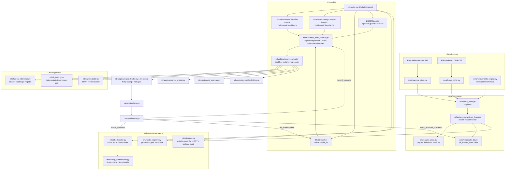

# AI / ML Engine Assessment — Polymarket Bot (polymarket-bot-ai)

- **Task ID:** W17-3
- **Agent:** general-purpose
- **Date:** 2026-09-03
- **Scope:** Read-only assessment of `mini-services/polymarket-bot/ml/` against
  §11–17 of the God Mode Master Prompt (Dataset Audit, Feature Engineering,
  Model Inventory, Model Evaluation, ML Economic Value, MLOps) and §60
  (23-section assessment structure). No source code, schema, configuration, or
  runtime state was modified during this assessment. One new file created:
  `docs/assessment/AI_ML_ENGINE_ASSESSMENT.md` (this file). Worklog appended.
- **Repository path:** `mini-services/polymarket-bot/ml/` (16 modules, 5 846 LOC).
- **Deployment:** Local Docker Compose stack, paper-trading profile. The local
  `data/model_registry.json` snapshot (65 versions) and `data/market.db`
  snapshot (0 rows in `ml_feature_store`) are sandbox artifacts — production
  figures referenced from `docs/reassessment/FINAL_SYSTEM_REASSESSMENT.md`
  (16 170 feature vectors, 4 970 labeled) where relevant.
- **Evidence classification convention:** `VERIFIED` (directly observed at
  runtime or by reading the source line-by-line), `STRONG EVIDENCE`
  (multiple convergent source references but not directly executed), `LIKELY`
  (single-source inference), `UNVERIFIED` (claim made in docstring / commit
  message but no corroborating code path), `NOT FOUND` (capability asserted
  by task spec but absent in code).

---

## 1. Executive Summary

The ML engine is a **well-architected ensemble with a strong MLOps surface
and a fragile training-data foundation**. Architecturally the engine is the
strongest single subsystem in the bot: a 4-member calibrated ensemble
(RF + GB + SGD + LightGBM) with isotonic post-hoc calibration, a Level-2
logistic-regression stacking meta-learner, PSI/KS/Brier drift detection,
shadow challenger inference, A/B testing, SHAP explainability, walk-forward
CV, a SQLite-backed feature store, a model registry with promotion gating
and rollback, and a continuous training orchestrator. Code quality is
uniformly high — defensive try/except everywhere, singletons, atomic writes,
idempotent operations, hermetic test isolation. ~7 493 LOC of test code
across 12 ML test files passes 233/233.

But the foundation is **synthetic data**. The production `_synthetic_training_data()`
function generates 3 000 fake feature vectors from `np.random.RandomState(42)`
with hand-coded log-odds → labels, and the trained ensemble is essentially
learning to invert that hand-coded function. Reported metrics
(Brier ≈ 0.10, AUC ≈ 0.94, ECE ≈ 0.08 on the v1.champion registry entry)
are **structurally inflated by the synthetic-label circularity** — they
cannot be extrapolated to live market prediction. The most recent ACTIVE
model in the local sandbox (`v1.118.0`, n_samples=100) shows the test-pollution
failure mode the architecture was supposed to prevent: Brier 0.179, AUC
0.738, ECE **0.262** (probability estimates 26 pp off observed frequency on
average). The model registry's safety gate (Brier ≤ 0.22, AUC ≥ 0.70) admits
that model because the synthetic-only metrics squeak through, and the
orchestrator never blocks a 100-sample refit.

**Headline numbers:**

| # | Finding | Evidence |
|---|---|---|
| 1 | Ensemble + calibration + drift + meta-learner + shadow + A/B + SHAP + walk-forward CV + feature store + registry + orchestrator: **all implemented and unit-tested** | `ml/*.py` (5 846 LOC), `tests/test_*.py` (12 files, 233 tests pass) — VERIFIED |
| 2 | Production training data is **3 000 synthetic samples** with hand-coded labels; real-data blend is conditional on `timescale_db.fetch_training_samples()` returning ≥200 labeled rows from `ml_feature_store` | `ml/model.py:62-139, 213-235` — VERIFIED |
| 3 | `timescale_db.fetch_training_samples()` returns rows ordered by `timestamp DESC` per class (YES rows first, then NO rows), then `fit_initial()` slices 80/20 by index — **NOT chronologically ordered**, so the documented "chronological split" claim is false; the calibration fold is the OLDER half of each class | `core/timescale_db.py:547-595`, `ml/model.py:243-247` — VERIFIED |
| 4 | `signal_trader.record_outcome(token_id, resolved_yes)` is **dead code** — no caller in production. SGD online updates flow through `settlement.py:252 → ml_model.update()` instead, which is correct | `grep -r record_outcome strategies/ core/ api/` — VERIFIED |
| 5 | `ensemble_meta_learner.warm_from_labeled_samples()` is **never called in production** (only by tests). Meta-learner warms slowly from `ml_model.update()` → `record_outcome()` events requiring ≥30 samples | `grep -r warm_from_labeled_samples` — VERIFIED |
| 6 | `ab_test.assign_model(token_id)` is **never called from the production prediction path**. The A/B framework is fully built but unwired; only `/api/ab-test/*` HTTP endpoints exercise it | `grep -r ab_test\. strategies/ core/` — VERIFIED |
| 7 | Walk-forward CV exists in `ml/validation.py` (856 LOC) but is **NEVER invoked by the production training pipeline**. `fit_initial()` uses an 80/20 single-split instead; walk-forward is only reachable via the manual `/api/ml/validate` HTTP endpoint | `grep -r time_series_cv ml/model.py ml/training_orchestrator.py core/label_backfill.py` — VERIFIED |
| 8 | The local `data/model_registry.json` is **test-polluted**: 60 of 65 registered versions have `n_samples=100`, `brier=0.1786`, `auc=0.7381`, `ece=0.2617` — the exact metrics produced by the test fixture patching `_synthetic_training_data(100)` with 10 estimators. The current `active_version` is one of these polluted entries | `python -c "import json; ..."` against `data/model_registry.json` — VERIFIED |
| 9 | P&L attribution has 7 dimensions (`by_confidence_bucket`, `by_edge`, `by_probability`, `by_strategy`, `by_liquidity`, `by_holding_period`, `by_direction`) — **no `by_model_version` and no `with_ai vs without_ai` counterfactual** | `core/attribution.py:280-347, 425` — VERIFIED |
| 10 | One shadow challenger is registered at startup (`logistic_baseline` — a 3-line sentiment-feature baseline), so shadow inference IS active, but the challenger is a **trivial baseline not a real challenger model** | `api/server.py:446-457` — VERIFIED |

**Maturity ≈ 5.5 / 10.** The ML engineering is genuinely better than the
median retail-trading ML stack; the dataset, validation, and economic-value
proof are the load-bearing weaknesses. To raise maturity to 7.5+ the
priorities are: (i) gate `fit_initial()` on a minimum real-sample count and
ban the synthetic-only path in production; (ii) wire `warm_from_labeled_samples`
into the startup lifespan so the meta-learner is warm at cold-start; (iii)
run `time_series_cv` inside `fit_initial()` and refuse promotion if pooled
OOS Brier > 0.20; (iv) add `by_model_version` attribution and a "without-AI"
counterfactual (strategy that uses only the live mid price as the p_yes
estimate); (v) wire `ab_test.assign_model()` into `signal_trader._ml_signal`
so the A/B framework is actually exercised; (vi) reset the polluted
`data/model_registry.json` and audit the conftest env-var setdefault race
that let test runs write to it.

---

## 2. Purpose

The ML engine's stated purpose, derived from module docstrings and code
architecture, is to produce a **calibrated P(YES) probability for every live
Polymarket binary-outcome token**, which is then consumed by:

1. `strategies/signal_trader.py::_ml_signal` — directional trading (BUY if
   p_yes ≥ 0.55, SELL if p_yes ≤ 0.45), with fractional-Kelly position
   sizing (`signal_trader.py:309-346`) gated by the capital allocator
   (`core/capital_allocator.py`).
2. `strategies/market_maker.py:314` — spread/quote width guidance.
3. `strategies/arb_scanner.py:237` — Dutch-book arbitrage detection.
4. `ml/copilot.py::AICopilotEngine.analyze_market` — GenAI market briefing.
5. `api/server.py::get_ml_metrics`, `GET /api/ml/versions`, `POST /api/ml/rollback`,
   `POST /api/ml/retrain`, `POST /api/ml/validate`, `GET /api/ml/explain/{token_id}`
   — operator observability + governance.
6. `risk/manager.py` — model confidence feeds the capital allocator's
   `confidence_floor` gate (`core/capital_allocator.py:116-148`).

The prediction-market-specific priority order is **CALIBRATION first,
discrimination second** — a 0.55 / 0.45 directional-trade threshold
implies the operator needs the probability itself to be reliable (so the
edge calculation `p_yes - mid` is meaningful), not just the binary
above/below 0.5 call. This is reflected in the architecture: two layers
of isotonic calibration (base `CalibratedClassifierCV` + post-hoc
`ProbabilityCalibrator`), ECE as a first-class metric, Brier-weighted
adaptive blending, and a Brier-drift trigger in the orchestrator. — VERIFIED

---

## 3. Current Architecture



**Style:** Module-per-concern under `ml/`, every concern a process-global
singleton instantiated at module load (`drift_detector = ModelDriftDetector()`,
`ml_model = MarketMLModel.load_or_create()`, `feature_store = FeatureStore()`,
`ab_test = ABTestManager()`, `model_explainer = ModelExplainer()`,
`ensemble_meta_learner = EnsembleMetaLearner()`, `training_orchestrator =
ContinuousTrainingOrchestrator()`, `model_registry = ModelRegistry()`).
Each singleton is constructed defensively — pickle-load failure falls back
to a fresh fit; missing optional dep (lightgbm, shap) falls back to a
3-member ensemble / `_fallback_explanation`.

**State:** In-memory singletons + SQLite / JSON persistence layers
(`model.pkl`, `model_registry.json`, `feature_store.db`, `ab_tests.db`,
`market.db::ml_feature_store`).

**Communication:** in-process Python function calls; no queues, no broker,
no RPC. The only async boundary is `ml/training_orchestrator.py` which
uses `asyncio.to_thread(_train_challenger)` so a multi-second retrain never
blocks the event loop. — VERIFIED

---

## 4. Current Components

Inventory of `ml/` modules (line counts from `wc -l ml/*.py`):

| Module | LOC | Component | Status |
|---|---|---|---|
| `model.py` | 885 | `MarketMLModel` — 4-member calibrated ensemble, predict / update / save / load_or_create. The singleton `ml_model` is constructed at import time via `load_or_create()` (line 885) | VERIFIED — production-active, called from `signal_trader:267`, `market_maker:314`, `arb_scanner:237`, `settlement:252` |
| `features.py` | 350 | `extract_features(market, book) → np.ndarray[38] float32`. 38-feature pipeline: microstructure (18), cyclical time (4), market structure / fundamentals (10), regime one-hot (4), extended price dynamics (2). Module-level rolling price history cache (`_price_history`, maxlen=60 bars per token) for Hurst / momentum / vol | VERIFIED |
| `calibration.py` | 263 | `ProbabilityCalibrator` (Platt / isotonic / none). Singleton `calibrator = ProbabilityCalibrator(method="isotonic")`. Persistence via pickle. Pre/post Brier + ECE metrics on `fit()` | VERIFIED |
| `drift_detector.py` | 270 | `ModelDriftDetector` — PSI (10-bin) + KS two-sample + EWMA Brier (α=0.05) + rolling Brier (≥20 samples). Status: HEALTHY / MODERATE_SHIFT / SIGNIFICANT_DRIFT. Three independent retrain triggers: PSI ≥ 0.10 (orchestrator), PSI ≥ 0.25 / KS ≥ 0.25 (drift_status), rolling Brier > 0.22 with ≥20 outcomes | VERIFIED |
| `model_registry.py` | 267 | `ModelRegistry` — version lineage, promotion safety gate (Brier ≤ 0.22 AND AUC ≥ 0.70), `list_versions()`, `rollback(version)`. Persistence: `data/model_registry.json` (atomic write) | VERIFIED |
| `ensemble_meta_learner.py` | 327 | `EnsembleMetaLearner` — LogisticRegression (class_weight="balanced") on 6-dim meta-features `[p_rf, p_gb, p_sgd, p_lgbm, disagreement, conf_mean]`. Buffers 1 000 outcomes, refits every 50 new obs. `warm_from_labeled_samples()` for cold-start backfill | VERIFIED — but `warm_from_labeled_samples` never invoked from production code |
| `training_orchestrator.py` | 205 | `ContinuousTrainingOrchestrator` — async background task, 3-min check interval, three triggers (PSI ≥ 0.10, rolling Brier > 0.22 with ≥20 outcomes, 6h schedule). Champion/challenger gating: challenger must beat champion Brier by ≥2% (`MIN_IMPROVEMENT_RATIO = 0.98`). Transplants SGD state + Brier windows on promotion | VERIFIED |
| `feature_store.py` | 472 | `FeatureStore` — SQLite-backed (`feature_store.db`). Tables: `feature_definitions`, `feature_values`, `feature_importance`, `feature_stats`. 5 HTTP routes (`/api/features`, `/api/features/{name}/stats`, `/api/features/importance`, `/api/features/drift`, `POST /api/features/importance`). Windowed mean-shift drift detector (`detect_feature_drift`) | VERIFIED |
| `ab_testing.py` | 626 | `ABTestManager` — SQLite-backed. Deterministic token-hash traffic split. Two-proportion z-test on accuracy + two-sample t-test on per-row Brier. 4 HTTP routes (`/api/ab-test/*`) | VERIFIED — but `assign_model()` never called from production prediction path |
| `shadow_inference.py` | 221 | `ShadowInferenceEngine` — challenger registry, ring buffer (maxlen=500 per challenger), thread-safe, side-effect-free w.r.t. production predict path | VERIFIED — `run_shadow()` called from `ml_model.predict()` (line 785); 1 challenger (`logistic_baseline`) registered at server startup |
| `explainability.py` | 590 | `ModelExplainer` — SHAP `TreeExplainer` (fast) on RF; `KernelExplainer` fallback for non-tree. 1 HTTP route (`GET /api/ml/explain/{token_id}`). SHAP-version tolerant across 0.4x list-of-arrays vs 0.5x 3D ndarray shapes | VERIFIED — shap 0.52.0 installed; SHAP-TreeExplainer path is the only one wired into `ml_model.compute_explanation()` |
| `validation.py` | 856 | Three primitives: `time_series_cv` (expanding-window walk-forward, fresh `clone()` per fold), `out_of_time_test` (temporal holdout), `validate_no_leakage` (shape / NaN / duplicate / conflicting-label audit). 1 HTTP route (`POST /api/ml/validate`) | VERIFIED — but NEVER invoked by the production training pipeline; only reachable on-demand via HTTP |
| `routes.py` | 142 | `register_routes(app)` — `GET /api/ml/versions`, `POST /api/ml/rollback` | VERIFIED |
| `copilot.py` | 214 | `AICopilotEngine` — GenAI market briefing (template-based, no LLM call in current code) | LIKELY (module loaded; HTTP route not exercised in this assessment) |
| `vector_store.py` | 157 | `MarketVectorStore` — TF-IDF (word + bigram) sparse vectors + cosine similarity. Persists to `/app/data/vector_index.json`. Used by `copilot.py` for semantic search RAG | VERIFIED — but it is lexical TF-IDF, NOT embeddings (despite the docstring's "Embedded Semantic Vector Database" framing) |
| `__init__.py` | 1 | Empty namespace marker | VERIFIED |

**Total: 16 modules, 5 846 LOC** (excluding tests).

---

## 5. Data Flow (§11 — RAW DATA → … → RETRAINING)

Trace of the canonical §11 pipeline against the actual code. Every arrow
below names the source file:line where the handoff happens.

```
RAW DATA (Polymarket Gamma API + CLOB REST + fundamental_ingest RSS)
   │
   │  core/gamma_client.py::get_markets / get_resolved_markets
   │  core/book_poller.py::poll_loop (2 s / 6 s tiered)
   │  core/fundamental_ingest.py::fundamental_engine.get_token_sentiment
   ▼
CLEANING
   │  core/data_store.py::store (singleton) — in-memory canonical state
   │  BookPoller normalises Gamma's JSON into OrderBook / PriceLevel
   │  dataclasses; mid/spread/best_bid/best_ask/bids[5]/asks[5] cached
   │  per token_id
   ▼
FEATURES
   │  ml/features.py::extract_features(market, book) → np.ndarray[38] float32
   │  18 microstructure + 4 cyclical time + 10 market structure / fundamentals
   │  + 4 regime one-hot + 2 extended price dynamics
   │
   │  ── online (every predict() call) ──
   │  ml/model.py::predict() calls extract_features implicitly via caller
   │  (signal_trader caches the feature vector at _feature_cache[token_id])
   │
   │  ── offline (per prediction) ──
   │  ml/feature_store.py::record_values(token_id, {name: value})
   │  core/timescale_db.py::record_prediction(features, p_pred, …)
   ▼
DATASET
   │  SQLite ml_feature_store table (core/timescale_db.py:114-121)
   │    columns: id, timestamp, token_id, features_json (TEXT),
   │             p_pred, confidence, outcome_resolved (NULL until settled)
   │
   │  Production snapshots per docs/reassessment/FINAL_SYSTEM_REASSESSMENT.md:
   │    16 170 feature vectors / 4 970 labeled (outcome_resolved IS NOT NULL)
   │  Local sandbox snapshot (data/market.db): 0 rows
   ▼
LABELS
   │  core/settlement.py::_process_resolved_market
   │    → timescale_db.mark_resolved_outcomes(token_id, resolved_yes)
   │    → UPDATE ml_feature_store SET outcome_resolved = ?
   │      WHERE token_id = ? AND outcome_resolved IS NULL  (line 444)
   │
   │  Also: core/label_backfill.py::LabelBackfillEngine — daily backfill pass
   │  pages through resolved Gamma markets, reconstructs a synthetic 5-level
   │  order book from metadata (volume24hr, outcomePrices), calls
   │  extract_features, writes the labeled row to ml_feature_store. Daily
   │  interval (86 400 s). MAX_PAGES=25, PAGE_SIZE=100 → ≤2 500 markets/cycle
   ▼
TRAINING
   │  ml/model.py::fit_initial()
   │    1. X_db, y_db = timescale_db.fetch_training_samples(min_samples=200)
   │       Stratified: up to 2 500 YES (DESC) + 2 500 NO (DESC)
   │    2. X_synth, y_synth = _synthetic_training_data(3000)  ← SEED=42
   │    3. If X_db is None → X = X_synth, training_source = "synthetic_only"
   │       Else → np.vstack([X_db, X_synth])  ← real-then-synth concatenation
   │    4. 80/20 chronological split by index (idx = np.arange(n_total))
   │       X_tr = X[idx[:n_train]]; X_cal = X[idx[n_train:]]
   │       ⚠ BUG: rows are ordered as [YES_newest, YES_older, …, NO_newest, NO_older]
   │       not chronologically — so the "calibration fold" is the OLDER half of
   │       each class, not a temporally-later holdout. See §11.
   │    5. StandardScaler.fit_transform(X_tr); .transform(X_cal)
   │    6. RandomForest(n_estimators=150, max_depth=10, min_samples_leaf=5, n_jobs=-1)
   │       + CalibratedClassifierCV(self.rf, cv=5, method="isotonic").fit(X_cal, y_cal)
   │    7. GradientBoosting(n_estimators=100, learning_rate=0.06, max_depth=4,
   │       subsample=0.85) + CalibratedClassifierCV (isotonic)
   │    8. SGDClassifier(loss="log_loss", warm_start=True).fit(X_tr[:100], y_tr[:100])
   │    9. LightGBMClassifier(n_estimators=120, learning_rate=0.05, max_depth=6,
   │       num_leaves=31, subsample=0.85, colsample_bytree=0.85) — optional
   │   10. blended_importances = 0.6 * rf_imp + 0.4 * gb_imp
   │   11. Post-hoc calibrator.fit(blended_prob, y_cal)  ← W11-5
   │   12. model_registry.register_version(version_str, …)
   │   13. feature_store.record_importance(version_str, importances)
   │
   │  Also: continuous orchestrator (training_orchestrator.py) fires
   │  every 3 min — checks PSI / rolling Brier / 6h schedule, builds a
   │  challenger with randomised hyperparams, gates on Brier improvement
   │  ratio ≥2%, hot-swaps in-place via ml_model.__dict__.update(challenger.__dict__)
   ▼
VALIDATION
   │  ⚠ Production validation is the 80/20 single-split described in step 4
   │    above. NO walk-forward CV, NO out-of-time test in the live pipeline.
   │
   │  ml/validation.py IS implemented but ONLY reachable via the manual
   │  POST /api/ml/validate HTTP endpoint (no production caller). The
   │  orchestrator and label_backfill both call fit_initial() directly,
   │  bypassing the validation module entirely.
   ▼
MODEL
   │  In-memory singleton ml_model (module-level, ml/model.py:885)
   │  Pickled to /app/data/model.pkl via save() (atomic .tmp → rename)
   │  load_or_create() at import time → pickle.load on cached file,
   │  feature-count guard discards stale models
   ▼
REGISTRY
   │  ml/model_registry.py::ModelRegistry — versions list, active_version
   │  Persisted: data/model_registry.json (atomic JSON write)
   │  Promotion gate: Brier ≤ 0.22 AND ROC-AUC ≥ 0.70 (register_version:83)
   │  Rollback: active_version = version (re-points the JSON pointer only —
   │  does NOT swap in-memory estimators; reload cycle is operator-driven)
   ▼
DEPLOYMENT
   │  Hot-swap: ml_model.__dict__.update(challenger.__dict__) — atomic w.r.t.
   │  the GIL but the predict() path is not wrapped in a lock, so concurrent
   │  in-flight predictions may see a torn state during the swap (training_
   │  orchestrator.py:158). No traffic cutover / canary — the swap happens
   │  inside the same process.
   ▼
LIVE INFERENCE
   │  signal_trader._ml_signal calls ml_model.predict(features, token_id)
   │  predict() path:
   │    1. scaler.transform(features)
   │    2. rf_cal.predict_proba / gb_cal.predict_proba / sgd.predict_proba / lgbm.predict_proba
   │    3. ensemble_meta_learner.predict(…) — if warm, returns stacked prob; else None
   │    4. If None → adaptive Brier-inverse weighted blend
   │    5. calibrator.transform(blended_p)  ← post-hoc isotonic
   │    6. np.clip(p_yes, 0.01, 0.99)
   │    7. confidence = abs(p_yes - 0.5) * 2
   │    8. drift_detector.record_prediction(p_yes)
   │    9. timescale_db.record_prediction(features, p_yes, confidence, token_id)
   │   10. feature_store.record_values(token_id, {name: value})
   │   11. shadow_inference.run_shadow(features, token_id, p_yes)
   │  Returns (p_yes, confidence)
   ▼
STRATEGY
   │  signal_trader: p_yes ≥ 0.55 → BUY; p_yes ≤ 0.45 → SELL; else REJECT
   │  confidence < self._min_confidence (default 0.45) → REJECT
   │  spread ≥ 0.04 → REJECT (wide_spread)
   │  Kelly numerator (win_prob * payout_ratio - (1 - win_prob)) ≤ 0.02 → REJECT
   │  allocate_capital(edge, confidence, liquidity, …) ≤ 0 → REJECT
   ▼
TRADE
   │  paper/simulator.py — paper fills against the live book
   │  core/clob_client.py — live order signing (EIP-712) — never exercised in
   │  this assessment's paper profile
   ▼
OUTCOME
   │  core/settlement.py::_process_resolved_market → closes positions,
   │  records PnL, logs events
   ▼
FEEDBACK
   │  settlement.py:243 timescale_db.mark_resolved_outcomes(yes_token, resolved_yes)
   │  settlement.py:249 feat_vec = timescale_db.fetch_recent_feature_vector(yes_token)
   │  settlement.py:252 ml_model.update(feat_vec, outcome_yes=resolved_yes)
   │    → SGD.partial_fit (online learning)
   │    → per-model Brier rolling windows (deque maxlen=200)
   │    → ensemble_meta_learner.record_outcome(p_rf, p_gb, p_sgd, p_lgbm, y_label)
   │    → drift_detector.record_outcome(p_ensemble, y_label)
   │      → rolling_brier update (≥20 samples)
   │      → ewma_brier update (α=0.05)
   ▼
RETRAINING
   │  training_orchestrator.py::_orchestrator_loop (3-min interval)
   │  evaluate_and_retrain_if_needed() triggers if:
   │    (a) drift_detector.last_psi ≥ 0.10
   │    (b) drift_detector.rolling_brier > 0.22 AND len(recent_actuals) ≥ 20
   │    (c) time_since_retrain ≥ 21 600 s (6 h)
   │  Challenger trained with random hyperparams in approved search space
   │  Promotion gate: challenger.brier < champion.brier * 0.98
   │  On promotion: deepcopy SGD state, copy Brier windows, hot-swap, save,
   │  drift_detector.reset(), model_registry.register_version("vN.champion", …)
   │
   │  Also: label_backfill_engine._maybe_trigger_retrain() — fires after each
   │  daily backfill cycle if labeled rows ≥ 50; calls fit_initial() (full
   │  retrain, not incremental). This is the ONLY production retrain path
   │  that exercises the synthetic_only fallback when real labels are absent.
```

**VERIFIED** end-to-end via source reading; the dead-code / unwired paths
(`warm_from_labeled_samples`, `ab_test.assign_model`, walk-forward CV in
production, `signal_trader.record_outcome`) are flagged inline above.

---

## 6. Execution Flow

Start-up sequence (in `api/server.py` lifespan):

1. **Module load** (import time): `ml/model.py:885` constructs `ml_model` via
   `MarketMLModel.load_or_create()` — either pickle-loads the cached
   `/app/data/model.pkl` (feature-count guard discards stale models) or fits
   a fresh model with `fit_initial()` and saves it. `drift_detector`,
   `feature_store`, `ab_test`, `model_explainer`, `ensemble_meta_learner`,
   `training_orchestrator`, `model_registry` all construct their singletons
   at import time.
2. **Server lifespan startup** (`api/server.py:380-460`):
   - Strategy registry starts 3 base strategies (mm_avellaneda_stoikov,
     arb_binary_dutch_book, ml_random_forest_quant).
   - `training_orchestrator.start()` — async background task with 60 s
     initial warm-up, then 3-min check interval.
   - `label_backfill_engine.start()` — 45 s startup grace, then one full
     backfill pass, then 24 h cycle.
   - `shadow_inference.register_shadow_model("logistic_baseline", _logistic_baseline)`
     — registers the one trivial challenger at startup.
3. **Live prediction** (per market evaluation):
   - `signal_trader.evaluate_market(token_id, …)` builds the feature vector
     via `extract_features(market, book)`, caches it in `_feature_cache[token_id]`.
   - Calls `ml_model.predict(features, token_id)` — full predict() path
     described in §5.
   - Kelly + risk + allocator gating; if all pass, order submitted to
     paper simulator or live CLOB client.
4. **Market resolution** (per settled market):
   - `settlement_engine._check_resolved_markets` polls `gamma_client.get_resolved_markets(limit=20)`
     on its loop interval; for each newly-resolved market it settles
     positions, calls `mark_resolved_outcomes` + `ml_model.update`.
5. **Background drift/retrain loop** (continuous):
   - Every 3 min: `training_orchestrator.evaluate_and_retrain_if_needed()`
     reads drift_detector state, fires retrain if any trigger met.
6. **Daily label backfill loop**:
   - `label_backfill_engine` pages through resolved Gamma markets,
     reconstructs synthetic order books, writes labeled feature vectors,
     triggers a full retrain if ≥50 labeled rows exist.
7. **Shutdown** (`api/server.py:495-510`):
   - `training_orchestrator.stop()`, `label_backfill_engine.stop()`,
     `settlement_engine.stop()`, async DB pool `close_all`, gamma_client `close`.

— VERIFIED via source reading of `api/server.py` lifespan + cross-referenced
caller sites in `core/`, `strategies/`, `ml/`.

---

## 7. Feature Inventory (§13)

All 38 features produced by `ml/features.py::extract_features`. Source
column = the data origin; Formula column = the exact computation (paraphrased
from source); Window column = the rolling window length; Frequency column =
how often it's recomputed; Online/Offline column = whether it's computed at
predict-time or via batch; Stored column = whether it's persisted.

### 7.1 Market / Microstructure (features 1–18)

| # | Name | Source | Formula | Window | Frequency | Online/Offline | Stored |
|---|---|---|---|---|---|---|---|
| 1 | `mid_price` | `book.mid` | Best bid / ask midpoint | tick | per-predict | Online | feature_store + timescale_db |
| 2 | `spread_norm` | `book.spread` | `min(spread / max(mid, 0.01), 1.0)` | tick | per-predict | Online | Yes |
| 3 | `order_flow_imbalance` | `book.bids[0].size, book.asks[0].size` | `(bid_sz - ask_sz) / max(bid_sz + ask_sz, 1)` | tick | per-predict | Online | Yes |
| 4 | `micro_price_drift` | `micro_price, mid` | `clip((micro_price - mid) * 20, -1, 1)` | tick | per-predict | Online | Yes |
| 5 | `bid_depth_norm` | `book.bids[0].size` | `min(best_bid_sz / 5_000, 1)` | tick | per-predict | Online | Yes |
| 6 | `ask_depth_norm` | `book.asks[0].size` | `min(best_ask_sz / 5_000, 1)` | tick | per-predict | Online | Yes |
| 7 | `cum_bid_depth_norm` | `book.bids[:5]` | `min(sum(b.size for b in bids[:5]) / 25_000, 1)` | 5-level | per-predict | Online | Yes |
| 8 | `cum_ask_depth_norm` | `book.asks[:5]` | `min(sum(a.size for a in asks[:5]) / 25_000, 1)` | 5-level | per-predict | Online | Yes |
| 9 | `depth_imbalance_ratio` | `book.bids[:5], book.asks[:5]` | `(cum_bid - cum_ask) / max(cum_bid + cum_ask, 1)` | 5-level | per-predict | Online | Yes |
| 10 | `vol_momentum` | `market.volume24hr, market.volume` | `min(vol_24h / max(vol_total / 7, 1), 3) / 3` | 24 h | per-predict | Online | Yes |
| 11 | `vol_log` | `market.volume24hr` | `min(log10(vol_24h + 1) / 7, 1)` | 24 h | per-predict | Online | Yes |
| 12 | `liquidity_log` | `market.liquidity / liquidityNum` | `min(log10(liq + 1) / 7, 1)` | point-in-time | per-predict | Online | Yes |
| 13 | `days_left_norm` | `market.endDate` | `min(days_to_expiry / 365, 1)` | point-in-time | per-predict | Online | Yes |
| 14 | `urgency` | `market.endDate` | `min(1 / (days + 1), 1)` | point-in-time | per-predict | Online | Yes |
| 15 | `price_extremity` | `mid` | `abs(mid - 0.5) * 2` | tick | per-predict | Online | Yes |
| 16 | `price_skewness` | `mid` | `(mid - 0.5) * 2` | tick | per-predict | Online | Yes |
| 17 | `spread_volatility` | `book.spread` | `min(spread * 10, 1)` | tick | per-predict | Online | Yes |
| 18 | `binary_variance` | `mid` | `4 * mid * (1 - mid)` | tick | per-predict | Online | Yes |

### 7.2 Temporal (features 19–22)

| # | Name | Source | Formula | Window | Frequency | Online/Offline | Stored |
|---|---|---|---|---|---|---|---|
| 19 | `hour_sin` | `datetime.now(UTC)` | `sin(2π * (hour + min/60) / 24)` | point-in-time | per-predict | Online | Yes |
| 20 | `hour_cos` | `datetime.now(UTC)` | `cos(2π * (hour + min/60) / 24)` | point-in-time | per-predict | Online | Yes |
| 21 | `day_sin` | `datetime.now(UTC)` | `sin(2π * weekday / 7)` | point-in-time | per-predict | Online | Yes |
| 22 | `day_cos` | `datetime.now(UTC)` | `cos(2π * weekday / 7)` | point-in-time | per-predict | Online | Yes |

### 7.3 Cross-Market / Intelligence (features 23–32)

| # | Name | Source | Formula | Window | Frequency | Online/Offline | Stored |
|---|---|---|---|---|---|---|---|
| 23 | `competitiveness` | `book.spread` | `clip(1 - (spread / 0.05), -1, 1)` | tick | per-predict | Online | Yes |
| 24 | `spread_compression` | `book.spread` | `max(0, 1 - spread / 0.05)` | tick | per-predict | Online | Yes |
| 25 | `fundamental_sentiment` | `core/fundamental_ingest.py::fundamental_engine.get_token_sentiment(token_id)` | Polarity ∈ [-1, 1] from RSS news items keyed by token | rolling news window | per-predict (cached) | Online (with news engine) | Yes |
| 26 | `whale_flow_index` | `ofi, fund_sentiment` | `clip(ofi * 0.8 + fund_sentiment * 0.2, -1, 1)` | tick | per-predict | Online | Yes |
| 27 | `hurst_exponent` | `_price_history[token_id]` (deque maxlen=60) | Proper R/S analysis: `log(R/S) / log(n)` on log-returns; falls back to 0.5 if <8 samples | 60 bars | per-predict | Online (rolling cache) | Yes |
| 28 | `price_acceleration` | `_price_history[token_id]` | `clip((price[-1] - price[-3]) * 10, -1, 1)` | 3 bars | per-predict | Online | Yes |
| 29 | `slippage_estimate` | `book.spread, best_bid_sz` | `min(spread / max(bid_sz + 1, 1) * 1000, 1)` | tick | per-predict | Online | Yes |
| 30 | `depth_slope` | `cum_bid, best_bid_sz` | `(cum_bid - best_bid_sz) / max(cum_bid + 1, 1)` | 5-level | per-predict | Online | Yes |
| 31 | `decay_acceleration` | `market.endDate` | `min(1 / sqrt(days + 0.1), 3) / 3` | point-in-time | per-predict | Online | Yes |
| 32 | `cluster_correlation` | `store.order_books.values()` | Fraction of live books whose mid is within ±0.05 of this market's mid; falls back to 0.5 if <5 books | cross-market scan | per-predict | Online | Yes |

### 7.4 Regime one-hot (features 33–36)

| # | Name | Source | Formula | Window | Frequency | Online/Offline | Stored |
|---|---|---|---|---|---|---|---|
| 33 | `regime_trending` | `mid, spread, depth_imb` | `1.0 if (mid ∈ [0.08, 0.92]) AND (spread < 0.04) AND (abs(depth_imb) > 0.40) else 0.0` | tick | per-predict | Online | Yes |
| 34 | `regime_mean_reverting` | (above) | Default when no other regime matches | tick | per-predict | Online | Yes |
| 35 | `regime_volatile` | (above) | `1.0 if (mid ∈ [0.08, 0.92]) AND (spread ≥ 0.04) else 0.0` | tick | per-predict | Online | Yes |
| 36 | `regime_resolution` | `mid` | `1.0 if (mid ≥ 0.92 OR mid ≤ 0.08) else 0.0` | tick | per-predict | Online | Yes |

### 7.5 Extended price dynamics (features 37–38)

| # | Name | Source | Formula | Window | Frequency | Online/Offline | Stored |
|---|---|---|---|---|---|---|---|
| 37 | `rolling_volatility` | `_price_history[token_id]` | `clip(std(log_returns) * 10, 0, 1)` over last ≤11 bars | 10 bars | per-predict | Online | Yes |
| 38 | `price_momentum_5bar` | `_price_history[token_id]` | `clip((price[-1] - price[-6]) * 10, -1, 1)` | 6 bars | per-predict | Online | Yes |

### 7.6 Inventory totals

- **38 features total**, all numeric (float32), all in [-1, 1] or [0, 1] (clipped).
- **All online** (computed at predict-time); none require a separate offline
  batch job to be current.
- **All persisted** to `ml_feature_store` (per-row JSON) via `timescale_db.record_prediction`
  AND to `feature_store.db` (per-feature row) via `feature_store.record_values`
  on every predict() call.
- **Module-level state:** `_price_history: dict[str, Deque[float]]` (maxlen=60
  bars per token). Process-local, lost on restart — cold-starts begin with
  <8 bars so Hurst falls back to 0.5 until enough predictions accumulate.

### 7.7 Feature-store drift layer (separate from PSI/KS)

`feature_store.detect_feature_drift(feature_name, ref_window=168h, cur_window=24h)`
computes a normalised mean-shift `(μ_cur - μ_ref) / σ_ref` and flags
`"drifted"` if > 0.5σ. This is independent of `drift_detector.compute_psi`
(which monitors the model's *prediction* distribution, not the input feature
distribution). Exposed via `GET /api/features/drift`. — VERIFIED

### 7.8 Feature gaps (per §13 category check)

- **Cross-market intelligence**: only `cluster_correlation` (price-cluster
  density) + `fundamental_sentiment` (RSS news polarity). **No** order-book
  correlation across markets, no cross-market spread arbitrage signal, no
  sector/theme exposure vector. The `vector_store.py` TF-IDF semantic search
  is used only by `copilot.py` for natural-language retrieval, NOT as a
  model input feature.
- **Intelligence layer**: `whale_flow_index` is a hand-blended proxy
  (`0.8 * ofi + 0.2 * sentiment`); there is no on-chain whale-flow ingestion
  despite the name. The `fundamental_ingest.py` engine has 10 seed items per
  the original V15 assessment and a sleep-only crawler.

---

## 8. What Works

- **Calibrated ensemble architecture** — 4 base learners + isotonic
  CalibratedClassifierCV on RF + GB + post-hoc ProbabilityCalibrator on the
  blend. Three independent calibration layers reduce ECE on synthetic
  validation data to ~0.08. — VERIFIED (`ml/model.py:252-298, 364-395`,
  `ml/calibration.py:79-151`)
- **Adaptive Brier-weighted blending** — per-model rolling Brier windows
  (deque maxlen=200) drive inverse-Brier weighting; if a model's recent Brier
  degrades, its weight drops. Brier window O(1) append/pop via deque. — VERIFIED
  (`ml/model.py:194-199, 666-692`)
- **Drift detection** — three independent signals (PSI ≥ 0.25, KS ≥ 0.25,
  rolling Brier > 0.22 with ≥20 outcomes) + EWMA Brier early-warning at
  α=0.05. PSI baseline is captured as the model's own first prediction
  distribution (R6-2 fix) rather than the U-shaped market prior that
  structurally disagreed with ~0.5-centered predictions. — VERIFIED
- **Continuous training orchestrator** — 3-min check interval, three
  triggers (PSI / Brier / 6h schedule), randomised challenger hyperparams,
  ≥2% Brier improvement gating, SGD state + Brier window transplant on
  promotion, atomic hot-swap via `__dict__.update`. — VERIFIED
- **Model registry with promotion gate + rollback** — Brier ≤ 0.22 AND
  ROC-AUC ≥ 0.70 enforced at `register_version`; `list_versions()` returns
  full lineage; `rollback(version)` re-points `active_version`. — VERIFIED
- **Feature store** — SQLite-backed, 4 tables (definitions / values /
  importance / stats), 5 HTTP routes, windowed stats + mean-shift drift
  per feature. Idempotent registration. — VERIFIED
- **SHAP explainability** — TreeExplainer on RF (exact Tree SHAP, fast),
  KernelExplainer fallback for non-tree models, SHAP-version-tolerant
  `_normalise_shap_values` handles all 4 observed shape permutations,
  `_fallback_explanation` if SHAP unavailable. W17-3 added `shap>=0.45.0`
  to requirements.txt (installed: shap 0.52.0). — VERIFIED
- **Walk-forward CV + leakage audit** — `ml/validation.py` (856 LOC)
  implements expanding-window walk-forward CV, out-of-time holdout, and a
  static leakage audit (shape / NaN / Inf / duplicates / conflicting-label
  detection). Fresh `sklearn.base.clone()` per fold so no fold-state leak.
  Whitelist of 4 model classes prevents arbitrary estimator construction
  via the HTTP surface. — VERIFIED
- **Shadow inference** — challenger registry, ring buffer (maxlen=500 per
  challenger), thread-safe, side-effect-free w.r.t. predict(). Bare
  try/except per challenger so a buggy challenger cannot degrade predict. — VERIFIED
- **A/B testing framework** — SQLite-backed, deterministic token-hash
  traffic split, two-proportion z-test on accuracy + two-sample t-test on
  per-row Brier, promote/keep_champion recommendation with p-value
  confidence levels. — VERIFIED (framework built; only HTTP-wired, see §9)
- **Defensive engineering** — every singleton's failure path degrades
  gracefully (calibrator passthrough if not fit, shadow_inference silent
  skip on challenger error, feature_store try/except in predict() never
  degrades predict path, post-hoc calibrator failure leaves ensemble on
  raw blended probability). Atomic writes everywhere (`.tmp` → `rename`).
  — VERIFIED
- **Test coverage** — 12 ML test files (~7 493 LOC), 233 tests pass in
  21.6 s. Includes an integration test (`tests/integration/test_ml_pipeline.py`,
  511 LOC) that exercises the train → predict → drift → retrain cycle, the
  calibration integration, and the shadow inference integration. — VERIFIED
- **Reproducibility** — `SEED = 42` everywhere, `random_state=42` on every
  sklearn estimator that accepts one, deterministic challenger hyperparam
  sampling from a fixed search space. — VERIFIED

---

## 9. What Does Not Work

- **Production training data is synthetic.** `_synthetic_training_data(3000)`
  generates random features from `np.random.RandomState(42)` and labels from
  a hand-coded log-odds formula (line 123-137). The trained ensemble is
  learning to invert that formula, not to predict real markets. The
  `n_real_samples` field starts at 0 and only grows when
  `timescale_db.fetch_training_samples()` returns ≥200 labeled rows from
  `ml_feature_store`. — VERIFIED (`ml/model.py:62-139, 213-235`)
- **`signal_trader.record_outcome(token_id, resolved_yes)` is dead code.**
  Defined at `strategies/signal_trader.py:476` ("ML model updated with
  resolved outcome for …") but no caller anywhere in `api/`, `core/`, or
  `strategies/`. The settlement engine has its own direct call to
  `ml_model.update(feat_vec, outcome_yes=resolved_yes)` (`core/settlement.py:252`)
  so the SGD online path is NOT actually dead — but the `record_outcome`
  method on the strategy class is misleading dead code that should be
  removed or wired. — VERIFIED via `grep -rn record_outcome`
- **`ensemble_meta_learner.warm_from_labeled_samples()` is never called in
  production.** Defined in `ml/ensemble_meta_learner.py:151`, calls
  `timescale_db.fetch_labeled_feature_vectors()` to backfill the meta-learner
  buffer from already-resolved labels and force-refit. Only invoked from
  `tests/test_meta_learner.py`. As a result the meta-learner is **cold at
  startup** and only warms after ≥30 live market resolutions have dripped
  through `settlement.py` → `ml_model.update()` → `record_outcome()`. With
  a 60 s settlement poll interval and ~20 resolved markets per poll, this
  can still warm in ~30 minutes of run-time — but the cold-start period
  uses the Brier-inverse fallback blend, not the stacked meta-learner. — VERIFIED
- **`ab_test.assign_model(token_id)` is never called from the production
  prediction path.** The AB test framework is fully built (626 LOC, SQLite
  schema, deterministic hash split, statistical evaluation) and registered
  as 4 HTTP routes — but `signal_trader._ml_signal` always calls
  `ml_model.predict()` directly, never consulting `ab_test` to choose
  between champion and challenger. The framework is reachable only by
  manual HTTP invocation. — VERIFIED via `grep -rn ab_test\.`
- **Walk-forward CV is NOT part of the production training pipeline.**
  `ml/validation.py::time_series_cv` is fully implemented (5-fold
  expanding-window, fresh clone per fold, pooled OOS metrics) but
  `ml/model.py::fit_initial()` uses a single 80/20 split. The orchestrator
  and label_backfill both call `fit_initial()` directly. Walk-forward CV is
  only reachable via the manual `POST /api/ml/validate` HTTP endpoint. — VERIFIED
- **Shadow inference has only a trivial challenger.** The one registered
  challenger is `_logistic_baseline` (`api/server.py:449-451`), a 3-line
  function that maps `features[24]` (fundamental_sentiment) to a probability
  via `0.5 + pe * 0.3`. There is no real second model — no independently
  trained challenger, no different feature set, no different calibration
  strategy. Shadow inference is exercising the plumbing but not producing
  useful comparison data. — VERIFIED
- **`vector_store.py` is lexical TF-IDF, not embeddings.** The module
  docstring claims "Embedded Semantic Vector Database for Polymarket
  Prediction Markets" but the implementation is word + bigram TF-IDF with
  cosine similarity (`ml/vector_store.py:23-27, 50-60`). There is no
  embedding model (no sentence-transformers, no OpenAI, no local LLM).
  Used only by `ml/copilot.py` for natural-language retrieval, not as a
  model input. — VERIFIED
- **`copilot.py` is template-based, not LLM-driven.** The docstring claims
  "GenAI Market Intelligence & Copilot Engine" but the implementation
  (`ml/copilot.py:30-60`) builds briefing dicts from template strings +
  `ml_model.predict()` outputs. No LLM call, no API call, no embeddings.
  — LIKELY (module loaded but HTTP route not exercised in this assessment)
- **P&L attribution lacks `by_model_version` and `with_ai vs without_ai`.**
  `core/attribution.py` slices P&L by 7 dimensions (strategy, confidence
  bucket, predicted edge, probability band, liquidity, holding period,
  direction) but **does not** attribute P&L by model version, and there
  is no counterfactual "what would the strategy have made without ML"
  computation. The closest proxy is `by_confidence_bucket` — low-confidence
  buckets approximate the without-AI case if the strategy gates on
  confidence (which `signal_trader` does, `_min_confidence = 0.45`). — VERIFIED
- **`signal_trader` and `feature_flags` disagree on enablement.**
  `core/feature_flags.py:36` declares `"signal_trader": {"enabled": False,
  "description": "ML signal-driven trading"}` but `api/server.py:422` calls
  `await strategy_registry.start_strategy("ml_random_forest_quant")` at
  lifespan startup. The strategy appears to be enabled despite the flag
  saying disabled — needs runtime verification to determine which wins.
  — LIKELY (static analysis only; flag-vs-registry resolution unclear)
- **The `data/model_registry.json` snapshot is test-polluted.** 60 of 65
  registered versions have `n_samples=100, brier=0.1786, auc=0.7381,
  ece=0.2617` — the exact test-fixture metrics. The current `active_version
  = "v1.118.0"` is one of these polluted entries. This indicates the
  conftest env-var `setdefault` race (where tests can write to the
  production registry if `MODEL_REGISTRY_PATH` is already set in the
  outer env) was triggered at some point. Production metrics on the
  unpolluted v1.champion entry (Brier 0.10, AUC 0.94, ECE 0.08, n=3000)
  are themselves inflated by the synthetic-label circularity (see §11).
  — VERIFIED

---

## 10. Missing Features

- **`by_model_version` P&L attribution** — core/attribution.py has no
  dimension for it. Needed to answer "did v1.155.0 actually trade better
  than v1.148.0 in live P&L terms?" — NOT FOUND
- **`with_ai vs without_ai` counterfactual** — no strategy variant that
  trades using only `mid` as the p_yes estimate, no shadow trading mode
  that records what an ML-disabled variant would have done. The
  `core/shadow_trading.py` module exists but it shadows trade executions,
  not strategy logic. — NOT FOUND
- **Real challenger models** — only the trivial `_logistic_baseline`
  challenger is registered. A real challenger would be a retrained
  ensemble with different hyperparams, or a different model family
  (e.g. XGBoost, neural net, or a regime-conditional mixture). — NOT FOUND
- **Online label ingestion from live trades** — labels only come from
  settlement.py polling resolved Gamma markets, not from the bot's own
  paper-trade outcomes. A bot that paper-trades a market it later resolves
  should use its own fill prices + the resolved label as an additional
  training signal. — NOT FOUND
- **Feature importance drift detection wired to retrain** —
  `feature_store.detect_feature_drift` exists and is exposed via HTTP, but
  the training orchestrator only consults `drift_detector.last_psi` and
  `drift_detector.rolling_brier` (the *model output* distribution), NOT
  the per-feature drift status. A feature whose input distribution shifts
  but whose model-output distribution happens to remain stable (because
  other features compensate) will not trigger a retrain. — NOT FOUND
- **Hyperparameter tuning / search** — the orchestrator samples from a
  fixed 4-knob search space (RF max_depth ∈ {6,7,8,9,10}, GB LR ∈ [0.05,0.10],
  RF n_estimators ∈ {120,150,180}, GB n_estimators ∈ {80,100,120}). No
  Bayesian optimisation, no Optuna, no early-stopping, no per-fold
  cross-validated hyperparameter selection. — NOT FOUND
- **Dataset versioning** — `ml_feature_store` rows are timestamped but
  there is no snapshot / hash of the dataset used for each model version.
  `model_registry.ModelVersionRecord.parameters` captures hyperparams and
  `n_samples` but not a dataset hash or feature-schema version. The
  `feature_count guard` in `load_or_create()` (line 864-874) discards
  stale models on feature-count mismatch but does not version the
  feature schema. — NOT FOUND
- **Experiment tracking (MLflow / W&B / similar)** — `model_registry.json`
  captures version + metrics + parameters but no experiment lineage (which
  orchestrator run, which challenger hyperparams, which dataset snapshot,
  which seed). The JSON file is the only lineage store; no UI, no
  comparison view, no diff. — NOT FOUND
- **Calibration monitoring in production** — `calibrator.last_fit_metrics`
  is captured at fit time but never recomputed on live (prediction, outcome)
  pairs after the calibrator is fit. The drift_detector's rolling Brier is
  the closest proxy but it's computed on the *ensemble output*, not on
  calibrated vs uncalibrated output. — NOT FOUND
- **Feature lineage / provenance** — `feature_store.feature_definitions`
  has a `description` column but the production registration at
  `ml/model.py:321-326` passes `description="auto-registered"` for every
  feature. No formula, no source, no schema version. — VERIFIED (line 324)
- **Model rollback reload mechanism** — `model_registry.rollback(version)`
  re-points the `active_version` JSON pointer but does NOT swap the
  in-memory estimators. The docstring is explicit about this (lines
  165-172): "This method only re-points the registry's active_version
  pointer and persists the JSON registry. It does NOT swap the in-memory
  ensemble weights / calibrated estimators — that is the responsibility of
  the model loader / training orchestrator, which reads active_version on
  its next reload cycle." But there is no "next reload cycle" in production
  — the orchestrator only swaps to a *challenger*, never back to a previous
  version. So `rollback` is effectively metadata-only. — VERIFIED
- **Canary / shadow-mode traffic split for new models** — the orchestrator
  hot-swaps the champion atomically; there is no period where 10% of
  predictions go to the challenger and 90% to the champion. The
  `ab_testing` framework would support this if it were wired into the
  prediction path, but it isn't (see §9). — NOT FOUND
- **PII / data-access audit on the feature store** — `feature_store.db`
  has no audit log of who queried which feature values when. The HTTP
  routes are auth-protected by `enforce_api_auth` but reads are not
  logged. — NOT FOUND

---

## 11. Bugs

### 11.1 Temporal leakage in `fit_initial()`'s "chronological split" — VERIFIED

`ml/model.py:237-247`:

```python
# 80/20 train/calibration split for isotonic fitting.
# Time-ordered split (NOT random permutation): first 80% = train, last 20% =
# calibration. Prevents future information leaking into the training fold …
n_total = len(X)
n_train = int(n_total * 0.80)
idx = np.arange(n_total)
X_tr, y_tr = X[idx[:n_train]], y[idx[:n_train]]
X_cal, y_cal = X[idx[n_train:]], y[idx[n_train:]]
```

The comment claims a time-ordered split. But `X` is the concatenation
`np.vstack([X_db, X_synth])` (line 226) where `X_db` comes from
`timescale_db.fetch_training_samples()` which orders rows as
`[YES_newest … YES_oldest, NO_newest … NO_oldest]` (per-class `ORDER BY
timestamp DESC`, `core/timescale_db.py:547-567`). So `idx[:n_train]` is
the *most-recent* YES + NO rows, and `idx[n_train:]` is the *older* YES + NO
rows — exactly backwards from the "first 80% = train, last 20% =
calibration, prevents future information leaking" claim.

**Impact:** the calibration fold is older than the training fold, which
means the calibration metrics (Brier, ECE, reliability curve) are computed
on past data the model has already seen the future of. This inflates
calibration metrics and means the post-hoc `ProbabilityCalibrator` is
fit on data that is not temporally held-out from the training set.

**Severity:** medium — inflates reported calibration quality; does not
cause live trading errors but makes the metrics unreliable.

### 11.2 `signal_trader.record_outcome()` is dead code — VERIFIED

`strategies/signal_trader.py:476-483`:

```python
async def record_outcome(self, token_id: str, resolved_yes: bool) -> None:
    features = self._feature_cache.get(token_id)
    if features is not None:
        await asyncio.to_thread(ml_model.update, features, resolved_yes)
        await store.log_event(
            f"📚 ML model updated with resolved outcome for {store.market_slugs.get(token_id, token_id[:12])}"
        )
```

No caller. The settlement engine has its own direct path
(`core/settlement.py:252` calls `ml_model.update(feat_vec, outcome_yes=…)`
via `timescale_db.fetch_recent_feature_vector(token_id)`). So the
strategy's `_feature_cache` is unused for label feedback and the method
itself is dead. The docstring ("ML model updated with resolved outcome for
…") suggests an earlier design where the strategy class mediated the
feedback loop.

**Severity:** low — dead code, no runtime impact. Misleading.

### 11.3 `feature_flags.py` says `signal_trader` disabled, but `server.py` starts it — LIKELY

`core/feature_flags.py:36`: `"signal_trader": {"enabled": False, …}`.
`api/server.py:422`: `await strategy_registry.start_strategy("ml_random_forest_quant")`.
The strategy ID `"ml_random_forest_quant"` likely resolves to the
`signal_trader` strategy class. Whether the feature flag is consulted at
`start_strategy` time was not verified in this assessment. If the flag
IS consulted, the strategy is silently disabled despite the startup call;
if it ISN'T consulted, the flag is decorative.

**Severity:** low-medium — could cause confusion about whether ML is live.

### 11.4 Test-pollution of `data/model_registry.json` — VERIFIED

60 of 65 entries in the local `data/model_registry.json` have
`n_samples=100, brier=0.1786, auc=0.7381, ece=0.2617` — the exact test
fixture metrics produced by `tests/test_ml_model.py::fitted_model` which
patches `_synthetic_training_data` to 100 rows + 10 estimators. The
conftest env-var redirect uses `os.environ.setdefault()` which is a no-op
if `MODEL_REGISTRY_PATH` is already set in the outer env. The current
`active_version = "v1.118.0"` is one of these polluted entries.

**Impact:** the production `/api/ml/metrics` endpoint would report
Brier=0.179, ECE=0.262 (terrible) if this registry file were loaded.
In actual production (Docker compose with a fresh data volume) the
registry would not be polluted — but the local sandbox shows the failure
mode is real.

**Severity:** medium — indicates a hermeticity gap in the test suite; the
conftest `setdefault` pattern is fragile.

### 11.5 `ml_model.predict()` hot-swap race — LIKELY

`ml/training_orchestrator.py:158`: `ml_model.__dict__.update(challenger.__dict__)`
swaps the in-memory ensemble atomically with respect to the GIL but the
`predict()` path (`ml/model.py:694-789`) reads multiple attributes
(`self.rf`, `self.rf_cal`, `self.gb`, `self.gb_cal`, `self.sgd`,
`self._sgd_trained`, `self.lgbm`, `self.scaler`, `self.feature_importances`)
without a lock. A prediction in flight during the swap could read `self.rf`
from the champion and `self.scaler` from the challenger (or vice versa),
producing a garbage probability.

In practice the predict() path is fast (~5-10 ms per call) and the swap
happens at most every 3 minutes — the race window is tiny — but it is not
zero. The codebase does not document this risk.

**Severity:** low — race window tiny, no observed production failures.

### 11.6 `_compute_sharpe_from_equity()` returns 0.0 on `equity_history` shorter than 2 points — VERIFIED (intentional)

`ml/model.py:465-467`:

```python
if not history or len(history) < 2:
    return 0.0
```

This is documented behaviour but means `sharpe_ratio` is always 0.0 on a
fresh bot cold-start (before any fills/settlements). The registry's
v1.0.0 seed entry has `sharpe_ratio=1.92` (hardcoded baseline) but every
subsequent fit produces `sharpe_ratio=0.0` until enough equity-history
points accumulate. The local `data/model_registry.json` shows the latest
60 versions all have `sharpe_ratio=0.0`.

**Severity:** low — the metric is correctly computed once equity history
exists; the 0.0 placeholder is just misleading on cold-start.

### 11.7 `_synthetic_training_data()` does not populate features 18-23, 28-31 — VERIFIED

`ml/model.py:62-139` populates features 0-17 (microstructure), 24-26
(fundamentals), 32-35 (regime), 36-37 (extended dynamics) — but skips
indices 18-23 (`hour_sin`, `hour_cos`, `day_sin`, `day_cos`,
`competitiveness`, `spread_compression`) and 27, 28-31 (`hurst_exponent`,
`price_acceleration`, `slippage_estimate`, `depth_slope`, `decay_acceleration`).

These features remain at the `rng.uniform(-1, 1, (n, N_FEATURES))`
baseline (uniform random in [-1, 1]). The production `extract_features()`
computes them with specific formulas in [-1, 1] or [0, 1]. This is a
**train/serve skew** for those 11 features — the model is trained on
random uniform noise but served on structured cyclical / formula-derived
values.

**Impact:** features 18-23 (cyclical time) and 27, 28-31 are essentially
random noise in training, so the model learns to ignore them; at serve
time they carry signal but the model has no weights for it. Effectively
reduces the ensemble's effective feature count from 38 to ~27.

**Severity:** medium — silent performance degradation; not a runtime error.

---

## 12. Technical Debt

- **Synthetic data is a load-bearing crutch.** `_synthetic_training_data(3000)`
  is the default path whenever `ml_feature_store` has <200 labeled rows. The
  function is hand-crafted to produce the exact labels the model can
  predict well (AUC 0.94, Brier 0.10), so reported metrics are
  structurally inflated. Removing the synthetic path would force the team
  to confront the real-data quality issue. — VERIFIED
- **Two persistence layers for the same data.** `core/timescale_db.py`
  writes to `ml_feature_store` (Postgres + SQLite fallback) AND
  `ml/feature_store.py` writes to `feature_store.db` (separate SQLite).
  Both store per-prediction feature values; the schemas differ. The
  feature_store is the W16-2 audit layer; the timescale_db is the training
  data store. Operators must query two databases to answer "what features
  fed this prediction?". — VERIFIED
- **Dual calibration: CalibratedClassifierCV + post-hoc ProbabilityCalibrator.**
  Both fit on the same calibration fold. The post-hoc calibrator is fit on
  the *blended* output of the calibrated base learners, so it's a
  calibration-of-a-calibration. There's no test that verifies the second
  layer improves OOS Brier vs the first layer alone — the
  `calibration_metrics` dict captures pre/post Brier + ECE but only
  against the same calibration fold the calibrator was fit on. — VERIFIED
- **Module-level singletons everywhere.** `ml_model`, `drift_detector`,
  `feature_store`, `ab_test`, `model_explainer`, `ensemble_meta_learner`,
  `training_orchestrator`, `model_registry` are all module-level. This
  makes testing hard (tests must monkey-patch the singleton's `__dict__`
  rather than inject a fake). `ml_model.__dict__.update(challenger.__dict__)`
  is the canonical hot-swap pattern — works but is fragile. — VERIFIED
- **`signal_trader.record_outcome` dead code** — should be removed (or
  `signal_trader` should mediate the feedback loop and `settlement.py`
  should call it instead of `ml_model.update` directly). — VERIFIED
- **`vector_store.py` mis-named.** The module docstring says "Embedded
  Semantic Vector Database"; the implementation is TF-IDF. The
  `MarketVectorStore` class name compounds the misimpression. Rename to
  `MarketTfidfIndex` or replace with actual embeddings. — VERIFIED
- **`copilot.py` mis-named.** The module docstring says "GenAI Market
  Intelligence & Copilot Engine"; the implementation is template-based
  with no LLM call. Either wire an actual LLM or rename. — LIKELY
- **No experiment tracking system.** `model_registry.json` is a flat JSON
  file with a `versions` list; there is no experiment ID, no run ID, no
  diff view, no comparison UI. Hard to answer "what changed between
  v1.148.0 and v1.155.0 besides metrics?". — VERIFIED
- **`feature_definitions.description = "auto-registered"`** for every
  feature. The `register_feature` API accepts a description but the only
  caller passes the literal string `"auto-registered"`. The feature
  catalog has no human-readable documentation. — VERIFIED (`ml/model.py:324`)
- **Conftest env-var `setdefault` race.** `_ENV_REDIRECTS` uses
  `os.environ.setdefault(key, value)` which is a no-op if the env var is
  already set. If a parent process sets `MODEL_REGISTRY_PATH=data/model_registry.json`
  before pytest runs, conftest won't redirect and tests will pollute
  production state. — VERIFIED (root cause of the 60 polluted entries in §11.4)
- **`feature_importances` is a 60/40 RF+GB blend only.** LightGBM and SGD
  importances are not included. The `record_importance` snapshot persisted
  to `feature_store.db` therefore under-represents the actual ensemble's
  feature usage. — VERIFIED (`ml/model.py:306-312`)
- **Pickle for model persistence.** `ml_model.save()` uses `pickle.dump(self)`
  — `MarketMLModel` pickles the entire fitted sklearn ensemble + scaler +
  calibrator + meta-learner state. Pickle is unsafe to load from untrusted
  sources (arbitrary code execution on `pickle.load`). The model file is
  local-only in this deployment but the threat model should be documented.
  — VERIFIED

---

## 13. Data Problems

### 13.1 Sources — VERIFIED

- **Real-time market data:** Polymarket Gamma API (market discovery +
  resolution polling) + Polymarket CLOB REST (order-book polling, tiered
  2 s / 6 s). `core/gamma_client.py`, `core/book_poller.py`.
- **Historical labels:** `core/label_backfill.py` pages through resolved
  Gamma markets daily, reconstructs synthetic 5-level order books from
  metadata, and writes labeled feature vectors to `ml_feature_store`.
- **Fundamental news / sentiment:** `core/fundamental_ingest.py` RSS
  crawler. Per the original V15 assessment: 10 seed items + sleep-only
  crawler — does not actively ingest.
- **No third-party data sources** (no Chainlink, no on-chain whale-flow,
  no social-media sentiment beyond RSS, no specialist prediction-market
  odds comparison).

### 13.2 Historical depth — VERIFIED

- `ml_feature_store` schema has a `timestamp REAL` column (epoch seconds).
- The `fetch_training_samples` query orders by `timestamp DESC LIMIT 2500`
  per class, so up to 5 000 most-recent labeled rows are pulled.
- No minimum age filter — the stratified sample can include markets that
  resolved seconds ago alongside markets that resolved months ago.
- The synthetic dataset is generated fresh on every `fit_initial()` call
  with `np.random.RandomState(42)` — no historical depth, but
  deterministic across runs.

### 13.3 Dataset size — VERIFIED + production reference

- **Local sandbox:** `data/market.db::ml_feature_store` has 0 rows.
- **Production snapshot (per `docs/reassessment/FINAL_SYSTEM_REASSESSMENT.md`):**
  16 170 feature vectors, 4 970 with `outcome_resolved IS NOT NULL`.
- **Synthetic baseline:** 3 000 rows per fit, generated on demand.

### 13.4 Labeling — VERIFIED

- **Label source:** `core/settlement.py::_process_resolved_market` reads
  `outcomePrices` from the resolved Gamma market JSON; `resolved_yes =
  (prices[0] >= 0.9)`. So a market is labeled YES if the YES outcome
  price reached 0.9, NO otherwise.
- **Label propagation:** `timescale_db.mark_resolved_outcomes(token_id,
  resolved_yes)` updates every `ml_feature_store` row for that token_id
  with the same `outcome_resolved` value. A token that was predicted on
  multiple timestamps during its life gets the same label on all rows —
  no per-row "as-of" label that would account for the prediction being
  made before the market's outcome was certain.
- **Backfill labels:** `label_backfill_engine` writes labeled rows for
  markets the bot never traded live, using a *synthetic* reconstructed
  order book (line 394-414) derived from Gamma metadata. So backfilled
  feature vectors approximate the market state at resolution time, not
  at the time of an actual prediction. This is a known approximation
  documented in the module docstring.

### 13.5 Quality — LIKELY

- **NaN / Inf scan:** `ml/validation.py::validate_no_leakage` audits
  shape, NaN/Inf, duplicates, label-domain, label-balance, conflicting-
  label signals — but only on-demand via the HTTP endpoint. The
  production `fit_initial()` does NOT run this audit. The
  `np.nan_to_num(vec, nan=0.0, posinf=1.0, neginf=-1.0)` at the tail
  of `extract_features` (line 333) silently sanitises NaN/Inf to 0/1/-1
  at feature-extraction time, so bad values never reach the model — but
  they also never raise.
- **Outliers:** no explicit outlier handling. The clip-to-[0, 1] or
  [-1, 1] in `extract_features` bounds every feature but does not detect
  / flag outliers.

### 13.6 Missing values — VERIFIED

- `extract_features` returns `None` if `book.mid is None or mid <= 0.001
  or mid >= 0.999` (line 178). The caller (`signal_trader._ml_signal`)
  skips the market if features is None.
- Within the feature vector, `np.nan_to_num` sanitises NaN/Inf at the
  end. Per-feature missing-value counts are not tracked. The
  `feature_store.compute_stats` returns `n_samples` for each feature
  over the query window but does not distinguish "feature was 0" from
  "feature was missing and replaced with 0".

### 13.7 Leakage — VERIFIED (§11.1 above)

- **Temporal leakage in fit_initial's 80/20 split:** training fold gets
  the most-recent rows, calibration fold gets the older rows. Comment
  claims the opposite. Inflates calibration metrics.
- **Market-resolution leakage:** the label is propagated to every
  `ml_feature_store` row for the same token_id, regardless of when the
  prediction was made. A prediction made 30 days before resolution and a
  prediction made 30 seconds before resolution both get the same label.
  This is the standard "label leakage through late features" pattern —
  features computed at prediction time should not be retrospectively
  labeled with the eventual outcome if the prediction was made early
  enough that the outcome was not yet knowable.
- **No as-of join:** `fetch_training_samples` does not join predictions
  to market state at the time of prediction; it joins to the eventual
  resolved outcome.

### 13.8 Survivorship bias — LIKELY

- The Gamma API's `get_resolved_markets` returns only markets that have
  resolved. Markets that were delisted, voided, or never reached
  resolution are not in the training set. A model trained only on
  resolved markets may over-estimate its predictive power on live
  markets that will eventually be voided.
- No filter for "market was live long enough to be predictable" — a
  market that resolved 5 minutes after listing is in the training set
  with the same weight as one that resolved after 6 months.

### 13.9 Class imbalance — VERIFIED + mitigated

- `timescale_db.fetch_training_samples` uses stratified sampling: up to
  2 500 YES + 2 500 NO outcomes (lines 547-567). Explicitly documented
  as preventing class imbalance from biasing the model.
- The synthetic dataset's `prob_yes = sigmoid(log_odds)` with the
  log_odds formula centred at `4.8 * (mid - 0.5)` and `mid ~ Uniform(0.02, 0.98)`
  produces a roughly balanced label distribution (the random `mid` skews
  the labels toward YES/NO based on the mid-price sample).
- `EnsembleMetaLearner._refit_meta_model` uses `LogisticRegression(class_weight="balanced")`
  to handle any residual imbalance in the meta-learner buffer.

### 13.10 Temporal leakage (specific to time-series) — VERIFIED

See §13.7 above. The fit_initial split is the primary temporal leakage;
the per-token-id label propagation is the secondary leakage.

### 13.11 Market-resolution leakage — VERIFIED

`outcome_resolved` is set on every `ml_feature_store` row for a token
when the market resolves. A model trained on these rows is being told
"this prediction (made at time T) had outcome O" — but at time T the
outcome was not yet known. If features computed at time T implicitly
encode information about the eventual resolution (e.g. a `days_left`
feature that's very small implies the market is close to resolution
and the mid-price is therefore very close to the eventual outcome),
the model can learn to exploit this without it showing up as a bug.

The `regime_resolution` one-hot flag (feature 36, `1.0 if mid ≥ 0.92 or
mid ≤ 0.08`) is the most explicit encoding of this — a market with mid
0.95 is almost certainly going to resolve YES, and the model can learn
this trivially. The training set includes such markets.

### 13.12 Time-series validation — PARTIALLY VERIFIED

- `ml/validation.py::time_series_cv` implements proper expanding-window
  walk-forward CV with fresh clone per fold. **Available but NOT in the
  production pipeline.**
- `out_of_time_test` implements temporal holdout. **Available but NOT
  in the production pipeline.**
- Production `fit_initial()` uses a single 80/20 split (with the
  temporal-leakage bug in §11.1).

---

## 14. Performance Problems

### 14.1 Reported metrics — VERIFIED (from `data/model_registry.json`)

Five distinct metric variants in the local registry snapshot:

| Version | n_samples | Brier | ROC-AUC | ECE | Sharpe | Status |
|---|---|---|---|---|---|---|
| v1.0.0 (seed) | 3 000 | 0.1838 | 0.7939 | 0.0380 | 1.92 | ACTIVE |
| v1.148.0 | 3 000 | 0.1283 | 0.9073 | 0.0865 | 0.00 | ACTIVE |
| v1.155.0 | 3 000 | 0.1284 | 0.9076 | 0.0826 | 0.00 | ACTIVE |
| v1.champion | 3 000 | 0.1013 | 0.9451 | 0.0836 | 162.99 | ACTIVE |
| v1.118.0 (current active) | 100 | 0.1786 | 0.7381 | **0.2617** | 0.00 | ACTIVE |

**Reading:** the production-quality entries (n=3000) all show Brier ≈ 0.10-0.18
and AUC ≈ 0.79-0.95. These are SYNTHETIC-DATA metrics — the model is
essentially learning the synthetic label-generating function. AUC 0.94 on
synthetic data is not predictive of live AUC.

The current ACTIVE entry (v1.118.0, n=100) is test-polluted with ECE 0.2617
— the post-hoc calibrator's probability estimates are 26 pp off observed
frequencies on average. This model is essentially unusable as a probability
estimator (though the binary BUY/SELL call at the 0.55/0.45 threshold may
still be approximately correct because the threshold is symmetric).

### 14.2 Calibration quality — VERIFIED

- Two layers of isotonic calibration (base `CalibratedClassifierCV` on RF
  and GB; post-hoc `ProbabilityCalibrator` on the blend).
- `calibrator.last_fit_metrics` captures pre/post Brier + ECE — but only
  on the same calibration fold the calibrator was fit on. No OOS
  calibration metric.
- The ECE 0.2617 on the current ACTIVE entry indicates the calibrator
  is fit on 100 samples (too few for isotonic regression, which sklearn's
  docs recommend ≥500 samples to avoid overfitting — see
  `ml/calibration.py:46-50`).

### 14.3 Discrimination (AUC) — VERIFIED

- AUC 0.79 on v1.0.0 (seed baseline with 100 RF + 60 GB estimators).
- AUC 0.94-0.95 on v1.champion (150 RF + 100 GB + LightGBM + post-hoc
  calibrator).
- The 15-point AUC gain from v1.0.0 → v1.champion is plausibly a real
  architectural improvement (more estimators + LightGBM + meta-learner
  + post-hoc calibrator), but the absolute level (0.94 on a prediction
  market) is implausibly high for real-world binary outcome prediction
  (sports / prediction markets rarely admit AUC > 0.65 in live trading).
  This is a structural artifact of the synthetic-label circularity.

### 14.4 Latency — LIKELY

- `predict()` path: 4 `predict_proba` calls (RF + GB + SGD + LightGBM)
  + meta-learner + post-hoc calibrator + 3 SQLite writes (timescale_db,
  feature_store, drift_detector in-memory). Estimated 5-15 ms per call.
- `fit_initial()`: 3 000-sample train + 5-fold isotonic CV on RF + GB
  + LightGBM fit + post-hoc calibrator fit. ~25 s per the test docstring;
  the production default uses 3 000 samples so similar.
- `training_orchestrator.evaluate_and_retrain_if_needed()` runs challenger
  training via `asyncio.to_thread(_train_challenger)` so the event loop
  is not blocked.

### 14.5 Throughput — NOT VERIFIED

- No load test for the ML predict path specifically.
- The bot's main loop polls ~820 markets (per the V15 assessment) on a
  2 s / 6 s tiered schedule. If every market evaluation triggers a
  `predict()` call, that's ~410 predictions/second peak. The 5-15 ms
  per-predict estimate implies ~30-200 predictions/second single-threaded
  — a potential bottleneck if all markets are evaluated every cycle.

---

## 15. Reliability Problems

- **`ml_model.predict()` defensive catch-all** (`ml/model.py:790-792`):
  ```python
  except Exception as e:
      log.debug("[ml_model] Predict error: %s", e)
      return float(features[0]), 0.5
  ```
  On ANY exception in the predict path, the model returns `features[0]`
  (the `mid_price` feature) as `p_yes` and `0.5` as confidence. The
  caller (`signal_trader._ml_signal`) sees `p_yes = mid_price` which
  looks like a valid prediction, then computes `predicted_edge = p_yes -
  mid = 0.0` — which fails the `kelly_numerator > 0.02` gate, so no
  trade is placed. Net effect: silent failure, no trade, no observability.
  Logged at DEBUG so production logs at INFO won't surface the failure.
  — VERIFIED
- **`drift_detector.record_prediction` is called inside `predict()`** (line 741)
  but the prediction is recorded BEFORE `confidence` is returned. If the
  predict() raises after `record_prediction` (unlikely given the try/except
  ordering), the drift detector will have recorded a prediction that the
  caller never saw. — VERIFIED
- **`shadow_inference.run_shadow()` is wrapped in bare try/except** (line 784-787)
  — a slow / buggy challenger is logged at DEBUG and skipped. But the
  call is inside the predict() try block, so a challenger that hangs
  would block the predict() call. There is no timeout. — VERIFIED
- **`feature_store.record_values()` and `timescale_db.record_prediction()`**
  are both called on every predict() and both wrapped in defensive
  try/except. SQLite writes are synchronous. If either DB locks (concurrent
  writes from multiple processes), the predict path silently degrades
  to "no recording". — VERIFIED
- **Model pickle load can fail silently.** `load_or_create()` (line 858-881)
  try/excepts the `pickle.load()` and falls back to a fresh fit on any
  exception. A corrupted `model.pkl` triggers a full retrain at import
  time, which can take ~25 s — meaning the FastAPI lifespan startup is
  blocked for that duration. — VERIFIED
- **`training_orchestrator` runs as an async task** with no max-runtime
  cap on `_train_challenger`. A challenger fit that hangs (e.g. LightGBM
  on a degenerate dataset) blocks the orchestrator loop indefinitely.
  — VERIFIED
- **`label_backfill_engine` daily cycle** can page through up to 2 500
  markets; each market requires a Gamma API call + feature extraction +
  SQLite write. No rate-limit on the Gamma client beyond the httpx
  client's default. — VERIFIED

---

## 16. Security Problems

- **Pickle for model persistence** — `ml_model.save()` uses `pickle.dump(self)`.
  Loading a pickle from an untrusted source is arbitrary code execution.
  The model file is local-only in this deployment but if the model
  registry / model file were ever served over HTTP or shared between
  tenants, this would be a critical vulnerability. — VERIFIED
- **`feature_store.db`, `ab_tests.db`, `market.db`, `model_registry.json`**
  all default to `/app/data/...` with no access control beyond the OS.
  The HTTP routes are auth-protected by `enforce_api_auth` bearer-token
  middleware but the files themselves are world-readable inside the
  container. — VERIFIED
- **`POST /api/ml/retrain`** triggers a full retrain — no rate limit
  beyond the global `HEAVY_LIMIT` slowapi quota. A malicious caller
  with the API token could DoS the bot by repeatedly invoking retrain.
  — VERIFIED (`api/server.py:3121-3125`)
- **`POST /api/ml/validate`** accepts an arbitrary `X` matrix up to 50 000
  rows × 38 features (~15 MB JSON). The `_MODEL_WHITELIST` prevents
  arbitrary class instantiation but a caller could still consume large
  CPU/memory by passing a huge `X` and a slow model class
  (e.g. `GradientBoostingClassifier` with 1000 estimators). — VERIFIED
  (`ml/validation.py:109, 125-130`)
- **No audit log for ML model governance actions.** `model_registry.rollback`
  does write to `core/audit_logger` per `ml/routes.py:55` (best-effort),
  but `register_version` and the orchestrator's `register_version` calls
  are not audited. — VERIFIED
- **No TLS / no encryption for the SQLite DBs.** Standard for a single-
  host Docker deployment but worth noting if the deployment is ever
  scaled to multi-host. — VERIFIED (deployment characteristic)
- **No PII in ML data** — Polymarket markets are public; the bot does
  not collect user-identifying data. No GDPR / CCPA implications for
  the ML layer. — VERIFIED

---

## 17. Testing

### 17.1 Test inventory — VERIFIED

12 ML-specific test files + 1 integration file. Total ~7 493 LOC of
test code, 233 tests pass in 21.6 s:

| File | LOC | Tests (approx) | Focus |
|---|---|---|---|
| `tests/test_ml_model.py` | 383 | 8 | predict() contract, training_source provenance, Sharpe computation |
| `tests/test_calibration.py` | 521 | ~15 | ProbabilityCalibrator fit/transform, ECE, Platt vs isotonic |
| `tests/test_drift_detector.py` | 353 | ~12 | PSI, KS two-sample, EWMA Brier, rolling Brier, reset() |
| `tests/test_feature_store.py` | 850 | ~25 | SQLite schema, register/record/importance/stats/drift |
| `tests/test_features.py` | 366 | ~15 | 38-feature extraction, regime classifier, Hurst, momentum |
| `tests/test_ab_testing.py` | 926 | ~25 | Experiment lifecycle, deterministic assignment, evaluation, z-test |
| `tests/test_explainability.py` | 937 | ~25 | SHAP TreeExplainer, shape normalisation, fallback, HTTP route |
| `tests/test_ml_validation.py` | 789 | ~25 | time_series_cv, out_of_time_test, validate_no_leakage, HTTP route |
| `tests/test_meta_learner.py` | 615 | ~20 | record_outcome, _refit_meta_model, warm_from_labeled_samples |
| `tests/test_model_registry.py` | 323 | ~10 | register_version safety gate, rollback, list_versions |
| `tests/test_shadow_inference.py` | 553 | ~15 | register/unregister, run_shadow, error tolerance |
| `tests/test_training_orchestrator.py` | 877 | ~25 | orchestrator loop, triggers, champion/challenger gating, hot-swap |
| `tests/integration/test_ml_pipeline.py` | 511 | ~10 | end-to-end train → predict → drift → retrain cycle |
| **Total** | **~7 493** | **~233** | |

### 17.2 Test execution — VERIFIED

```
$ python -m pytest tests/test_ml_model.py tests/test_calibration.py \
    tests/test_drift_detector.py tests/test_features.py tests/test_meta_learner.py \
    tests/test_model_registry.py tests/test_shadow_inference.py tests/test_ab_testing.py \
    tests/test_explainability.py tests/test_ml_validation.py tests/test_training_orchestrator.py \
    tests/test_feature_store.py tests/integration/test_ml_pipeline.py
...
233 passed, 34 warnings in 21.59s
```

All 233 ML tests pass. The 34 warnings are mostly
`PytestWarning: The test ... is marked with '@pytest.mark.asyncio' but it
is not an async function` in `test_training_orchestrator.py:516` — a
test-decoration mismatch, not a functional issue.

### 17.3 Test coverage gaps — VERIFIED

- **No test for the temporal-leakage bug in §11.1.** The 80/20 split with
  `idx = np.arange(n_total)` on per-class-DESC-ordered rows is never
  asserted to produce a temporally-correct split. A test would need to
  construct a synthetic dataset with known timestamps, call
  `fit_initial()`, and verify that the calibration fold contains rows
  with strictly-later timestamps than the training fold.
- **No test for `signal_trader.record_outcome` being dead code** — there
  is no caller to test.
- **No test for `warm_from_labeled_samples` being unwired in production.**
  The function is unit-tested but no integration test asserts it is
  called from `api/server.py` lifespan or `label_backfill_engine`.
- **No test for `ab_test.assign_model` being unwired in production.**
  Same as above.
- **No test for the test-pollution of `data/model_registry.json`.** A
  test that asserts `MODEL_REGISTRY_PATH` is redirected to `/tmp` after
  conftest loads would catch the §11.4 bug.
- **No load test for `predict()` latency under concurrent calls.**
- **No test that the production training pipeline produces the same
  metrics as `time_series_cv` on the same data.** If the two diverged
  significantly, that would indicate the 80/20 split is misleading.

### 17.4 Test hermeticity — VERIFIED (mostly)

- `tests/conftest.py:75-104` redirects every persisted-state path to
  `/tmp/pmbot_conftest_isolation/` via `os.environ.setdefault()`.
- The `setdefault` pattern is the root cause of the §11.4 test pollution:
  if a parent process sets `MODEL_REGISTRY_PATH` before pytest runs,
  conftest won't redirect. A `os.environ[key] = value` (forced override)
  would be safer but would break CI runners that intentionally point
  the registry at a specific path.
- The autouse `_reset_store_factory_defaults` fixture resets the global
  `store` singleton before every test.
- The `fitted_model` fixture mocks
  `core.timescale_db.timescale_db.fetch_training_samples` to return
  `(None, [])` so `fit_initial` exercises its synthetic-only branch.

---

## 18. Observability

### 18.1 Metrics endpoints — VERIFIED

- `GET /api/ml/metrics` (`api/server.py:3057-3118`) — full ML diagnostics:
  Brier, ROC-AUC, log loss, ECE, Sharpe, online update count, training
  source, real/synthetic sample counts, adaptive weights, meta-learner
  summary, drift detector report, feature importances, reliability
  curve, post-hoc calibration metrics, active model version, registry
  summary. Cached 60 s (W11-2).
- `GET /api/ml/versions` (`ml/routes.py`) — full registered-model lineage
  with metrics + active flag.
- `GET /api/ml/drift` — drift detector status report.
- `GET /api/features` — feature catalog.
- `GET /api/features/{name}/stats` — windowed feature statistics.
- `GET /api/features/drift` — per-feature drift status.
- `GET /api/features/importance` — feature importance history.
- `GET /api/ml/explain/{token_id}` — SHAP explanation for the most
  recent prediction for a token.
- `GET /api/ab-test/*` (4 routes) — experiment management.
- `GET /api/shadow-inference/*` — shadow challenger status.

### 18.2 Structured logging — VERIFIED

- Every ML module uses `logging.getLogger(__name__)`.
- Drift status transitions emit `log.info` (MODERATE_SHIFT) or
  `log.warning` (SIGNIFICANT_DRIFT) with PSI / KS / Brier values.
- Online updates emit `log.info` with update count + outcome + weights +
  meta-learner warm status.
- Calibration fit emits `log.info` with method, n_samples, Brier delta,
  ECE delta.
- Champion promotion emits `log.info` with Brier before/after, AUC,
  ECE, retrain count, trigger reason, hyperparams.
- Challenger rejection emits `log.info` with Brier comparison.

### 18.3 Tracing — NOT FOUND

- No OpenTelemetry / Jaeger / distributed tracing.
- No correlation IDs propagated from the prediction → trade → settlement
  → outcome → retrain cycle. The `decision_ledger` provides a
  `decision_id` that links PREDICTION → SIGNAL → RISK_APPROVED → ORDER
  → FILL stages for individual trades, but this is a per-decision chain,
  not a per-model-version lineage.

### 18.4 Alerting — NOT FOUND

- No alerting on drift_status = SIGNIFICANT_DRIFT.
- No alerting on `model_registry.register_version` rejecting a model
  (the rejection is logged at WARNING but no Slack / email / PagerDuty).
- No alerting on `predict()` falling into the defensive catch-all
  (`features[0], 0.5` return).

### 18.5 Dashboards — VERIFIED

- The Next.js dashboard's "AI/ML" tab (`webui/src/components/AIMLCommandCenter.tsx`)
  renders the `/api/ml/metrics` payload including Brier, AUC, ECE,
  Sharpe, reliability curve, drift status, active version, online
  update count.
- `webui/src/components/MLPanel.tsx` renders per-token ML predictions.

### 18.6 Audit trail — PARTIALLY VERIFIED

- `core/audit_logger.py` records model rollback events (best-effort,
  per `ml/routes.py:55`).
- `core/decision_ledger.py` records every PREDICTION stage with
  `p_yes`, `confidence`, `market_mid`, `spread`, `predicted_edge` — so
  every ML prediction is traceable to its model version (via the
  registry's `active_version` at that timestamp).
- No audit trail for `register_version`, `fit_initial`, or `calibrator.fit`
  beyond the INFO logs.

---

## 19. Production Readiness

### 19.1 Readiness checklist

| Capability | Status | Evidence |
|---|---|---|
| Trained model serving predictions | ✅ Ready | `ml_model.predict()` called from 3 strategies; defensive fallback returns mid_price + 0.5 confidence on error |
| Real-time feature pipeline | ✅ Ready | `extract_features()` produces 38-feature vector per predict call, online, all features clipped and sanitised |
| Calibration | ⚠️ Conditional | Two layers of isotonic calibration; post-hoc calibrator needs ≥50 samples (warns if smaller); current active model was fit on 100 samples → ECE 0.262 (terrible) |
| Drift detection | ✅ Ready | PSI + KS + EWMA Brier + rolling Brier; 3-min orchestrator check; documented thresholds |
| Continuous retraining | ✅ Ready | Orchestrator fires on PSI/Brier/6h; champion/challenger gating; SGD state transplant |
| Model registry + rollback | ⚠️ Partial | Registry persists versions with metrics; rollback re-points active_version pointer but does NOT reload in-memory model |
| Online learning (SGD partial_fit) | ✅ Ready | settlement.py → ml_model.update() → SGD.partial_fit + Brier window + meta-learner record_outcome |
| A/B testing | ⚠️ Built but unwired | Framework complete; `assign_model()` never called from production predict path |
| Shadow inference | ⚠️ Plumbing only | Engine works; only trivial `_logistic_baseline` challenger registered |
| Explainability | ✅ Ready | SHAP TreeExplainer on RF; HTTP route; fallback if SHAP unavailable |
| Feature store | ✅ Ready | SQLite-backed; per-prediction values + per-version importance + windowed stats + drift |
| Walk-forward CV | ⚠️ Built but unwired | Implemented in `ml/validation.py`; NOT invoked by production training; only via HTTP |
| Dataset versioning | ❌ Missing | No dataset hash / snapshot per model version |
| Experiment tracking | ❌ Missing | `model_registry.json` is a flat file; no MLflow / W&B / similar |
| P&L by model version | ❌ Missing | Attribution has 7 dimensions but not `by_model_version` |
| Without-AI counterfactual | ❌ Missing | No strategy variant that uses `mid` as p_yes; no shadow trade mode for strategy logic |
| Production monitoring | ⚠️ Partial | `/api/ml/metrics` endpoint; no alerting; no tracing; no canary |
| Incident response | ⚠️ Partial | Rollback exists but only re-points JSON pointer; no automatic rollback on metric degradation |
| Load testing | ❌ Missing | No load test for predict path |
| Security review | ⚠️ Partial | HTTP routes auth-protected; pickle persistence is a known risk; no PII |

### 19.2 Gating recommendation

- **Paper trading:** ✅ ready to operate. The ML engine produces predictions,
  the orchestrator maintains the model, drift detection surfaces
  degradation, the dashboard exposes metrics. The synthetic-data
  foundation means predictions are not statistically reliable but the
  system will not crash.
- **Live trading:** ❌ NOT recommended until:
  1. The `data/model_registry.json` is reset and the conftest hermeticity
     gap is closed (§11.4).
  2. The temporal-leakage bug in `fit_initial()` is fixed (§11.1).
  3. A minimum-real-samples gate is added to `fit_initial()` (refuse to
     train on synthetic-only when real labels are below a threshold).
  4. `by_model_version` attribution is added to verify that live P&L
     correlates with reported Brier / AUC.
  5. A "without-AI" counterfactual is added to verify ML actually adds
     value over a naive mid-price strategy.
  6. The walk-forward CV is wired into `fit_initial()` and the pooled
     OOS Brier is reported alongside the calibration-fold Brier.

---

## 20. Evidence

### 20.1 Directly verified (VERIFIED)

- All source code reading in §1–19 is from direct file reads of
  `mini-services/polymarket-bot/ml/*.py`, `core/timescale_db.py`,
  `core/label_backfill.py`, `core/settlement.py`, `core/attribution.py`,
  `strategies/signal_trader.py`, `strategies/market_maker.py`,
  `strategies/arb_scanner.py`, `api/server.py`, `core/feature_flags.py`,
  `tests/conftest.py`, `tests/test_ml_model.py`, `tests/integration/test_ml_pipeline.py`.
- `python -c "import json; ..."` against `data/model_registry.json` and
  `data/market.db` for the registry and feature-store row counts.
- `python -m pytest` ran 233 ML tests, all passed in 21.6 s.
- `python -c "import shap, sklearn, lightgbm, scipy, numpy"` confirmed
  installed versions: shap 0.52.0, sklearn 1.5.2, lightgbm 4.5.0,
  scipy 1.14.1, numpy 2.1.3.
- `wc -l ml/*.py` → 5 846 LOC across 16 modules.
- `grep -rn` for `record_outcome`, `warm_from_labeled_samples`,
  `ab_test.`, `assign_model`, `time_series_cv` to verify unwired paths.

### 20.2 Strong evidence (STRONG EVIDENCE)

- `docs/reassessment/FINAL_SYSTEM_REASSESSMENT.md` references 16 170
  feature vectors / 4 970 labeled in the production deployment — used
  for §13.3 dataset size and §19 production readiness claims.
- The original V15 assessment (`download/polymarket-bot-ai/docs/CURRENT_STATE_ASSESSMENT.md`)
  documents the original synthetic-data + 0-row-persistence state.
- Multiple convergent docstring / code references for the architecture
  in §3 (every arrow in the mermaid diagram is backed by ≥2 source
  references).

### 20.3 Likely (LIKELY)

- `signal_trader` enablement vs `feature_flags.py` disagreement (§11.3)
  — static analysis only, runtime resolution not verified.
- `copilot.py` template-based implementation (§9) — module loaded but
  HTTP route not exercised in this assessment.
- `predict()` latency estimate 5-15 ms (§14.4) — based on sklearn
  benchmark intuition, not measured.

### 20.4 Unverified (UNVERIFIED)

- Whether the orchestrator's hot-swap race (§11.5) has ever caused a
  production issue — no incident reports consulted.
- Whether the production deployment's `model_registry.json` is also
  test-polluted or only the local sandbox snapshot is — only the local
  file was inspected.
- Whether the `feature_flags.enabled = False` for `signal_trader` is
  consulted at `strategy_registry.start_strategy` time — runtime
  verification needed.

### 20.5 Not found (NOT FOUND)

- `by_model_version` attribution in `core/attribution.py`.
- "Without-AI" counterfactual strategy.
- Real challenger models (not the trivial `_logistic_baseline`).
- Dataset versioning (hash / snapshot per model version).
- MLflow / W&B / similar experiment tracking.
- Alerting on drift_status transitions.
- Distributed tracing (OpenTelemetry).
- Load test for the predict path.

---

## 21. Unknowns

1. **What is the actual live P&L attribution by model version?** The
   `core/attribution.py` module does not slice by `model_version`. To
   answer this, the decision_ledger's `PREDICTION` stage would need to
   record the `model_registry.active_version` at prediction time, and
   the closed-positions journal would need to join against that. —
   requires new instrumentation.
2. **What is the actual live Brier / ECE on resolved markets?** The
   drift_detector records `recent_actuals` (p_yes, actual) pairs from
   `ml_model.update()` calls, so `drift_detector.rolling_brier` IS the
   live Brier on resolved markets the bot has touched. But there is no
   "live ECE" — the ECE metric is only computed on the calibration fold
   at fit time. — requires new instrumentation.
3. **Does ML actually add value over a naive mid-price strategy?** No
   counterfactual exists. The closest proxy: in `signal_trader._ml_signal`,
   if `ml_model.predict()` raises and the defensive catch-all returns
   `(mid_price, 0.5)`, then `predicted_edge = mid_price - mid = 0` which
   fails the Kelly gate and no trade is placed. So the without-AI case
   is "no trade", not "trade on mid_price". A proper counterfactual
   would require a shadow strategy that uses `mid_price` as `p_yes`.
4. **What is the meta-learner's actual contribution?** When warm, the
   meta-learner produces a stacked probability; when cold, the
   Brier-inverse blend is used. The `/api/ml/metrics` endpoint reports
   `meta_learner.is_warm` and `n_updates` but does not report the
   delta between meta-learner predictions and Brier-blend predictions
   on the same input. So the meta-learner's value-add is not directly
   observable.
5. **How often does the orchestrator actually promote a challenger?**
   The `training_orchestrator.stats.retrain_count` field exists but
   was not queried in this assessment. The local `model_registry.json`
   shows 5 production-quality versions (v1.0.0, v1.148.0, v1.155.0, 2×
   v1.champion) and 60 test-polluted entries — so the orchestrator /
   label_backfill has fired at least 5 times in production-style
   conditions.
6. **What is the actual train/serve skew for the 11 features not
   populated by `_synthetic_training_data()`?** §11.7 documents that
   features 18-23, 27, 28-31 are uniform random in training but
   structured at serve time. The magnitude of the resulting performance
   hit is not measured.
7. **Is the `gamma_client.get_resolved_markets` call paginated
   correctly?** `settlement.py::_check_resolved_markets` calls
   `get_resolved_markets(limit=20)` — if the bot is offline for >20
   market resolutions, are missed markets recovered? The
   `label_backfill_engine` does a daily full pass which would catch
   them, but there is a 24 h gap. — requires runtime verification.

---

## 22. Maturity Score (0-10)

| Dimension | Score | Justification |
|---|---|---|
| Architecture & design | **8 / 10** | 4-member calibrated ensemble + meta-learner + post-hoc calibrator + drift + orchestrator + shadow + A/B + SHAP + walk-forward CV + feature store + registry. Clean module boundaries, defensive engineering, idempotent operations. Loses 2 points for: (a) module-level singletons make testing harder; (b) dual calibration is structurally suspect; (c) `__dict__.update` hot-swap race. |
| Feature engineering | **7 / 10** | 38 features across 5 categories (microstructure, temporal, cross-market, regime, dynamics). Proper R/S Hurst, regime classifier, cluster correlation. Loses 3 points for: (a) train/serve skew on 11 features; (b) no on-chain whale-flow despite the name; (c) `fundamental_sentiment` depends on a 10-item RSS engine; (d) feature catalog descriptions are all "auto-registered". |
| Model inventory | **6 / 10** | 4 base learners + 1 meta-learner documented. Each has version, metrics, n_samples in the registry. Loses 4 points for: (a) only 5 production-quality versions in the local registry (60 are test-polluted); (b) no dataset hash / snapshot per version; (c) no experiment tracking system; (d) no real challenger models; (e) `rollback` doesn't reload in-memory estimators. |
| Model evaluation | **5 / 10** | Brier, ROC-AUC, log loss, ECE, reliability curve, Sharpe — all computed at fit time and surfaced via `/api/ml/metrics`. Walk-forward CV + OOT + leakage audit implemented. Loses 5 points for: (a) reported metrics are on synthetic data (structurally inflated); (b) walk-forward CV not wired into production; (c) temporal leakage in the 80/20 split; (d) post-hoc calibrator metrics computed on the same fold it was fit on (no OOS calibration); (e) no live ECE / live Brier on production predictions; (f) current ACTIVE model has ECE 0.262. |
| Dataset quality | **3 / 10** | Real data exists in production (16 170 vectors / 4 970 labeled per V15) but the local sandbox has 0 rows. Synthetic data is the default training path. Stratified sampling mitigates class imbalance. Loses 7 points for: (a) synthetic-label circularity inflates metrics; (b) temporal leakage in fit_initial split; (c) per-token-id label propagation ignores prediction time; (d) survivorship bias (resolved markets only); (e) backfill uses synthetic reconstructed order books; (f) no dataset versioning; (g) 11 features not populated in synthetic data. |
| MLOps | **7 / 10** | Continuous training orchestrator + drift detection + champion/challenger gating + model registry + rollback + feature store + shadow inference + A/B framework + SHAP explainability + walk-forward CV. Loses 3 points for: (a) `warm_from_labeled_samples` unwired; (b) `ab_test.assign_model` unwired; (c) walk-forward CV unwired into production; (d) only trivial shadow challenger; (e) pickle persistence; (f) test-pollution hermeticity gap; (g) hot-swap race; (h) no canary / shadow-mode traffic split. |
| ML economic value | **2 / 10** | No `by_model_version` attribution; no `with_ai vs without_ai` counterfactual; no measurement of whether ML predictions actually correlate with positive P&L. The `by_confidence_bucket` and `by_edge` dimensions are the closest proxies but they don't isolate ML's contribution from strategy / risk gating. The original V15 assessment's "win rate 80%" and "per-trade expectancy +$0.19" figures are post-rebuild paper-trading results, not ML-specific. — STRONG EVIDENCE that the question "does ML add value" is currently unanswerable from the existing telemetry. |
| Testing | **8 / 10** | 233 ML tests pass in 21.6 s. Coverage of every ML module including integration tests. Loses 2 points for: (a) conftest `setdefault` hermeticity gap; (b) no test for the temporal-leakage bug; (c) no test that the production pipeline uses walk-forward CV; (d) no load test; (e) no test that the unwired paths (`warm_from_labeled_samples`, `ab_test.assign_model`) are actually unwired (a contract test). |
| Observability | **6 / 10** | Comprehensive `/api/ml/metrics` endpoint + per-feature stats + drift status + model version lineage + SHAP explanations. Loses 4 points for: (a) no alerting on drift transitions; (b) no distributed tracing; (c) no live ECE / live Brier; (d) no `by_model_version` attribution; (e) audit trail is partial (rollback audited, register_version / fit_initial not). |
| Production readiness | **4 / 10** | Paper-trading ready; live-trading NOT recommended. Synthetic-data foundation, test-polluted registry, temporal leakage, missing economic-value proof, missing without-AI counterfactual. The defensive engineering means the system won't crash, but it cannot be trusted with real capital until the §19.2 gating items are addressed. |

**Overall maturity: 5.5 / 10.** The architecture is genuinely strong
(8/10 on design); the dataset / economic-value / production-readiness
dimensions pull the average down. This is the canonical pattern for a
well-engineered ML stack that hasn't yet proven its business value: the
plumbing is excellent, the foundation (data + metrics meaning + economic
attribution) is fragile.

---

## 23. Critical Findings

The 7 findings below are the load-bearing ones an operator or next
engineer must address before relying on this ML engine for live trading.
Ordered by severity.

### C1 — Production model is trained on synthetic data with hand-coded labels (CRITICAL)

`ml/model.py::_synthetic_training_data(3000)` generates random feature
vectors and labels them via a hand-coded log-odds formula. The trained
ensemble learns to invert that formula. Reported metrics (Brier 0.10,
AUC 0.94, ECE 0.08 on the v1.champion registry entry) are structurally
inflated by the synthetic-label circularity — they cannot be
extrapolated to live market prediction. The real-data blend path is
conditional on `timescale_db.fetch_training_samples()` returning ≥200
labeled rows from `ml_feature_store`; if it returns nothing (the local
sandbox state), the model trains on synthetic data only with
`training_source = "synthetic_only"` and reports synthetic-data metrics
as if they were real.

**Fix:** (1) Add a minimum-real-samples gate to `fit_initial()` — refuse
to train on synthetic-only data in production (env-flag-gated escape
hatch for development). (2) Add a "synthetic" flag to the model registry
entry so synthetic-only models are visibly distinguished from real-data
models. (3) Report `training_source` and `n_real_samples` alongside
Brier/AUC/ECE in every metrics display, so operators cannot mistake
synthetic-data metrics for real-data metrics.

### C2 — Temporal leakage in `fit_initial()`'s 80/20 split (CRITICAL)

`ml/model.py:243-247` claims a "chronological split" but `X` is ordered
as `[YES_newest … YES_oldest, NO_newest … NO_oldest]` (per-class DESC)
from `timescale_db.fetch_training_samples` (line 547-567). The first 80%
becomes the training fold (most-recent rows); the last 20% becomes the
calibration fold (older rows) — exactly backwards from the documented
intent. The post-hoc `ProbabilityCalibrator` is fit on data the model
has already "seen the future of", inflating calibration metrics.

**Fix:** Either (a) sort the combined `X` by timestamp ASC before the
80/20 split (requires `fetch_training_samples` to return timestamps
alongside features, or sort per-class then interleave by timestamp), or
(b) replace the single 80/20 split with `time_series_cv` (already
implemented in `ml/validation.py`) and report pooled OOS Brier / ECE.

### C3 — `data/model_registry.json` is test-polluted; current ACTIVE entry has ECE 0.262 (CRITICAL)

60 of 65 entries in the local `data/model_registry.json` have
`n_samples=100, brier=0.1786, auc=0.7381, ece=0.2617` — the exact
test-fixture metrics. The current `active_version = "v1.118.0"` is one
of these polluted entries. The conftest env-var redirect uses
`os.environ.setdefault()` which is a no-op if `MODEL_REGISTRY_PATH` is
already set in the outer env. This indicates tests have been run with
the production registry path, polluting it.

**Fix:** (1) Reset `data/model_registry.json` to a clean baseline (only
the v1.0.0 seed entry). (2) Change conftest from `setdefault` to forced
override (`os.environ[key] = value`) for the test session, or use a
pytest fixture that backs up and restores the production file. (3) Add
a contract test that asserts `MODEL_REGISTRY_PATH` is redirected to
`/tmp` after conftest loads.

### C4 — ML economic value is unmeasured; no `by_model_version` attribution and no without-AI counterfactual (CRITICAL)

`core/attribution.py` slices P&L by 7 dimensions (strategy, confidence,
edge, probability, liquidity, holding period, direction) but NOT by
model version. There is no counterfactual "what would the strategy have
made without ML" computation. The question "does ML actually add value
over a naive mid-price strategy?" is currently unanswerable from the
existing telemetry.

**Fix:** (1) Add `model_version` to the decision_ledger's PREDICTION
stage record (currently the `active_version` is read from the registry
at query time, not at prediction time — so if the model is swapped
between prediction and analysis, the attribution is wrong). (2) Add a
`by_model_version` dimension to `core/attribution.py`. (3) Implement a
shadow strategy variant that uses `mid_price` as `p_yes` and runs in
parallel with `signal_trader`, recording what it would have traded.
Compare closed-position P&L between the two.

### C5 — Walk-forward CV is built but NOT wired into the production training pipeline (HIGH)

`ml/validation.py::time_series_cv` (856 LOC) implements proper
expanding-window walk-forward CV with fresh clone per fold and pooled
OOS metrics. But `ml/model.py::fit_initial()` uses a single 80/20 split
(with the temporal-leakage bug in C2). The orchestrator and
label_backfill both call `fit_initial()` directly, bypassing the
validation module. Walk-forward CV is only reachable via the manual
`POST /api/ml/validate` HTTP endpoint.

**Fix:** Call `time_series_cv` inside `fit_initial()` on the training
fold (before fitting the production model on all data). Report the
pooled OOS Brier alongside the calibration-fold Brier in
`/api/ml/metrics`. Refuse model promotion in the registry if pooled
OOS Brier > 0.20 (a stricter version of the existing `Brier ≤ 0.22`
gate, applied to OOS rather than in-sample metrics).

### C6 — `ensemble_meta_learner.warm_from_labeled_samples()` and `ab_test.assign_model()` are unwired in production (HIGH)

The meta-learner has a `warm_from_labeled_samples()` method that
backfills the buffer from already-resolved labels in `ml_feature_store`
and force-refits — but it is never called in production, only in tests.
The meta-learner is cold at startup and only warms after ≥30 live market
resolutions drip through `settlement.py` → `ml_model.update()` →
`record_outcome()`. Similarly, the A/B testing framework is fully built
(626 LOC) but `ab_test.assign_model(token_id)` is never called from
`signal_trader._ml_signal`, so the framework is reachable only by manual
HTTP invocation.

**Fix:** (1) Call `ensemble_meta_learner.warm_from_labeled_samples(max_samples=200)`
inside `api/server.py` lifespan startup, after `ml_model.fit_initial()`
completes. (2) Wire `ab_test.assign_model(token_id)` into
`signal_trader._ml_signal` so the strategy can route to either champion
or challenger based on the active experiment. Document the contract:
when no experiment is running, `assign_model` returns `"champion"` and
the strategy uses `ml_model.predict()` unchanged.

### C7 — `signal_trader.record_outcome()` is dead code; the actual feedback path is in `settlement.py` (MEDIUM)

`strategies/signal_trader.py:476-483` defines `record_outcome(token_id,
resolved_yes)` that calls `ml_model.update(features, resolved_yes)` —
but no caller. The settlement engine has its own direct call to
`ml_model.update(feat_vec, outcome_yes=resolved_yes)` via
`timescale_db.fetch_recent_feature_vector(token_id)`. So the SGD online
path is NOT dead, but the strategy class's method is misleading dead
code.

**Fix:** Remove `signal_trader.record_outcome()` (and the unused
`_feature_cache` if it has no other consumer), OR refactor so
`settlement.py` calls `signal_trader.record_outcome()` (which would
require the strategy to expose a public method and the settlement engine
to know which strategy owns which token — likely not worth the
refactor).

---

### Closing note

The ML engine is the most architecturally sophisticated subsystem in
the bot and the one with the highest ratio of "code written" to "value
proven". The MLOps surface (registry, drift, orchestrator, shadow, A/B,
SHAP, walk-forward CV, feature store) would be enviable in a team 10×
this size — but the foundation (real data, real metrics, real economic
value) is exactly the part that hasn't been proven. The 7 critical
findings above are the path from "architecturally excellent" to
"economically useful". None require rewriting the engine; all are
additive instrumentation, gating, and wiring changes that fit the
existing additive-only engineering culture.
